# Post 
[https://www.instagram.com/p/ChfE3GoNrRE](https://www.instagram.com/p/ChfE3GoNrRE)

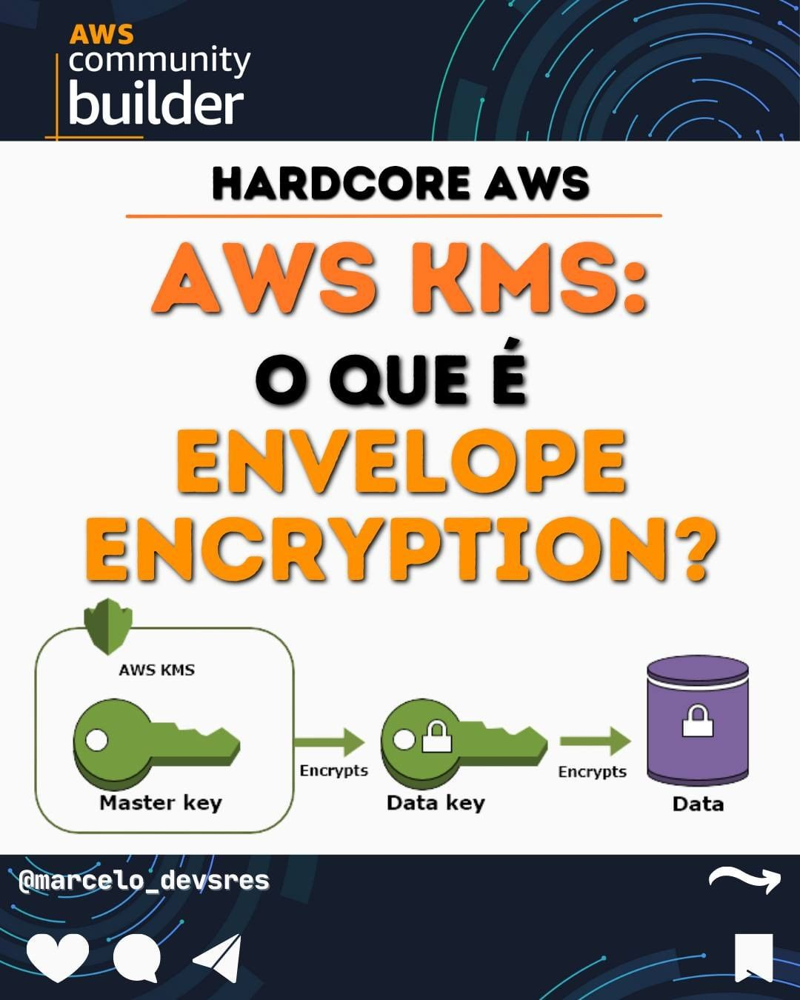

O que é "envelope encryption"?

Poucos serviços são tão importantes quanto o KMS. Nenhum outro - exceto talvez pelo IAM e suas policies! - integra com tantos outros serviços de maneira tão crítica, em especial levando em consideração os requisitos de compliance.

A despeito disso, é um serviço relativamente mal compreendido.

Ele permite gerenciar chaves de criptografia, embora com quase 100% de certeza você não o usará para criptografar dados diretamente. Talvez sequer usar suas próprias chaves você o faça, porque usar chaves internas da AWS normalmente são maiss baratas.

O mais comum é que você só vai se debruçar sobre este serviço quando sua empresa exigir.

Um dos conceitos possivelmente mais confusos é o de Envelope Encryption, que efetivamente é tão simples quanto a imagem de capa exibida; ele acaba se tornando esquisito pela forma como é apresentado, normalmente associado ao serviço S3. 

Neste post, vou mostrar da maneira mais manual e arcaica possível de usar Envelope Encryption a partir da AWS CLI. Entendendo a ideia por trás, fica fácil entender como serviços como o S3 e EBS efetivamente trabalham.

#aws #devops #cloudnative #kms #devsres

# Post 
[https://www.instagram.com/p/ChDbOV2giZg](https://www.instagram.com/p/ChDbOV2giZg)

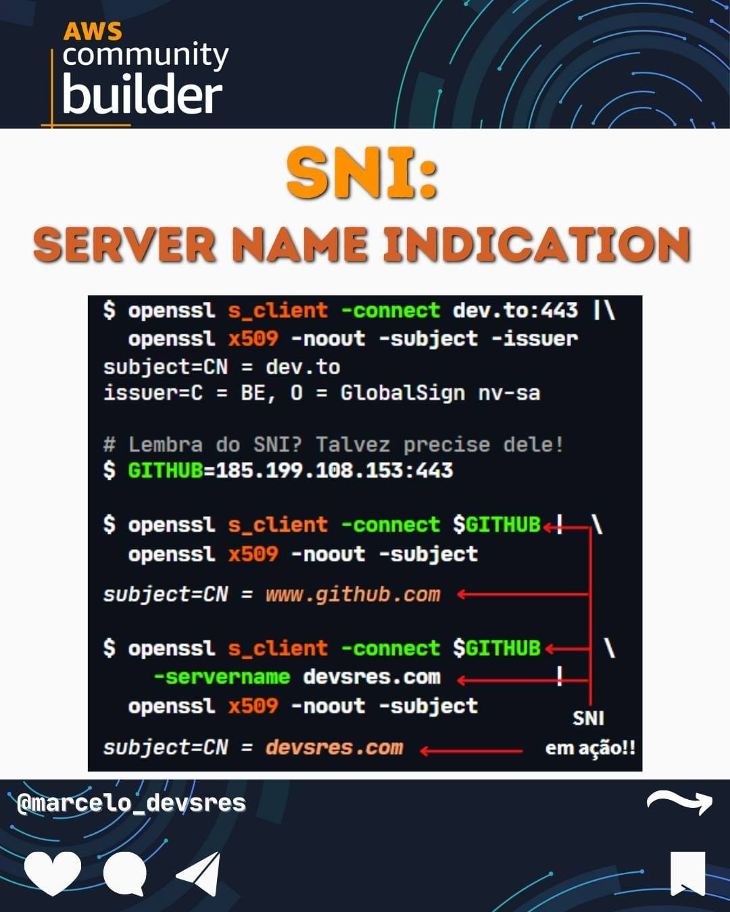

Esse vai para a série: assuntos sem graça que você se pergunta como é que viveu sem saber disso até hoje!

Poucas coisas me causaram mais transtornos na minha vida pós-kubernetes que a completa ignorância sobre a existência do SNI.

Como Ingress Controllers atuam de maneira semelhante a balanceadores de carga em camada 7, a capacidade de entregar as requisições para o sistema certo não depende apenas de configurar adequadamente o Kubernetes: você também precisa ensinar aos desenvolvedores que eles precisam fazer as requisições "do jeito certo"!

Talvez você trabalhe em algum lugar bacana que já fez tudo que é necessário para suas aplicações funcionarem e nunca ouviu falar de SNI na vida antes.

Vamos tentar entender esse assunto tentando compreender a motivação para sua existência. Depois é fuçar a RFC e Wireshark mesmo! Do 0 ao 100 em 8 imagens!

Eu recomendo que leia este post. Pode ser a diferença na sua próxima posição como pleno ou sênior em uma empresa menos amistosa!

#linux #redes #devops #infraestrutura  #devsres

# Post 
[https://www.instagram.com/p/CgpAJY4rJFN](https://www.instagram.com/p/CgpAJY4rJFN)

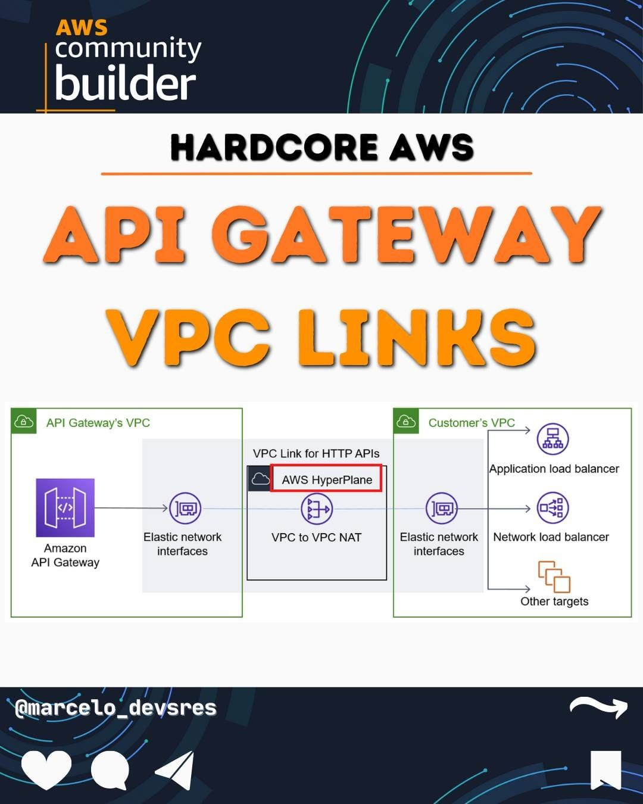

Que tal uma nova série HARDCORE AWS? Vamos sair um pouco do trivial que geralmente nossos colegas "influencers" abordam para explorar assuntos pouco conhecidos sobre os serviços?

O assunto de hoje é o conceito de VPC Links para API Gateway.

No post passado, vimos como o AWS PrivateLink viabiliza um canal de comunicação entre a sua conta e serviços da AWS. E se eu precisar fazer o contrário - fazer com que um serviço da AWS se conecte a um serviço isolado no meu VPC?

A AWS implementou essa funcionalidade para os API Gateways com o nome de VPC Links. O nome soa parecido mas não é a mesma coisa, e exige atenção na análise do seu funcionamento.

O uso dos VPC Links para REST APIs (a funcionalidade original) criadas no API Gateway opera de maneira bastante semelhante ao que já vimos com o PrivateLink, mas na direção contrária: as interface endpoints são criadas na conta interna da AWS que hospeda o API Gateway (invisível para você). Para que ele se conecte ao serviço na sua conta, é criado um Endpoint Service implicito - que já vimos que só funciona com NLBs. Então é correto afirmar que VPC Links de REST APIs se conectam apenas a NLBs.

Mas com as HTTP APIs mais baratas, tudo muda de figura. Eu não mostrei na imagem, mas entender de verdade seu funcionamento exige que você enxergue "por dentro" da implementação do serviço AWS Privatelink e como os VPCs funcionam, alicerçados sob um serviço interno que poucos já ouviram falar: o AWS Hyperplane.

Não há como falar sobre isso em um post com 10 imagens. Por isso, vou deixar que você preocure pela apresentação do AWS re:Invent de 2017 com nome "Another Day, Another Billion Flows". A revelação do Hyperplane ocorre por volta dos 37 minutos.

#aws #devops #linux #cloudnative #devsres #awshardcore

# Post 
[https://www.instagram.com/p/Cgne82UJtOj](https://www.instagram.com/p/Cgne82UJtOj)

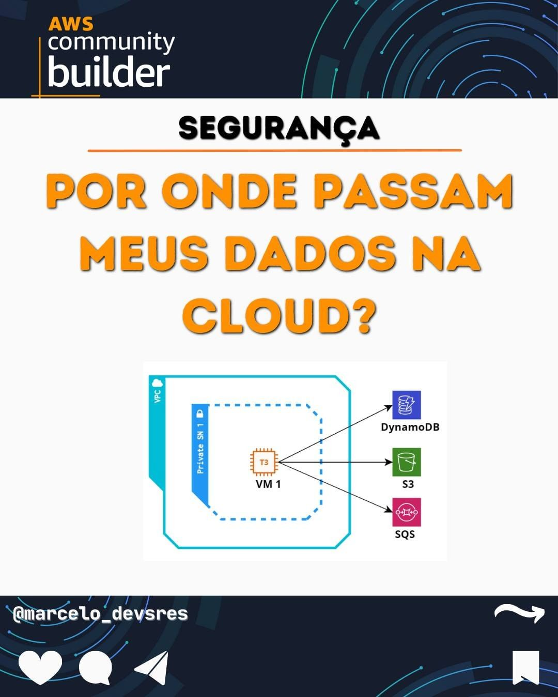

Está chegando a hora de renovar meu status de AWS Community Builder, então vamos justificar meu "título" com alguns posts AWS, naquele ritmo que eu gosto: do básico ao avançado em poucas imagens.

Será que você vai aprender alguma coisa diferente no post de hoje?

Se você quer ser um Solutions Architect Associate, é necessário conhecer os detalhes de como funcionam os interface endpoints e os gateway endpoints.

Agora, se você quer saltar mais alto e tem interesse em se tornar um AWS Solutions Architect Professional, este assunto é importantíssimo, ainda mais as particularidades que eu aponto nas duas últimas imagens!

#aws #devops #linux #cloudnative #devsres

# Post 
[https://www.instagram.com/p/CgiTAAwL7Ff](https://www.instagram.com/p/CgiTAAwL7Ff)

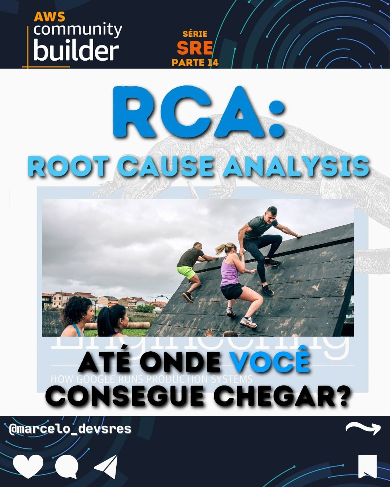

Você é bom de RCA? Então me diz: até onde você consegue chegar com suas análises?

Você efetivamente resolve os problemas que encontra ou esbarra em outros obstáculos intransponíveis que o faz depender da atuação de outras pessoas?

Nas lives do Twitch, já comentei diversas vezes como um problema que identifiquei no kube-proxy me forçou a substituí-lo por outro software. Em vez de ir atrás da causa raiz, acabei ignorando o assunto. 

Outra pessoa que esbarrou no mesmo problema acessou a Issue que abri 1 ano antes e reportou que a situação também a afligia. Mas, em vez de contornar o problema e esquecê-lo, optou por seguir adiante nas etapas 3 e 4, debugando o software e submetendo um pull request que efetivamente tornou a vida de todo mundo melhor.

Este é, de longe, o meu pior ponto fraco, e algo que consome tempo para evoluir. Felizmente, quanto mais cedo você fica ciente disso, melhor.

Se você é um profissional de infraestrutura sem desenvoltura com código, os espaços com qualidade que te esperam são cada vez menores. Pense nisso!

#linux #devops #sre #cloudnative #devsres

# Post 
[https://www.instagram.com/p/CgfwArcsytr](https://www.instagram.com/p/CgfwArcsytr)

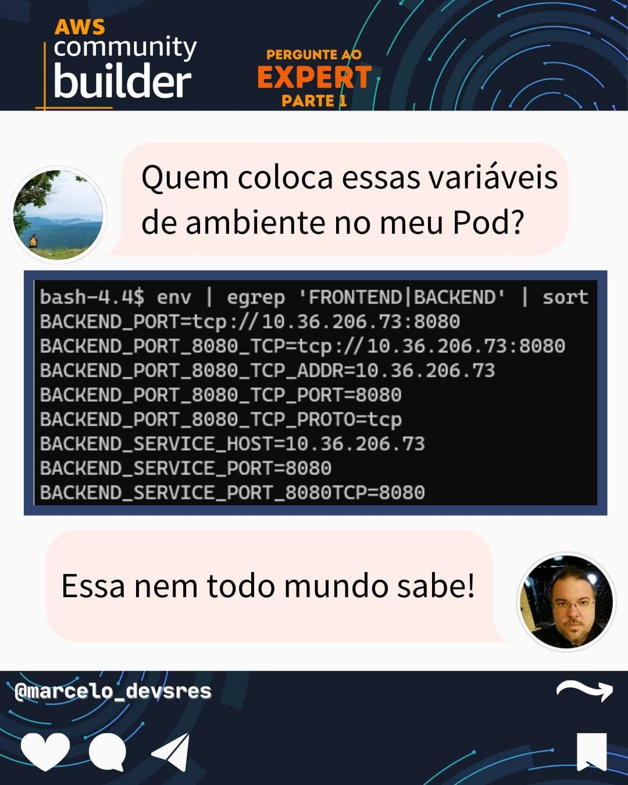

Já foi atrás de saber porque tem um monte de variável de ambiente nos seus Pods que você não criou? Ou nem sabia que elas existiam?

Um salve ao Felipe Nobrega por me lembrar que este assunto existia. 

Batemos em um incidente causado por este comportamento em 2017 ou 2018, quando uma única namespace tinha mais de mil objetos services: os Pods simplesmente paravam de subir com o famoso erro "argument list too long".

Procurei por alguém relatando este tipo de coisa em português e não achei em lugar nenhum, então aproveitem!

#kubernetes #devops #sre #cloudnative #devsres #linux

# Post 
[https://www.instagram.com/p/CgXBbfEN3AG](https://www.instagram.com/p/CgXBbfEN3AG)

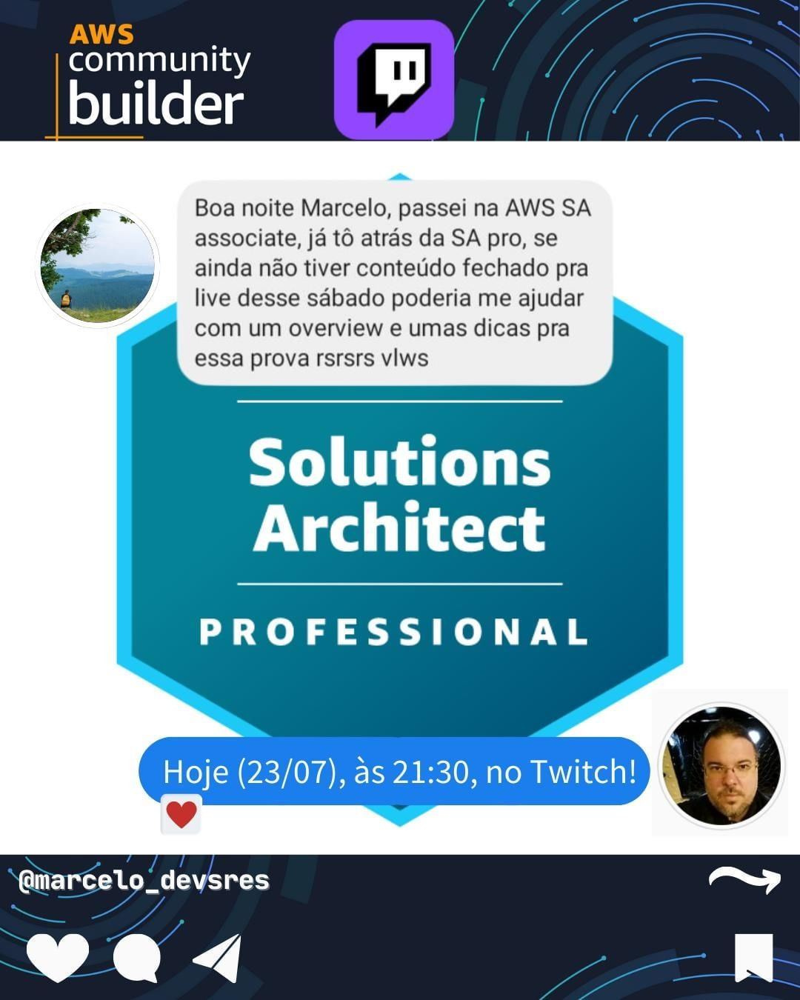

Que tal um pouco de "Architecting Solutions on AWS", nível professional?

Alguém pediu, e todo mundo votou que sim, então vamos lá! Hoje, 21:30, live dedicada a dicas para essa prova, tanto de metagaming (de como fazer a prova) quanto de assuntos relevantes a serem estudados.

Já ouviu falar de Nitro Enclaves? De Roles Anywhere? Do qarto tipo de ELB, o Gateway Load Balancer?  Quais as diferenças do Cloudfront, Global Accelerator e do S3 Transfer Accelerator?

Vamos ver coisas do tipo hoje, 23/07, a partir das 21:30! Te aguardo lá!

#aws #cloudnative #devops #linux #devsres

# Post 
[https://www.instagram.com/p/CgTADFmD8Q-](https://www.instagram.com/p/CgTADFmD8Q-)

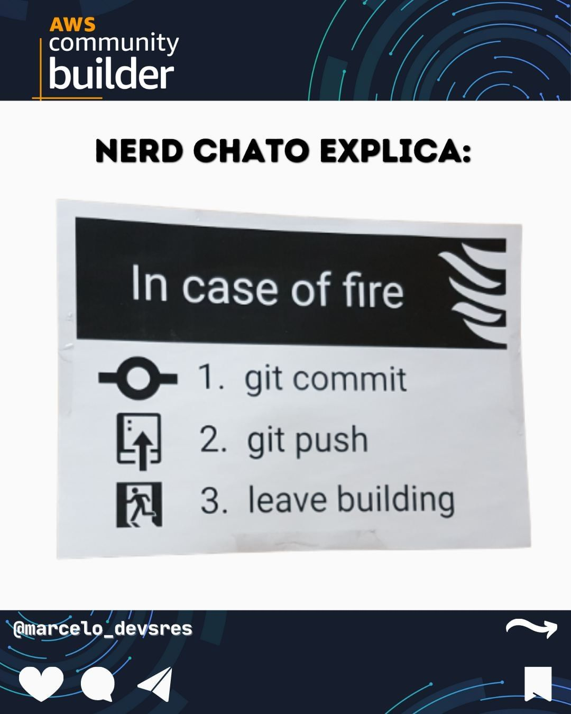

Já faz um tempinho que eu não sou um nerd chato e estrago uma piada!

A última vez que fiz um post explicando uma foi de um cara que gosta de Windows reclamando do Bind e do problema de não atualizar o serial (se não as mudanças não são propagadas!) no post 5 níveis de DNS!

O assunto hoje é a famosa plaquinha do in case of fire git commit ; git push.

Vamos dar uma olhada neste assunto?

Ah, e o que vocês acham de fazer uma "série longa" sobre Git, assim como fiz sobre Terraform e, por último, Prometheus? Diz aí se você acha que interessa!

#linux #devops #cloudnative #sysadmin #git #devsres

# Post 
[https://www.instagram.com/p/CgQPAtUDVdi](https://www.instagram.com/p/CgQPAtUDVdi)

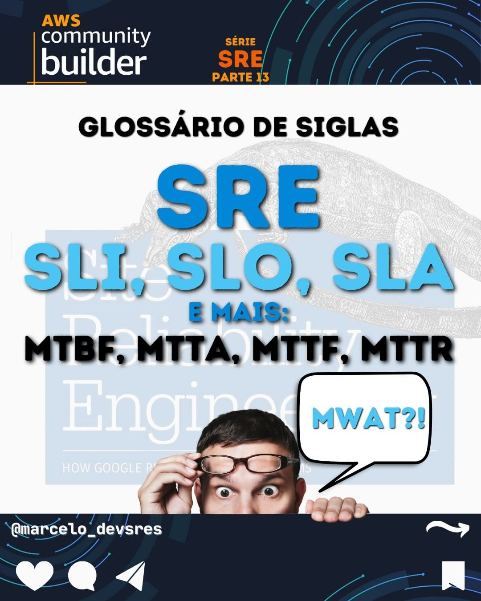

Você sabe o que quer dizer SRE? De verdade?

Site Reliability Engineer. Parabéns, você acertou. Mas o que é esse "site" do SRE? 

Existe uma sutileza no entendimento que só quem trabalhou com a Internet de 2000 vai entender - a compreensão errada da palavra "site" pode dar a entender que o escopo do SRE está limitado a uma localidade (física ou virtual), o que, definitivamente, não é verdade. Acompanha o post para entender!

Depois disso, temos os famosos SLI, SLO e SLA. São relativamente simples de descrever em um parágrafo, mas só quem já teve que estabelecê-los alguma vez para seus sistemas sabe o desafio que é. Não vou fazer isso essa semana, vou novamente descrevê-los para vocês e deixar uma palhinha de um provável post futuro.

Por fim, temos alguns mais obscuros que muita gente não liga, mas que são indispensáveis para que a empresa tenha o conhecimento adequado de suas aplicações e equipes. As métricas do tipo "Mean Time" lidam com incidentes e fornecem subsídios à tomada de decisão do que priorizar para melhorar um sistema.

Lembrem-se: SRE não trabalha com esperança ou adivinhação: todo trabalho é alicerçado em métricas de algum tipo.

---

Me conta aí do que você mais gostou do post de hoje!

#sre #monitoring #linux #devops #kubernetes #devsres

# Post 
[https://www.instagram.com/p/CgE9A2WLAda](https://www.instagram.com/p/CgE9A2WLAda)

Finalmente o último post da série!

Inverti a ordem de Summaries e Histograms porque, na prática, eles foram implementados em dois momentos diferentes.

Mas ainda que a maioria das pessoas opte por usar Histograms por ser a "funcionalidade moderna", acredito que entender como os Summaries funcionam primeiro ajuda a entender que problema este outro tipo de métrica ajudou a resolver.

Está aí, o último post sobre métricas do Prometheus. 

Espero que gostem.

#prometheus #sre #monitoring #linux #devops #kubernetes #devsres

# Post 
[https://www.instagram.com/p/Cfg55VKvMq6](https://www.instagram.com/p/Cfg55VKvMq6)

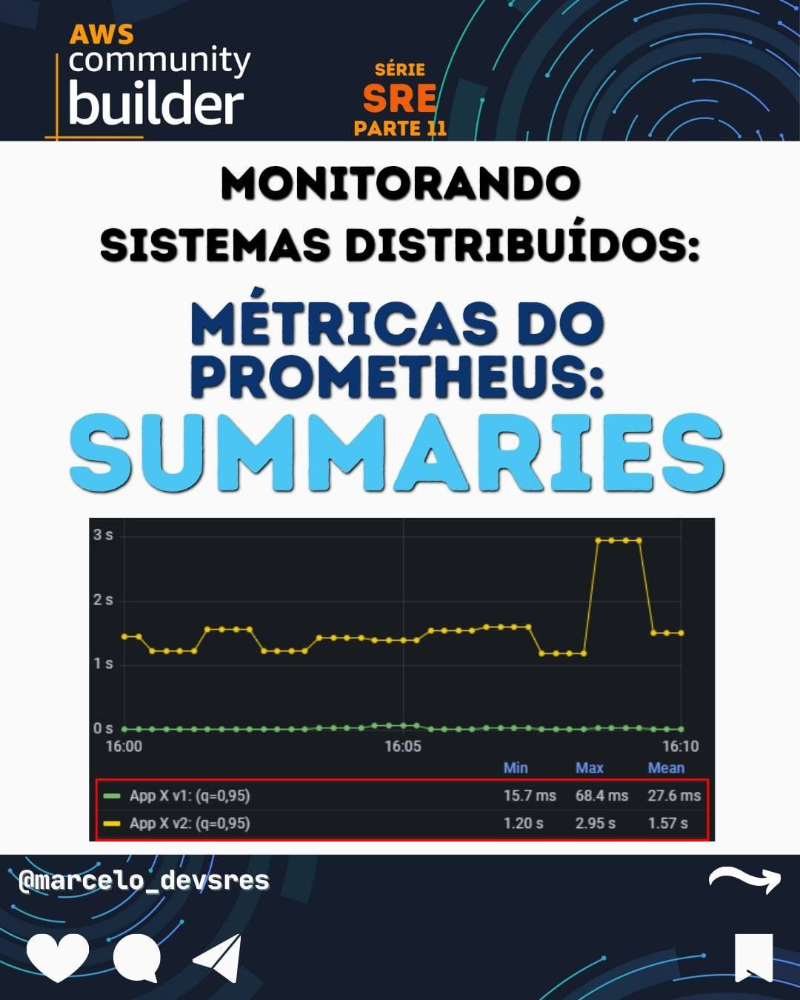

Hoje eu quero que você saia daqui entendendo como funcionam os Summaries do Prometheus.

Se você perdeu os outros posts sobre o assunto, tem outros quatro no feed te esperando para olhar.

A estratégia de Summaries do Prometheus foi a primeira tentativa de implementar o cálculo de percentis na solução. A ideia funciona e atende aos requisitos da época, mas com um inconveniente - que normalmente pesa contra o já ponto negativo de instrumentação: é cara computacionalmente. 

Além deste inconveniente, ainda há o problema de não oferecer a possibilidade de usar as agregações e o arsenal matemático oferecido pelo Prometheus para trazer mais versatilidade às métricas. 

Enquanto o servidor evoluia, percebeu-se que, provavelmente, a melhor opção é delegar para o lado do servidor o grosso das contas.

Mas ainda que muitos considerem Summaries uma métrica "deprecated" para cálculo de percentis, ainda há um caso em que ela é a melhor escolha. Você sabe qual?

Espero que gostem!

#prometheus #sre #monitoring #linux #devops #kubernetes #devsres

# Post 
[https://www.instagram.com/p/Ce7G6IxjNDZ](https://www.instagram.com/p/Ce7G6IxjNDZ)

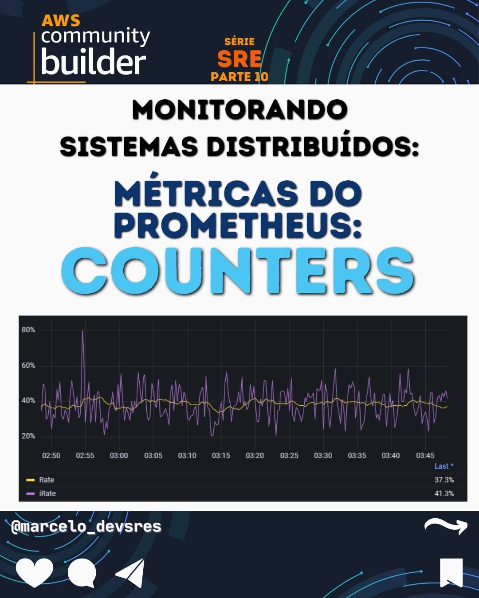

Ainda que meu último post sobre Prometheus Gauges tenha tido a pior quantidade de visualizações e interações dos últimos 50 que eu fiz, vou seguir com a série porque acho que é um assunto particularmente interessante e importante!

Não que os Gauges não sejam importantes, mas os Counters são o coração do Prometheus. Fácil de entender na teoria - uma métrica cujo valor sempre sobe! -, mas incrivelmente difícil de trabalhar na prática, os fabulosos contadores apresentam a primeira divisão de águas entre esta solução e as demais que atuam com monitoramento.

A primeira delas é o entendimento de que as métricas, em si, fazem pouco por você; será necessário integrá-las com diversas funções e outros agregadores para extrair real valor. E quando você começa a tentar entender as funções, literalmente começa a cair na "toca do coelho" como se não houvesse fim.

A ideia básica, entretanto, não é tão difícil de entender: use counters para conseguir mensurar volumes de operações, requisições, erros ou algo do tipo, e use funções como rate para extrair as taxas de crescimento em determinada unidade de tempo. 

Simples assim, certo?

Na verdade, você que me diz. E aí: simples ou incompreensível?

#sre #devops #cloudnative #prometheus #monitoring #devsres

# Post 
[https://www.instagram.com/p/Ceyt4bZsdbg](https://www.instagram.com/p/Ceyt4bZsdbg)

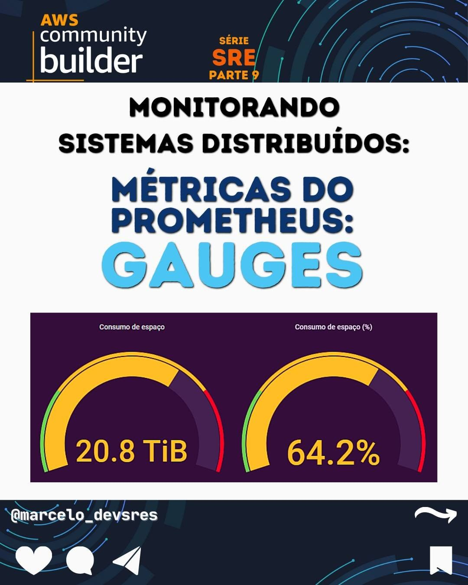

Vamos continuar falando de Prometheus?

O tipo de métrica mais básica para aprender a fazer alguma coisa são os Gauges. 

Além de aprender a coisa mais importante, que é como se pronuncia (em inglês, "Gayges"), não há muito o que aprender sobre eles. 

Gauge é um nome "chique" para indicar que você coletou um dado a respeito de algo em uma unidade de tempo e anotou. Ao fim do dia, se você coletar os dados uma vez por minuto, dá para você ter uma ideia aproximada de como seu sistema se comporta.

Até aí, nenhuma grande novidade. Esta é basicamente a forma como a infraestrutura é monitorada ao longo das últimas décadas, inclusive levando em consideração que, às vezes, esse tipo de amostra não é suficiente para monitorar de maneira eficiente seu ativo.

Você pode ser tentado a baixar cada vez mais o intervalo de coleta para tentar combater essa deficiência, mas o Prometheus não é o melhor lugar para fazer isso. Se você precisar de ultra granularidade, considere outras opções de monitoração, em especial se você usa essas métricas, por exemplo, para bilhetar custos. Melhor deixar o Prometheus para usar com seus pontos fortes!

Ainda assim, vamos mostrar uma vantagem de usar Prometheus (a capacidade de sumarizar métricas para agregar totais) e uma gambiarra muito usada para contornar a limitação da métrica exclusivamente numérica!

#sre #devops #cloudnative #prometheus #monitoring #devsres

# Post 
[https://www.instagram.com/p/CehrmHIuTo5](https://www.instagram.com/p/CehrmHIuTo5)

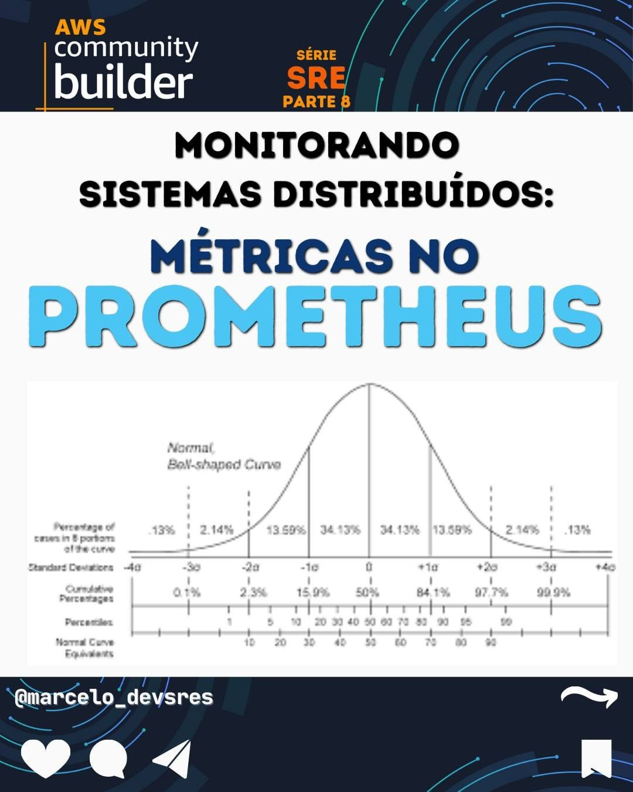

Qual o assunto de hoje? Tipos de métricas de Prometheus.

Este é um dos piores posts que já elaborei; tentei introduzir um assunto seguindo a lei máxima dos SREs: "o mais simples possível, mas não simples demais". Existe um limite do que dá para fazer em 10 imagens, e infelizmente não foi possível ir mais simples que isso.

Para compensar, vou abordar cada assunto deste post em um post separado até me dar por satisfeito.

Por que eu falhei? Bem, vá até o final; depois, comenta aí e me diz se você conseguiu entender!

#sre #devops #cloudnative #prometheus #monitoring #devsres

# Post 
[https://www.instagram.com/p/CecbHWzr6fY](https://www.instagram.com/p/CecbHWzr6fY)

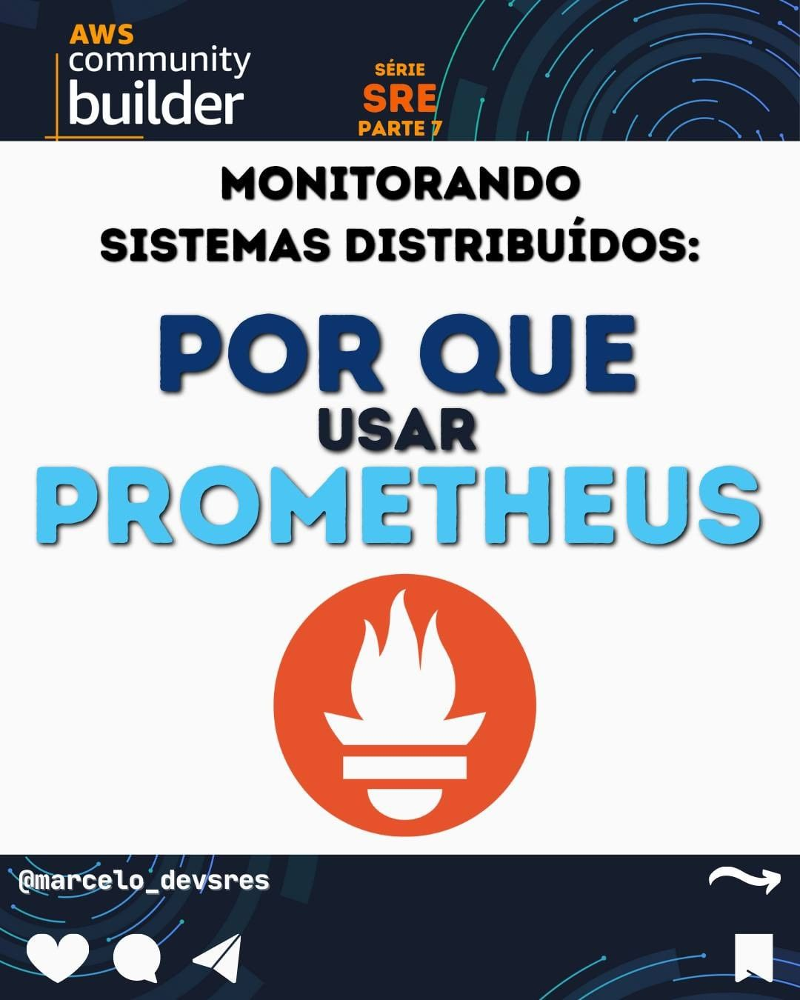

Não é apenas o Kubernetes que "nasceu" inspirado em uma tecnologia do Google (o famoso Borg); o serviço de monitoramento Prometheus também é amplamente inspirado no serviço semelhante Borgmon.

Vamos conhecer alguns aspectos sobre este programa no post de hoje, e apontar um detalhe que pouca gente presta atenção para entender porque se tornou tão relevante.

E lembre-se: não é porque está todo mundo usando que você tem que substituir o que já tem por ela!

#sre #devops #cloudnative #prometheus #Linux #monitoring #devsres

# Post 
[https://www.instagram.com/p/CeSA6gIlpAZ](https://www.instagram.com/p/CeSA6gIlpAZ)

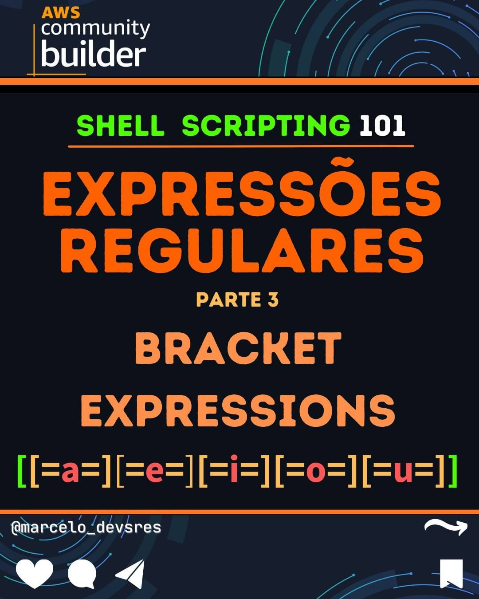

Que tal mais um pouco de expressões regulares?

Hoje o assunto é "bracket expressions", um wildcard menos wild que o "dot" (.), mas que ainda assim é wild o suficiente para nossos gostos.

Quando ler o texto, lembre-se que:

- wildcards casam com um único caractere;
- quantificadores (que não vimos ainda) atuam no número de ocorrências.

Além disso, não se esqueça que ls *.txt é um shell globbing e não tem nada a ver expressões regulares.

Me diz aí: viu alguma coisa no post que não conhecia?

#linux #devops #sysadmin #devsres

# Post 
[https://www.instagram.com/p/Cd_DrXDsK4I](https://www.instagram.com/p/Cd_DrXDsK4I)

O assunto de hoje é: métricas de Cloudwatch! Ou, basicamente, a falta de métricas extremamente importantes na "baseline" de monitoração deste serviço.

Quando você instala um EC2, sem precisar fazer nada, a AWS já te entrega "de graça" um pouquinho de monitoração. 

Essa monitoração conta com as métricas exibidas no post, podendo variar entre os tipos de instâncias e recursos usados.

Mas a primeira coisa que um profissional experiente em monitoramento irá perceber: cadê as minhas informações de consumo de memória e disco? 

Um conjunto de métricas tão básico estar faltando de uma ferramenta assim, tem algo errado, certo?

Vamos entender o que precisamos fazer para disponibilizar essas métricas, e mais do que isso, vamos entender o porquê delas não serem disponibilizadas.

#aws #devops #sre #cloudnative #linux #devsres

# Post 
[https://www.instagram.com/p/CduQI6zLgZT](https://www.instagram.com/p/CduQI6zLgZT)

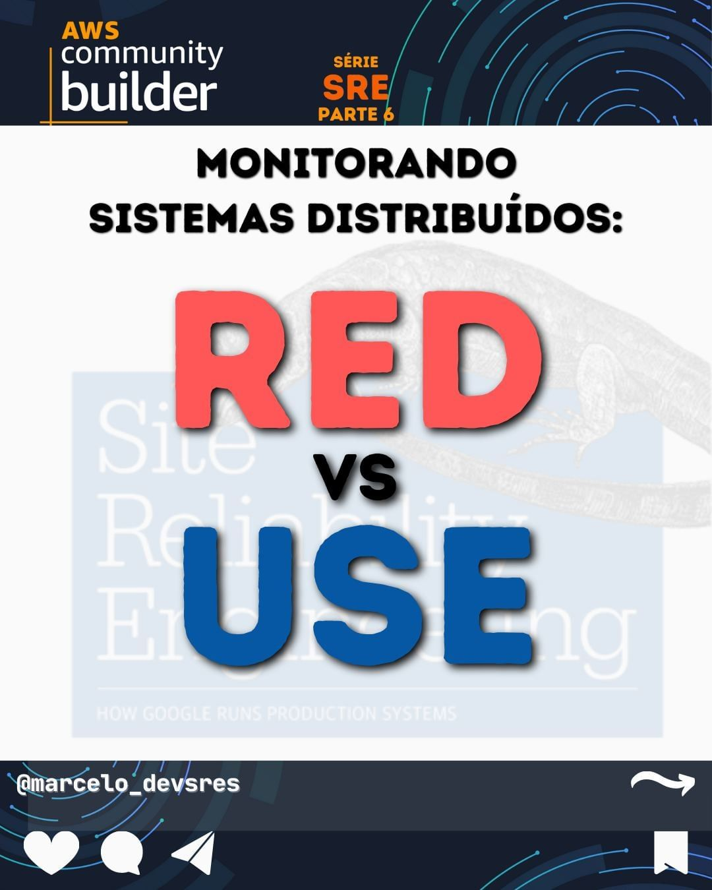

Se você começar a pesquisar sobre monitoramento na web, provavelmente vai se bater com esses dois termos: "RED vs USE".

Você sabe de onde eles vieram? O que está por trás deles? Eles entregam algo de novo no cenário?

Se você se interessa pela sequência de monitoramento, talvez conhecer esses dois termos te ajude a destravar conteúdos magistrais (especialmente no que diz respeito à "metodologia USE") e enriquecer bastante seu conhecimento sobre não apenas como monitorar sistemas distribuídos mas ativos de uma maneira geral.

#sre #cloudnative #devops #devsres

# Post 
[https://www.instagram.com/p/CdmaSDjJK1U](https://www.instagram.com/p/CdmaSDjJK1U)

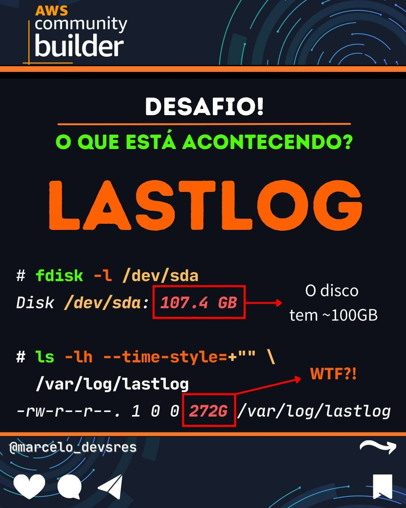

Muita gente chegou no perfil aqui nos últimos dias vindo do ilustre @sysadmin_impaciente - e entendo que a maioria curte Linux, embora deva ter este ou aquele fã de HyperV ai no meio.

Então tirei o pó de um post que estava parado faz um tempo exclusivamente para vocês.

Vamos lá, quem aí já teve problemas com arquivos como o /var/log/lastlog no seu sistema do arquivos? E se sim, você entendeu exatamente o que está acontecendo?

Me conta aí se você já teve problemas com este tipo de evento - como o que eu descrevi lá na penúltima imagem!

#linux #devops #cloudnative #devsres

# Post 
[https://www.instagram.com/p/Cdjs4B8pk-u](https://www.instagram.com/p/Cdjs4B8pk-u)

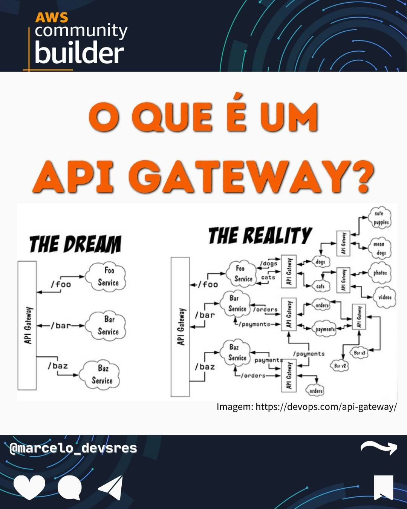

O próximo serviço da série AWS Developer Associate  é o AWS API Gateway. Mas acho que vale a pena uma pausa antes para entendermos qual a ideia de um API Gateway de maneira mais genérica antes de abordar funcionalidades - e limitações - daquele serviço!

A primeira coisa para se falar sobre API Gateways é que, antes qualquer outra coisa, você deve entender  o que é uma API. Com a Internet moderna e o desenvolvimento web,  API virou um termo amplamente usado, mas pouco explorado; você deveria dedicar uma horinha do seu dia para entender até onde vai este termo e como ele se especializou no que  você usa no dia-a-dia.

A outra coisa é buscar entender o limiar da diferença de um balanceador de carga para um "gateway de apis". Especialmente ao trabalhar em camadas mais altas, muitas das funcionalidades de um estão disponíveis no outro. Quais as diferenças?

API Gateways são, assim como os pipelines de CI/CD, ideias tecnológicas para reduzir o custo operacional de manter sua aplicação no ar. Vamos averiguar com mais detalhes ao estudar o AWS API Gateway em um próximo post!

#cloudnative #devops #aws #devsres

# Post 
[https://www.instagram.com/p/CdV9QznpoVf](https://www.instagram.com/p/CdV9QznpoVf)

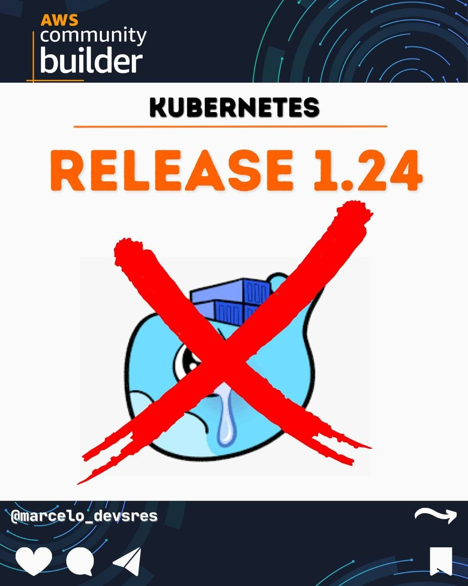

Com atraso de uma semana, vamos falar sobre o Kubernetes 1.24.

Essa é a derradeira release em que o "Docker foi descontinuado".

Eu já falei sobre isso antes por aqui, mas não custa lembrar, caso algum outro "influencer" por aí queira aparecer com manchetes clickbaits.

Eu estou bem mais chateado com o "disable" das APIs betas por padrão - isso provavelmente vai te obrigar a esperar bem mais para usar certas coisas nos ambientes "gerenciados" - que é o que a maior parte das pessoas "normais" que usam Kubernetes tem acesso.

#kubernetes #k8s #devops #cloudnative #devsres

# Post 
[https://www.instagram.com/p/CdB5MHoMKls](https://www.instagram.com/p/CdB5MHoMKls)

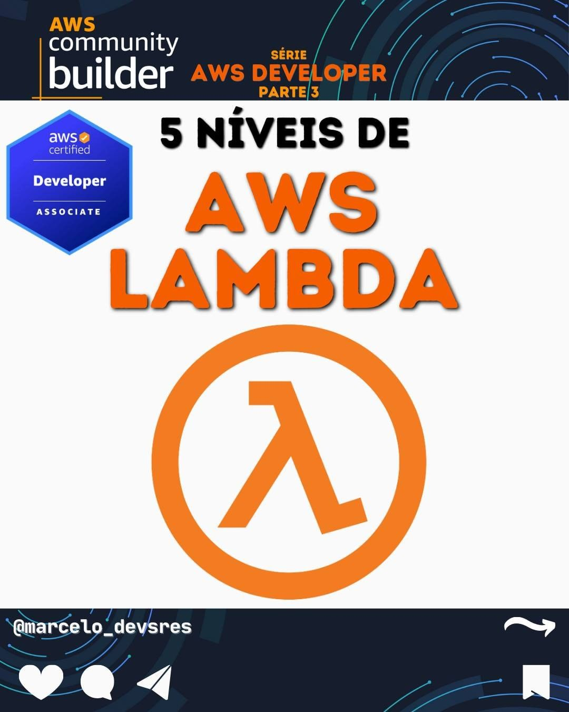

5 níveis de AWS Lambda! Em qual você está?

Havia prometido posts falando sobre AWS Developer para incentivar a galera a seguir também esta trilha. 

Não é porque eu já tirei a certificação que não vou cumprir com a palavra!

Vamos lá, o que você achou do que eu elenquei para falar de Lambda? Você acha que ficou faltando algo mais importante do que o listado?

(ps: com certeza ficou faltando dezenas de coisas!)

#aws #developerassociate #devops #cloudnative #cloud #serverless #devsres

# Post 
[https://www.instagram.com/p/Cc1R9lXrugc](https://www.instagram.com/p/Cc1R9lXrugc)

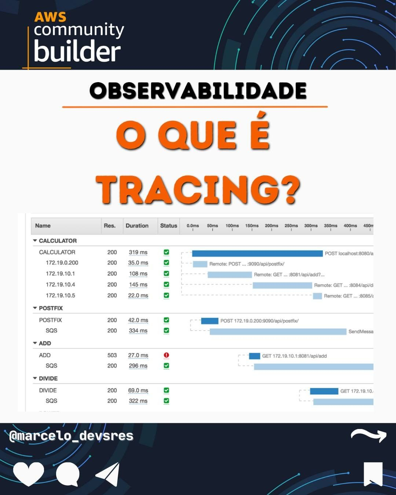

Se toda vez que você lê sobre observabilidade, você vê escrito "trace" e nunca viu um na vida, este post é para você.

Um dos "pilares da observabilidade" amplamente propagado e repetido por aí, os Traces se juntam aos amigos mais simples de entender Logs e Métricas como a promessa para desvender os mistérios dos sistemas distribuídos modernos.

Mas exatamente o que é um "Trace"? Olha dentro do Post para descobrir!

#devops #cloud #cloudnative #aws #devsres

# Post 
[https://www.instagram.com/p/CcygPOzOysx](https://www.instagram.com/p/CcygPOzOysx)

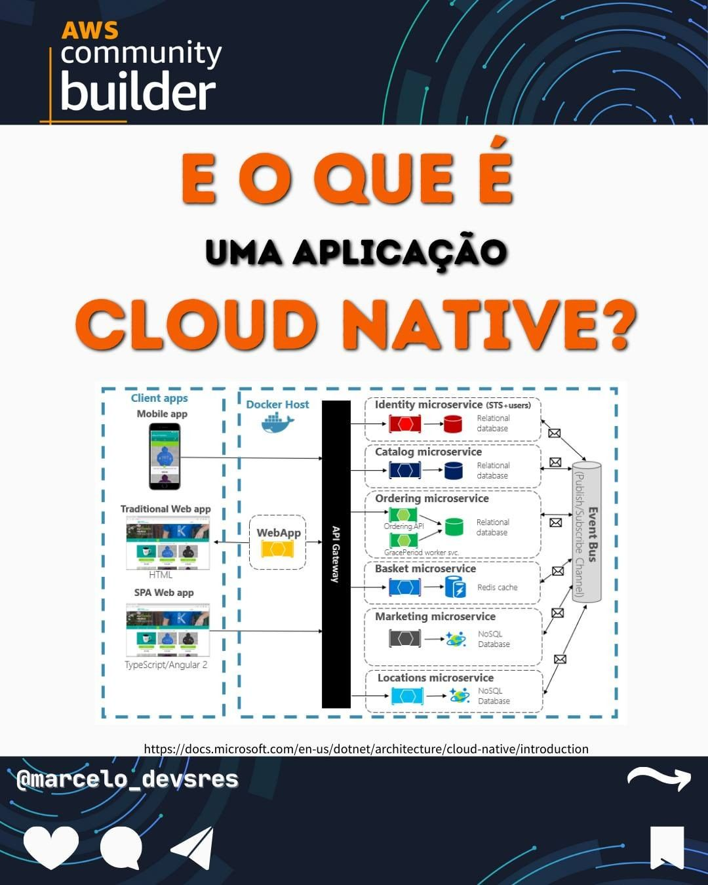

O Roberto pediu para eu fazer um post sobre Cloud Native. Até porque... Quem é que sabe o que define uma aplicação Cloud Native?

Assim como vários termos da TI moderna, "Cloud Native" é apenas mais um com uma definição amorfa; pesquisar sobre ele provavelmente vai trazer mais dúvidas que respostas, isso se você não encontrar definições conflitantes entre si.

A ideia por trás do Cloud Native fala menos sobre esta ou aquela tecnologia e mais sobre princípios, ideias e abordagens.

No fim das contas, é apenas mais uma maneira de tentar atingir o que já estamos tentando fazer há algum tempo: produzir software de qualidade que atenda às necessidades dos clientes de maneira viável e inteligente.

Acompanhe neste post o meu "take" sobre o assunto!

#sre #devops #cloudnative #cloud #devsres

# Post 
[https://www.instagram.com/p/CctLxrQuyT6](https://www.instagram.com/p/CctLxrQuyT6)

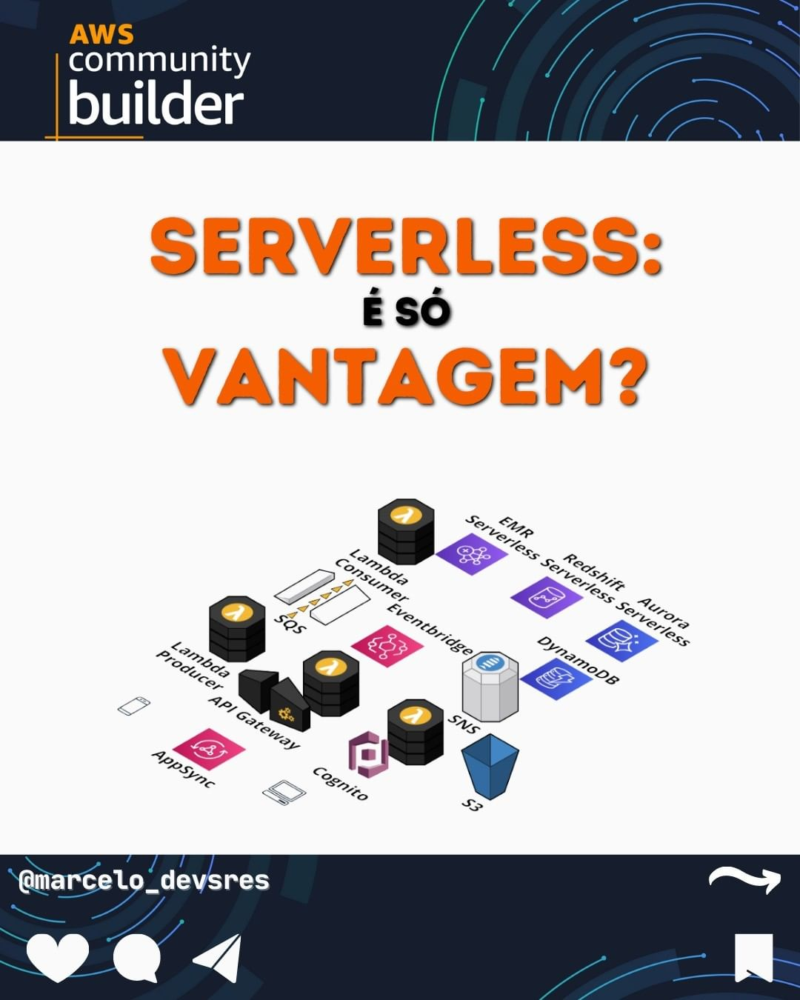

Já que meu amigo Marcelo @binbash.sh curtiu o post de Serverless, adiantei a parte 2 para hoje!

No post passado, ficou parecendo que Serverless é a solução definitiva para todos os problemas.

Isso só aconteceu porque né, o Instagram me limita a 10 figuras por post.

Vamos ao contraponto da ideia do Serverless, porque nem tudo são flores e como você deve olhar com cuidado para papéis de divulgação que te prometam muito sem dizer quais são as letras miúdas!

#aws #cloud #devops #serverless #devsres

# Post 
[https://www.instagram.com/p/CcorSWpLKLA](https://www.instagram.com/p/CcorSWpLKLA)

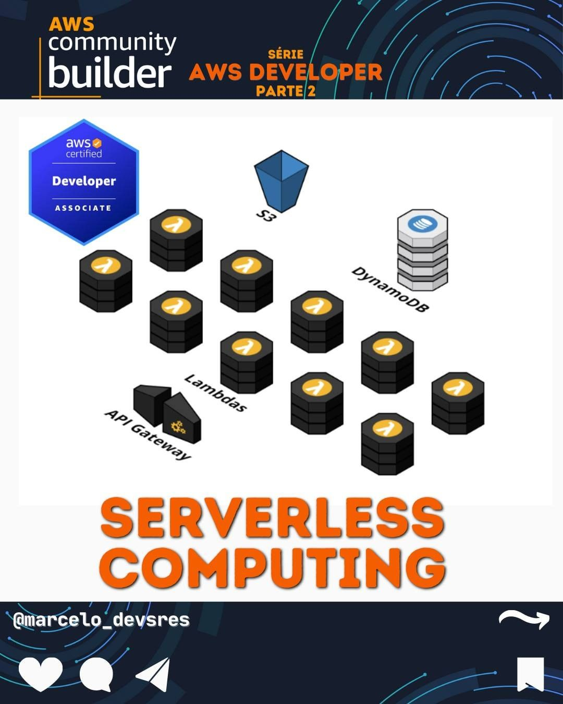

Vou começar uma série de posts sobre os serviços que estou estudando para a prova de AWS Developer Associate, mas achei melhor criar uma introdução com a ideia de Serverless para o pessoal que tem pouca ou nenhuma familiaridade com esta "variedade" de serviços comumente oferecidas em Clouds Públicas.

Mas atenção: como o espaço é limitado para as imagens, é importante que você entenda que Serverless não é a bala de prata definitiva e a solução para todos os problemas do mundo da computação! Asssim como tudo, há tradeoffs. 

Entenda Serverless como o modelo possivelmente mais vantajoso (do ponto de vista de custo/benefício) para a modelagem de aplicações em Clouds públicas. Uma das principais razões para isso ser verdade é que o modelo também é vantajoso para *eles* - garantindo uso elástico e racional dos recursos, é possível vender mais coisa para mais gente!

#aws #serverless #cloud #devops #devsres

# Post 
[https://www.instagram.com/p/Ccjo99QDG5-](https://www.instagram.com/p/Ccjo99QDG5-)

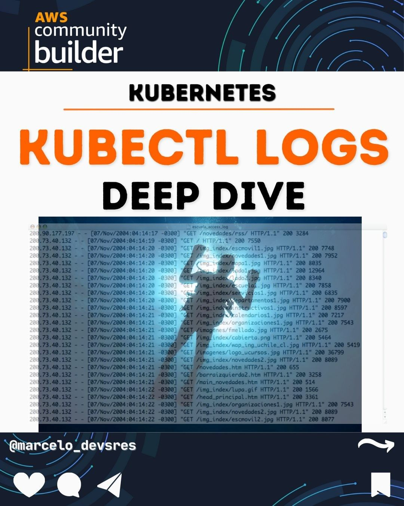

Vamos fazer um Deep Dive no comando kubectl logs?

Normalmente negligenciado, a maior parte das pessoas aprende o mínimo e confia em seus poderosos serviços caríssimos de logs centralizados para buscar as informações que você quer.

Bem, nem sempre isso será uma opção - ninguém quer pagar Splunk para receber log daquele cluster de lab - e normalmente é onde os problemas mais aparecem!

Você conhecia todos os recursos do kubectl logs que eu listei aqui? Se não, qual foi a novidade?

Galera, atenção na ERRATA aqui! Eu não consigo editar as imagens, então vai ficar por aqui mesmo.

No último "slide", eu agrupei kubectl logs de deployments, services e labels como se fizessem a mesma coisa (escolhessem a primeira ocorrência caso haja mais de um Pod). E não é! Eu deletei a "bolinha" que explicava a diferença!

Como o Leonardo apontou certeiro aí embaixo, com label selector, ele pega *todos* os logs de todos os Pods dos labels especificados.

E ele sequer se restringe a pegar do "mesmo tipo": se você tiver, por exemplo, um helm chart que aplica um label comum a 10 deployments diferentes, ele vai trazer logs de todos os pods de todos os deployments.

#kubernetes #cka #cks #cloudnative #devops #devsres

# Post 
[https://www.instagram.com/p/Ccg9kUmt-FR](https://www.instagram.com/p/Ccg9kUmt-FR)

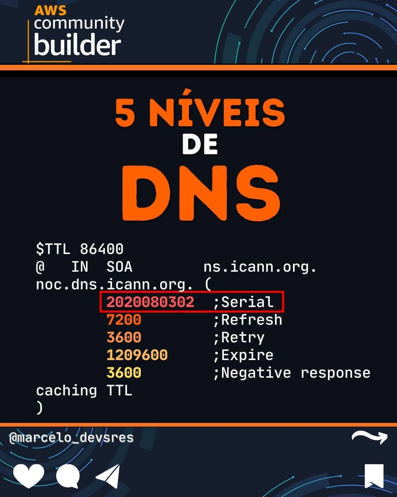

Ninguém gosta de quem explica piada, né? Mas em TI, e particularmente, nesse caso, eu acho que vale a pena.

Aqui vai um post para todas as pessoas e idades, do nível "nem sou de TI" para o pessoal que já tem alguma experiência na área.

Vamos falar de DNS e ir subindo o nível progressivamente até conseguir explicar a piada que apareceu no perfil do sysadmin_impaciente?

Ps: o objetivo do post é defender o Linux da raiva! O campo serial é algo especificado na especificação do registro do protocolo! A parcela de culpa do Linux aqui é que ele deixa você fazer tudo na mão se você quiser!

#linux #devops #cloudnative #sysadmin #devsres

# Post 
[https://www.instagram.com/p/CcbFoJYJmn8](https://www.instagram.com/p/CcbFoJYJmn8)

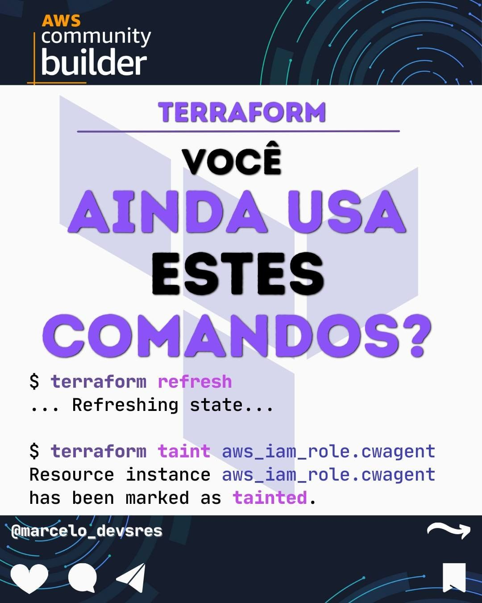

Você ainda usa estes comandos?! 😱

O título pode soar meio clickbait, mas os comandos estão na imagem da capa, então ninguém pode reclamar que eu fiz o post só para você ser obrigado a olhar dentro para descobrir quais são!

Tanto o comando refresh quanto o taint são considerados "deprecated" e você deve buscar alternativas.
Normalmente, as alternativas são listadas nas próprias páginas dos comandos, então nada de mais.
Agora enteder o porquê de estarem sendo descontinuados é mais interessante que conhecer as alternativas!

Me acompanha neste post que eu acho que você vai gostar!

#terraform #devops #iac #cloudnative #linux #devsres

# Post 
[https://www.instagram.com/p/CcWTqOVLO0N](https://www.instagram.com/p/CcWTqOVLO0N)

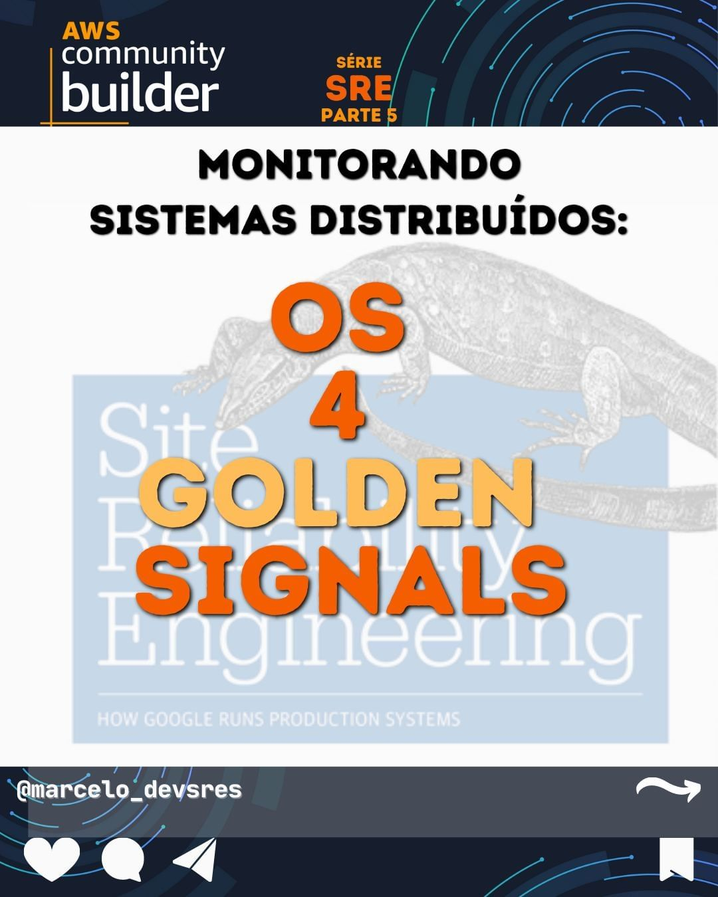

Vocês pediram e aqui está: o post sobre os 4 Golden Signals descritos no livro de Site Reliability Engineering do Google!

Se você precisar escrever a monitoração de um sistema que será implantado, você partiria de que ponto?

SRE também é levar o "engineering" para o processo de monitoramento de aplicações. 

E se você achou um pouco do arcabouço matemático necessário  lembrando bastante o que se faz com o Prometheus, saiba que, assim como o Kubernetes é um projeto inspirado pelo Borg, o Prometheus é amplamente inspirado no BorgMon, outra solução do Google!

#sre #sysadmin #devops #cloudnative #devsres

# Post 
[https://www.instagram.com/p/CcTntF7rBOK](https://www.instagram.com/p/CcTntF7rBOK)

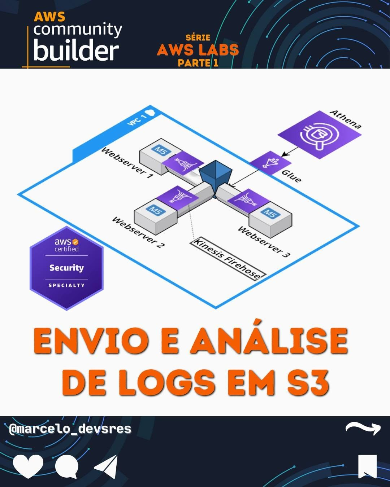

Durante meu curso de Security Specialty, havia alguns laboratórios direcionados em Qwiklabs como complemento prático ao conteúdo teórico.

Este é um deles.

Com base nisso, estava pensando em elaborar uma série de posts com serviços da AWS pensados em contexto, com casos práticos que possam ajudar a entender melhor a aplicabilidade de cada um.

Acho que é mais interessante para alguém estudar serviços analisando o papel em uma topologia com propósito relevante que simplesmente ler aleatoriamente "mitochondria is the powerhouse of the cell", ou, neste caso, "kinesis é um serviço de stream de dados".

Digam aí se curtiram a ideia ou não!

#aws #devops #cloud #cloudnative #devsres

# Post 
[https://www.instagram.com/p/CcRUcgIMEyr](https://www.instagram.com/p/CcRUcgIMEyr)

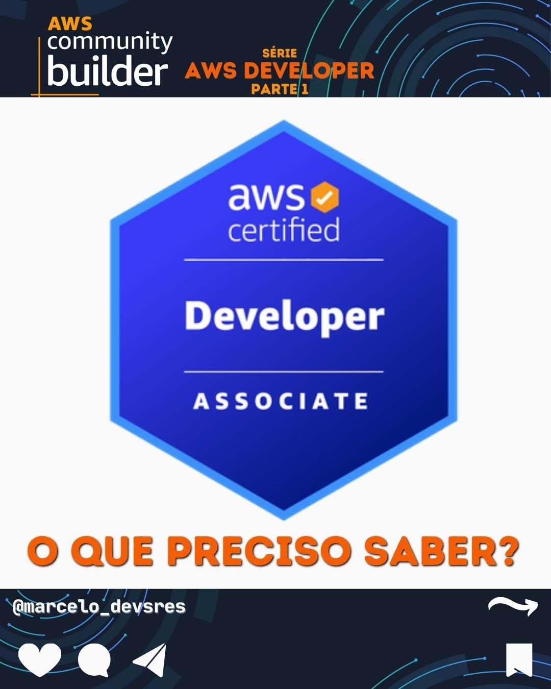

Promoção Certificação AWS Developer Associate com 50% de desconto! Mas... do que se trata essa certificação?

Ela irá avaliar sua fluência em desenvolver soluções usando todo o ecossistema da AWS. Não vai pedir para você programar nada, mas sim perguntar se você é capaz de juntar os pontos ou se sabe preencher as lacunas vazias com o que é necessário para entregar resultados!

Devo dizer para vocês que muitos não consideram esta prova das mais fáceis; assim como Sysop Associate, que sofreu reformulação recente, cobra detalhes que normalmente passam batidos nos estudos e demandam alguma experiência prática com os assuntos abordados.

Eu ia fazer essa prova em agosto do ano passado, mas desisti - não tinha a fluência necessária.

Vamos fazer desta vez então?

#aws #developerassociate #cloudnative #devops #devsres

# Post 
[https://www.instagram.com/p/CcMQC0yuY33](https://www.instagram.com/p/CcMQC0yuY33)

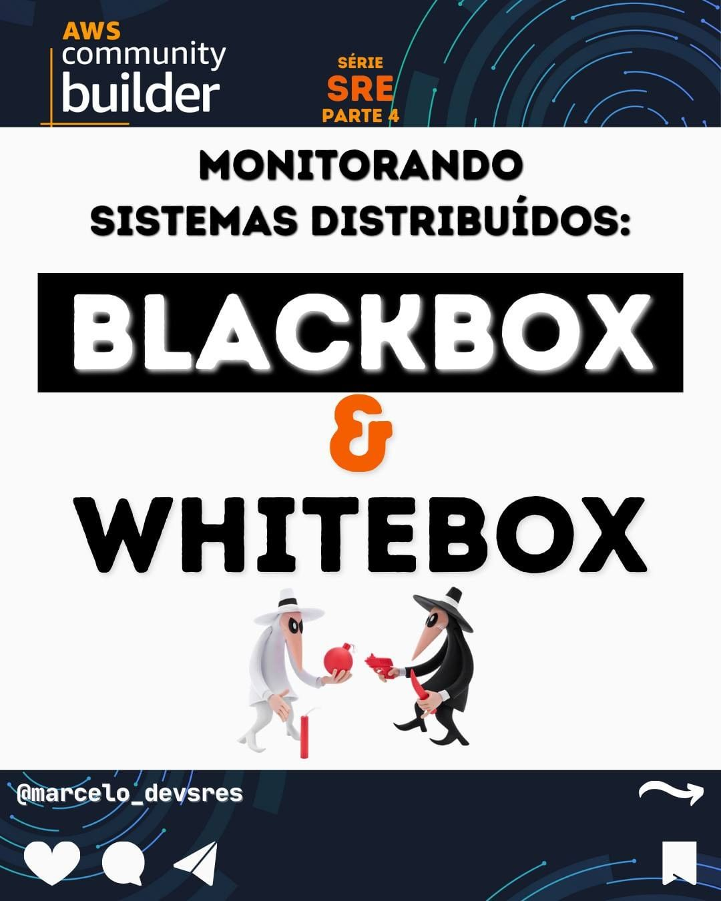

Monitoração, para mim, é o exemplo mais "DevOps" do DevOps.

Muito se fala em "shared ownership", quebra de silos e mudança cultural, mas normalmente todas essas propostas ficam no plano das ideias sem sugestões concretas de como viabilizá-las na prática.

Com a monitoração, temos O exemplo que descreve o que é realmente uma "cultura DevOps".

Historicamente uma responsabilidade da área de operações, a monitoração tradicional foca no estado dos componentes de infraestrutura e tem uma visão (quase) cega a respeito dos serviços em execução internamente. Não é raro o único indicador da monitoração de que um sistema está de pé é o fato de que a porta do servidor de aplicações está aberta.

Muito se fala em observabilidade e como ela difere da monitoração, mas vamos ser pragmáticos aqui: na prática, o que temos é o shift left da busca por melhores técnicas de como monitorar uma aplicação, gerar métricas e informações sobre seu comportamento, assim dividindo a responsabilidade com operações no ato de quantizar e especificar a saúde de minha aplicação, definindo o que é seu comportamento aceitável e o que não o é.

Olhando neste aspecto, é o melhor exemplo prático de eliminação de silos e compartilhamento de responsabilidades que eu vi em DevOps.

#sre #devops #observabilidade #devsres

# Post 
[https://www.instagram.com/p/CcJQTrohHuY](https://www.instagram.com/p/CcJQTrohHuY)

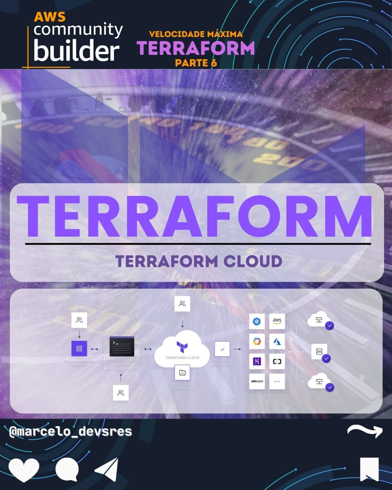

Neste último post da série Velocidade Máxima - Terraform, vamos analisar o Terraform Cloud.

O objetivo não é "vender" ele como ferramenta para ninguém; na verdade, é usá-lo feito uma aula de como você deveria usar Terraform.

Provavelmente, os caras que idealizaram o negócio tem uma boa visão do que é a melhor prática para lidar com a ferramenta. Sendo assim, vale a pena dar uma "espiada" para ver o que você precisa fazer se não quiser (ou não puder!) usar o SaaS da Hashicorp.

#terraform #devops #cloudnative #linux #devsres

# Post 
[https://www.instagram.com/p/CcGrhHxtc_V](https://www.instagram.com/p/CcGrhHxtc_V)

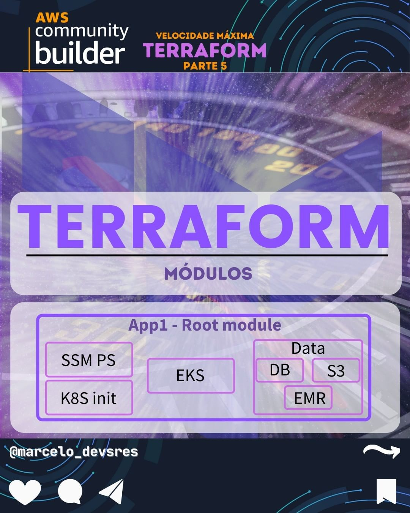

A próxima etapa para quem está escrevendo código Terraform é passar para a escrita de módulos!

Com módulos, sua equipe pode ter uma base de código reusável que pode ser aproveitada para entregar novos ambientes de maneira bem mais ágil e com o mínimo de repetição possível.

Obviamente, nada na vida é sem o famoso tradeoff, e embora eu até tenha mencionado no post, vale a pena citar novamente por aqui: ao usar módulos, você está introduzindo um novo componente que precisa ser adequadamente versionado e testado ao longo da história do seu código.

Agora, não é apenas a versão do Terraform e a versão dos seus Providers que precisam de atenção: também é importante tomar muito cuidado com o ciclo de vida dos módulos - que normalmente é quem causa mais dor de cabeça, devido à tendência natural de componentes exigirem reescrita!

#terraform #devops #cloudnative #linux #devsres

# Post 
[https://www.instagram.com/p/CcEHJhclY_O](https://www.instagram.com/p/CcEHJhclY_O)

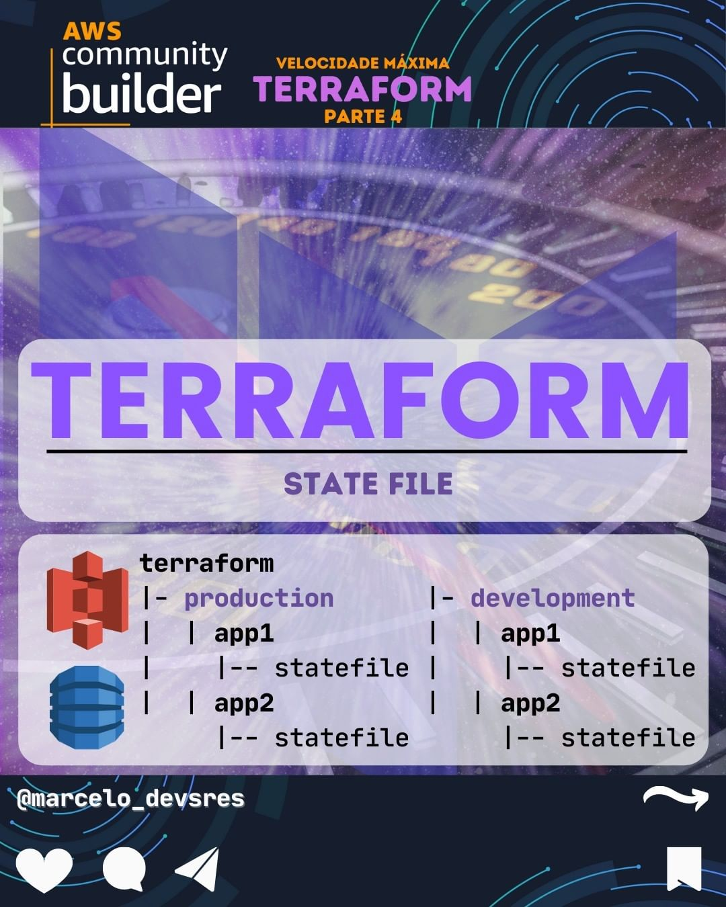

Agora, vamos falar um pouco do State file, tentar entender seu propósito e relevância para o Terraform.

Ter que lidar com State é o que faz muita gente desistir do terraform, seja pela mão de obra operacional ou pela fragilidade do ponto de vista de segurança.

Se você não pode trabalhar com Cloud, aí então que complica mais ainda: resolver o problema do state deixa de ser trivial e passa para ser uma tarefa avançada.

Você já usa Terraform? Como você lida com seu state file? Eu tenho interesse especial nessa resposta se você lida com ambientes on-premises!

#terraform #devops #cloudnative #linux #devsres

# Post 
[https://www.instagram.com/p/CcA_mx4LChr](https://www.instagram.com/p/CcA_mx4LChr)

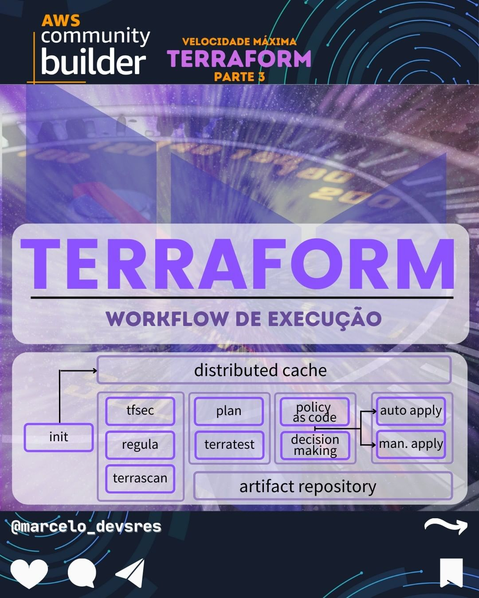

Você já teve que desenhar um fluxo de execução de Terraform para alguém? Como você fez?

Na teoria, Terraform parece algo simples. Na prática, pode ser o terror das implementações que não foi pensada adequadamente - em especial pela sua atipicidade no que diz respeito aos testes e manutenção evolutiva dos códigos.

Neste post, vamos entender o básico para poder partir para abordagens que sejam capazes de atender às necessidades reais.

#terraform #devops #cloudnative #linux #devsres

# Post 
[https://www.instagram.com/p/Cb_K3TWrZ1k](https://www.instagram.com/p/Cb_K3TWrZ1k)

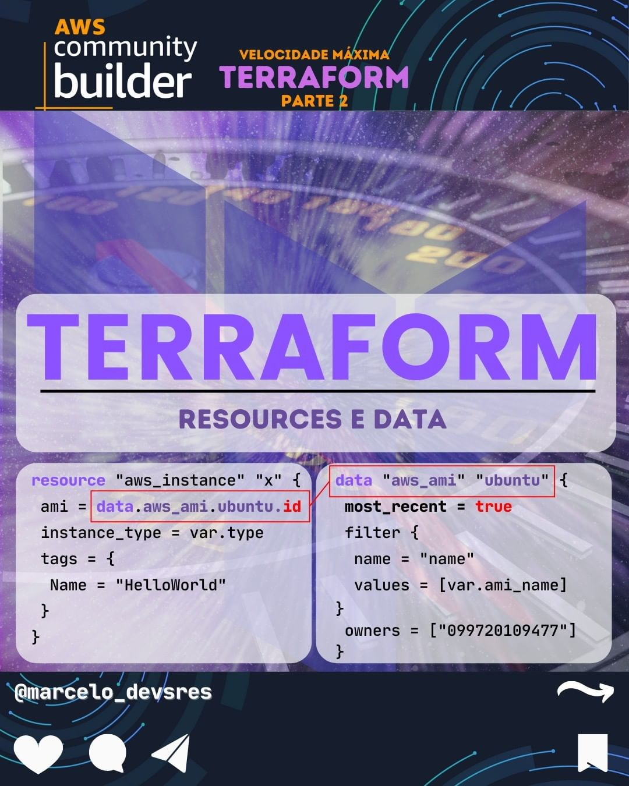

Antes de acelerar, às vezes é necessário engatar a primeira marcha.

Aprender uma tecnologia nova é um eterno conflito entre escolher em que pontos se demorar e quais outros você pode acelerar para ver depois.

O mais importante é ter a noção dos objetivos concretos. Exemplificando com o Terraform: é necessário entender bem o workflow, inclusive seus pontos fracos e de atenção especial para poder saber se é plausível de se aplicar na sua empresa.

Mas não dá para fazer isso sem ter algum alicerce. Então vamos lá criar uma VM na AWS, batendo em todas as dificuldades possíveis!

#terraform #devops #cloudnative #linux #devsres

# Post 
[https://www.instagram.com/p/Cb86-derUiS](https://www.instagram.com/p/Cb86-derUiS)

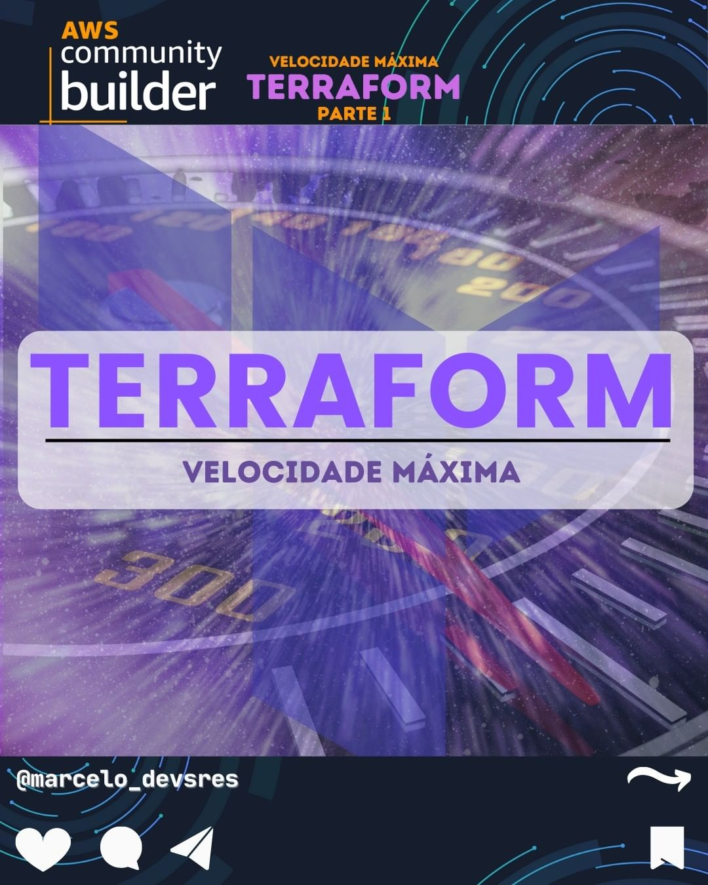

Você já sabe tudo que quer sobre Terraform?

Começa hoje a "Semana Terraform Velocidade Máxima". E o que você precisa fazer para acompanhar? Só clicar no "Follow". Vou postar tudo por aqui.

Sempre me perguntam como eu faço para estudar as tecnologias com as quais eu trabalho. Vou tentar explicar, em vez de perder horas tentando descrever, usando um estudo de caso: o Terraform.

Como seria se meu primeiro contato com o Terraform fosse hoje?

Espero que curtam!

Ps: dois posts no mesmo dia? ZOMG.

#terraform #devops #cloudnative #linux #devsres

# Post 
[https://www.instagram.com/p/Cb71_-0Lv0S](https://www.instagram.com/p/Cb71_-0Lv0S)

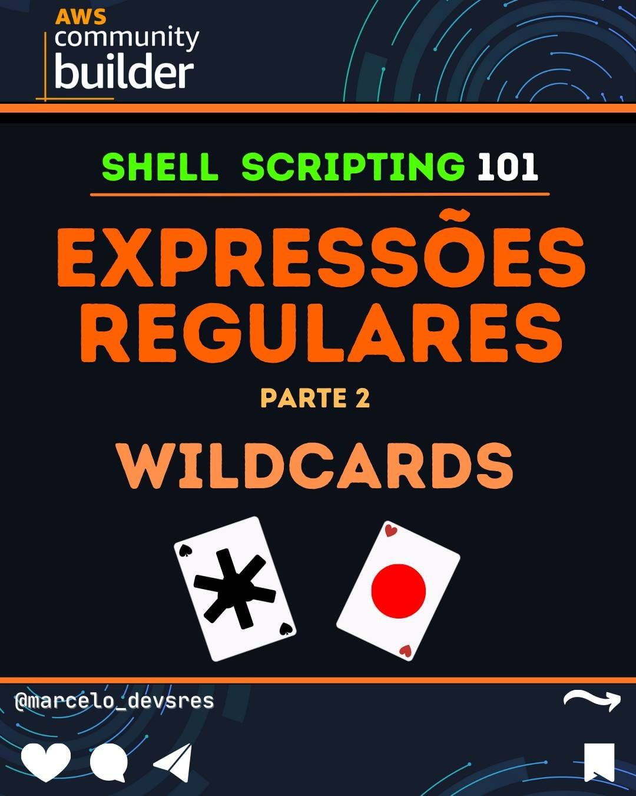

Qual o wildcard, em expressões regulares, que substitui qualquer caractere? Será que você acerta?

De maneira bem contraintuitiva com o que a maioria das pessoas esperam, talvez o seu chute imediato não funcione nas expressões regulares POSIX.

Mais que isso, é importante dissociar o conceito de *wildcard* de *quantificador* - este segundo conceito eu deixei para o próximo post.

Está pronto para conhecer o funcionamento de 3 dos caracteres especiais que apresentei no post anterior?

#bash #linux #devops #cloud #devsres

# Post 
[https://www.instagram.com/p/Cb0AwJrrCCQ](https://www.instagram.com/p/Cb0AwJrrCCQ)

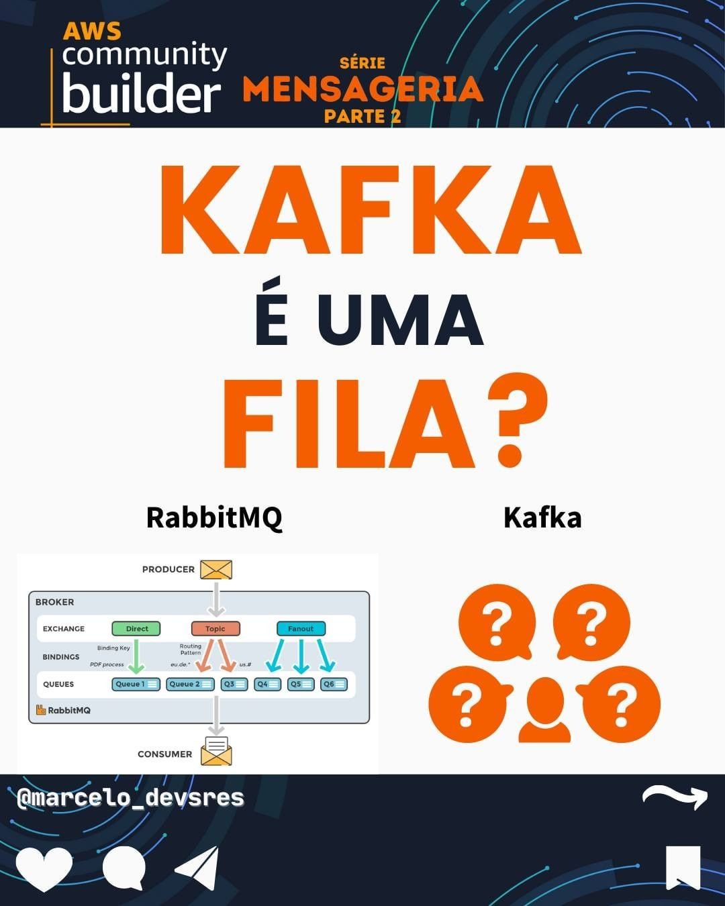

Você acha que o Kafka é uma fila?

Vamos analisar essa pergunta sobre a ótica das "filas comuns" dos softwares de mensageria que comumente as pessoas trabalham.

O que você achou da análise? Concorda? Discorda? Me conta aí!

#kafka #devops #cloud #devsres

# Post 
[https://www.instagram.com/p/Cbdsh3qNhUw](https://www.instagram.com/p/Cbdsh3qNhUw)

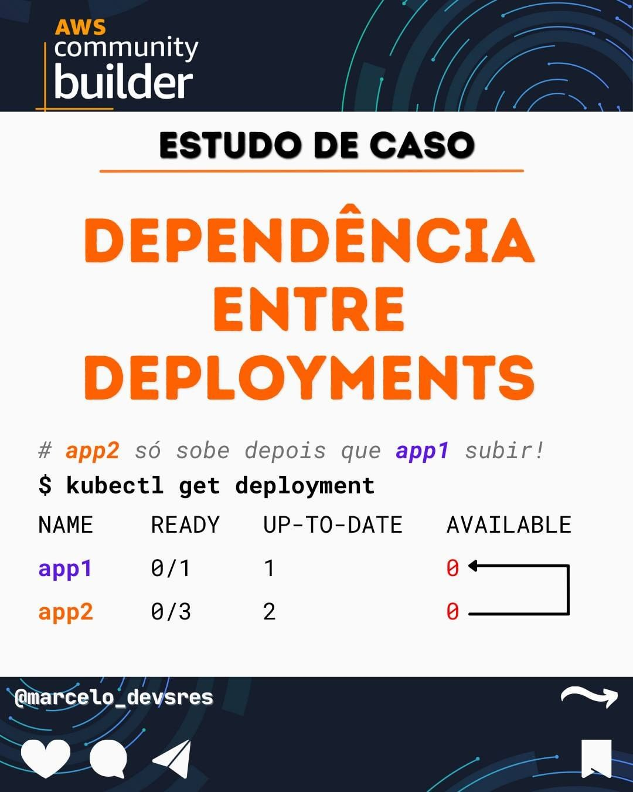

Você sabe implementar dependências entre deployments para garantir que um só comece a executar seus Pods após o outro?

Na última live do Twitch, um de nossos queridos membros da audiência trouxe este problema, e gostaria de saber como resolvê-lo.

Indiquei que não há uma solução formal por parte do Kubernetes "Vanilla" (i.e., sem "modificações") para mapear essas relações de dependências - o que não quer dizer não temos alternativas para atendê-lo!

Tem alguma dúvida de Kubernetes? Aparece lá na live que a gente tira.

Mas e aí? Qual solução você aplicaria? Concorda com a minha conclusão final?

#kubernetes #k8s #devops #cloudnative #devsres

# Post 
[https://www.instagram.com/p/CbL3oz9lEaY](https://www.instagram.com/p/CbL3oz9lEaY)

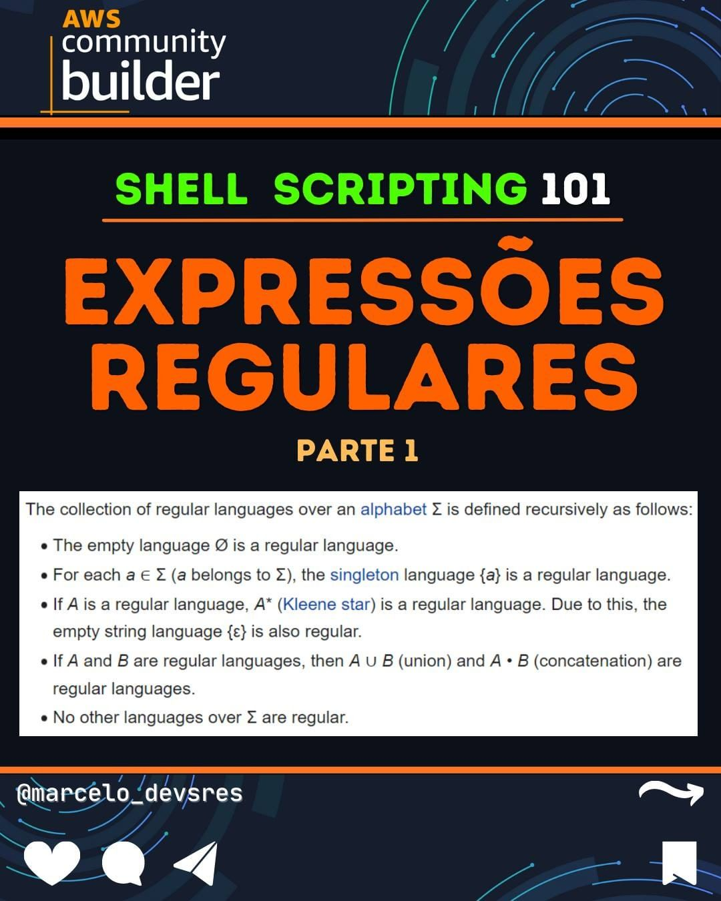

Você sabia que há uma formalização teórica científica para expressões regulares?

Um matemático chamado Kleene possivelmente é o  responsável pelo * ter esse significado quase universal na computação.

Mas tudo bem, quando eu falo em "um pouco de teoria", não estou falando de estudarmos o teorema de Kleene e autômatos finitos para aprender expressões regulares; eu quero dizer que precisamos entender um pouco das várias "famílias" de expressões regulares que existem para definir o conjunto das regras do jogo do que vamos aprender.

O post de hoje talvez seja uma leitura meio assustadora, mas prometo que os próximos terão um foco maior em "legibilidade".

Espero que curtam!

#linux #devops #shellscript  #bash #regex #devsres

# Post 
[https://www.instagram.com/p/CbG0wa5J_ss](https://www.instagram.com/p/CbG0wa5J_ss)

O resultado da enquete sobre Kafka foi quase um uníssono: sim, queremos Kafka!

Antes de efetivamente falar de Kafka, entretanto, acho que seria interessante falar de mensageria de uma forma mais abrangente para entender em qual contextos o Kafka se destaca.

Embora eu ache esse nome extremamente infeliz, entender a ideia de "mensageria" e os paradigmas associados são essenciais para o desenvolvimento "cloud native" de aplicações escaláveis, resilientes e que podem fazer aquele diferencial no currículo de quem está começando!

Espero que curtam!

#cloudnative #devops #devsres

# Post 
[https://www.instagram.com/p/Ca8HU9fr0yr](https://www.instagram.com/p/Ca8HU9fr0yr)

Acho que o meu post mais popular deste perfil foi o "Troubleshooting real Kubernetes: Você sabe achar a causa?".

Naquele post, eu menciono que no "Runbook" de soluções, uma das possíveis causas do problema é falha no metrics-server, o que não era o caso naquele momento.

Recentemente, alguém me reenviou aquele post e perguntou "que história é essa do metrics server derrubar o cluster".

Hoje eu explico justamente essa história, mostrando como o metrics-server estende a API do Kubernetes por meio de um bem pouco conhecido recurso chamado de apiservice.

Espero que gostem.

#kubernetes #cka #devops #cloudnative #devsres

# Post 
[https://www.instagram.com/p/CaYeVlmLW6P](https://www.instagram.com/p/CaYeVlmLW6P)

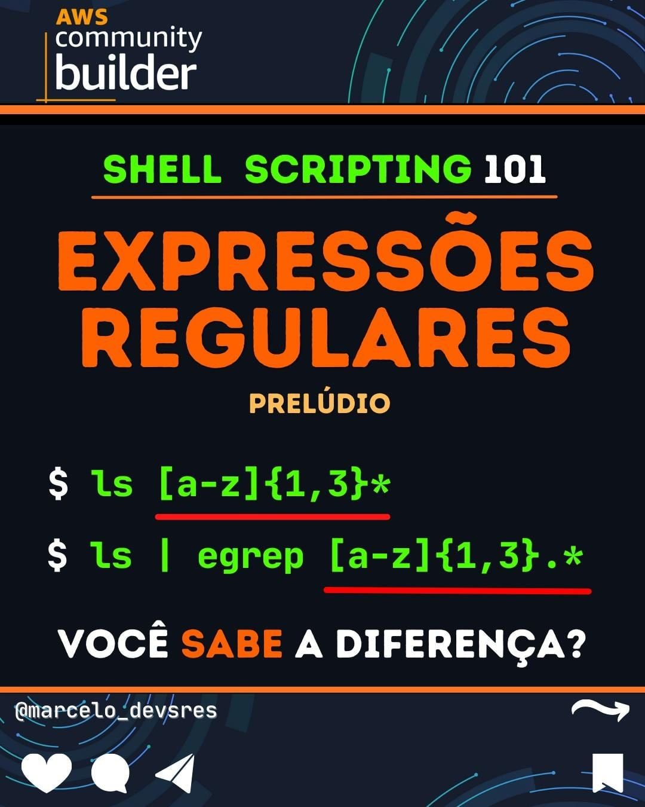

No Linux, antes de aprender andar, aparentemente você precisa aprender a voar!

Mas não é bem assim. Eu entendo que, para entender resultados hoje, muito do aprendizado de base acaba ficando para trás. Mas seria importante você entender que o shell Linux executa diversas operações diferentes ao interpretar seus comandos, entre expansões, substituições, uso de palavras reservadas e operadores.

Na verdade, acho que estou fazendo errado para quem gostaria de aprender da maneira menos dolorosa de aprender: a melhor maneira de estudar expressões regulares é *fora do shell Linux*. Seja em alguma linguagem de programação ou mesmo em um editor de texto sem a complexidade do bash para levar em consideração. Assim você pode se dedicar apenas ao assunto em questão, em vez de ter que se preocupar se tal caractere será expandido e você precisa "escapá-lo".

Mas você está no meu perfil. Aqui, fazemos as coisas do meu jeito. Por isso, vamos a um post inteiro dedicado a mencionar que o shell usa diversos dos metacaracteres que precisaremos para trabalhar expressões regulares, mas não implementa expressões regulares*.

Entendam isso antes de partirmos para as regex!

#linux #bash #devops #devsres

(* com uma única exceção, que deixei propositalmente de fora, mas a gente chega lá!)

# Post 
[https://www.instagram.com/p/CaQqZ3bMOhC](https://www.instagram.com/p/CaQqZ3bMOhC)

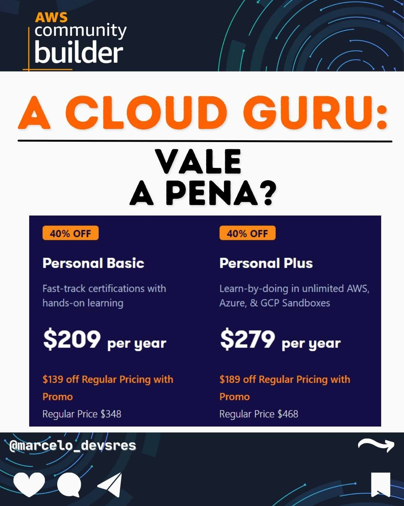

Plantão do desconto: A Cloud Guru vale a pena?

A Cloud Guru é a principal recomendação dos fóruns de discussão gringos - até porque o custo é relativamente irrelevante para quem tem o poder econômico "superior". Mas para os nossos bolsos, é um curso "prermium".

Vale a pena pagar preço "premium" por um monte de vídeos gravados de Cloud?

Confira no post aí a minha opinião sobre o assunto.

Como uma nota não relacionada: se você acha A Cloud Guru caro, compare os recursos que eles oferecem sempre que você for adquirir cursos por aí, sejam estrangeiros ou nacionais. Muito curso caro nacional não oferece nem 1/100 do que eles entregam, mas cobram quase o mesmo preço.

#cloud #devops #devsres

# Post 
[https://www.instagram.com/p/CaLMOgxrKey](https://www.instagram.com/p/CaLMOgxrKey)

Uma pergunta interessante, para quem olha "de fora": um SRE faz trabalhos operacionais?

A resposta é sim, mas a ideia por trás do trabalho operacional é diferente.

Na TI tradicional, não é incomum você construir uma hierarquia de suporte a operações em vários níveis, com diferentes graus de capacidade técnica para lidar com os problemas. À medida que um incidente ou chamado evolui, ele pode ir transitando de mão em mão até chegar à equipe apta para resolvê-lo. 

Em uma empresa que segue o ITIL, por exemplo, um *Incidente* pode ser sanado sem qualquer tipo de ação a ser tomada a posteriori. Em caso de repetidos incidentes com possível causa raiz comum, um *Problema* pode ser aberto para que uma equipe defina efetivamente que melhorias precisam ser implementadas. Dependendo do processo, pode demorar meses para acontecer.

A ideia de posicionar um SRE na linha de frente dos acionamentos, atendendo tanto a incidentes quanto a requisições de serviço (tickets) de seus ambientes é posicionar o engenheiro responsável pela operação frente à frente com a operação, para que ele possa identificar oportunidades de melhoria na confiabilidade e disponibilidade do ambiente e gerar um backlog para seu próprio time, sempre com ênfase em melhorar o sistema como um todo.

Espero que estejam curtindo a série sobre a ideia do que é SRE!

#sre #devops #cloudnative #sysadmin #devsres

# Post 
[https://www.instagram.com/p/CaI1hkLrEKw](https://www.instagram.com/p/CaI1hkLrEKw)

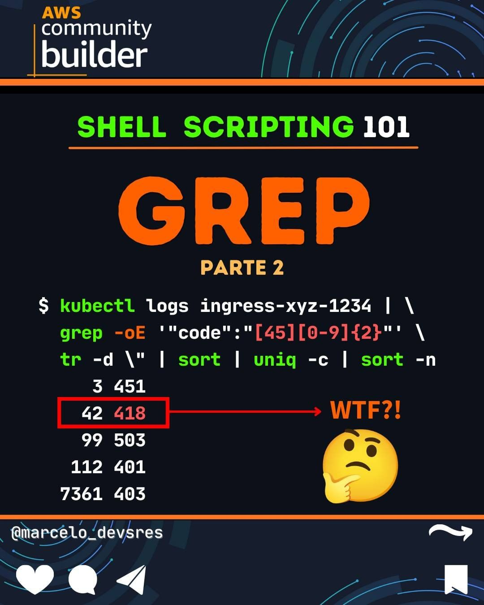

Grep parte 2! Agora com mais shell scripting!

Demorou mas saiu, vai mais algumas dicas úteis de como usar o grep de maneira mais efetiva no seu dia a dia. 

O objetivo deste post é encerrar com as linhas de comando e apresentar uma das opções que usaremos amplamente nas lições de Expressões Regulares!

Você quer aprender Expressões Regulares?

Então curta o post e comenta pedindo, ou vou achar que ninguém liga e deixar para lá!

#devops #bash #linux #sysadmins #devsres

# Post 
[https://www.instagram.com/p/CZwzFoFNEq5](https://www.instagram.com/p/CZwzFoFNEq5)

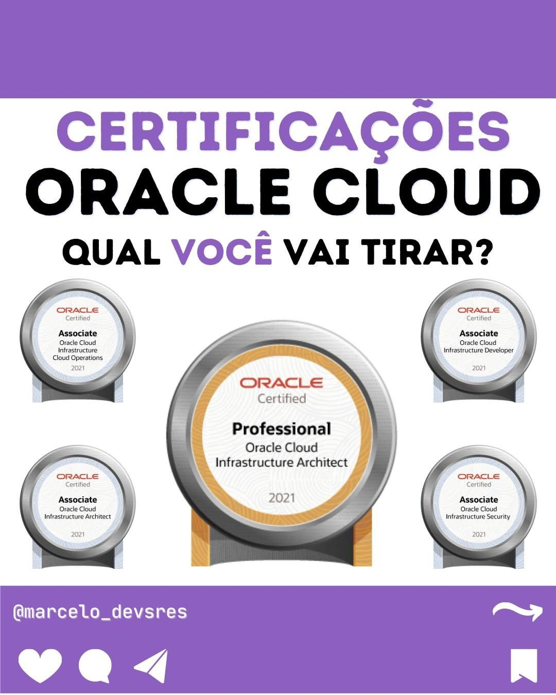

Algumas dicas para as provas de certificação da Oracle, que estão disponíveis gratuitamente até o fim de fevereiro.

Quer dizer, se você já agendou, porque acredito que não há mais datas para agendamento daqui para o fim do mês - será que a Oracle adia novamente?

Aqui dou alguns insights sobre as 5 provas disponíveis para a categoria Oracle Cloud Infrastructure, em especial do que esperar em termos de conteúdo. 

A aprovação em qualquer um dos exames dependerá especialmente dos conhecimentos comuns listados na segunda imagem, listados em ordem de importância. Depois de ler o máximo de documentação de cada item, vale a pena especializar nos serviços relevantes de cada prova.

As dicas vão de óbvias (Cloud Guard deve ser cobrado na prova de segurança) a não tanto assim (veja a parte de Developer!). E quando eu cito que Kubernetes e Terraform são assuntos, não estou falando apenas de teoria, mas você pode ser cobrado de comandos e conceitos altamente específicos dessas tecnologias.

Espero que o conteúdo ainda seja útil para alguém!

#devops #cloud #oci #devsres

# Post 
[https://www.instagram.com/p/CZmrcayuzEo](https://www.instagram.com/p/CZmrcayuzEo)

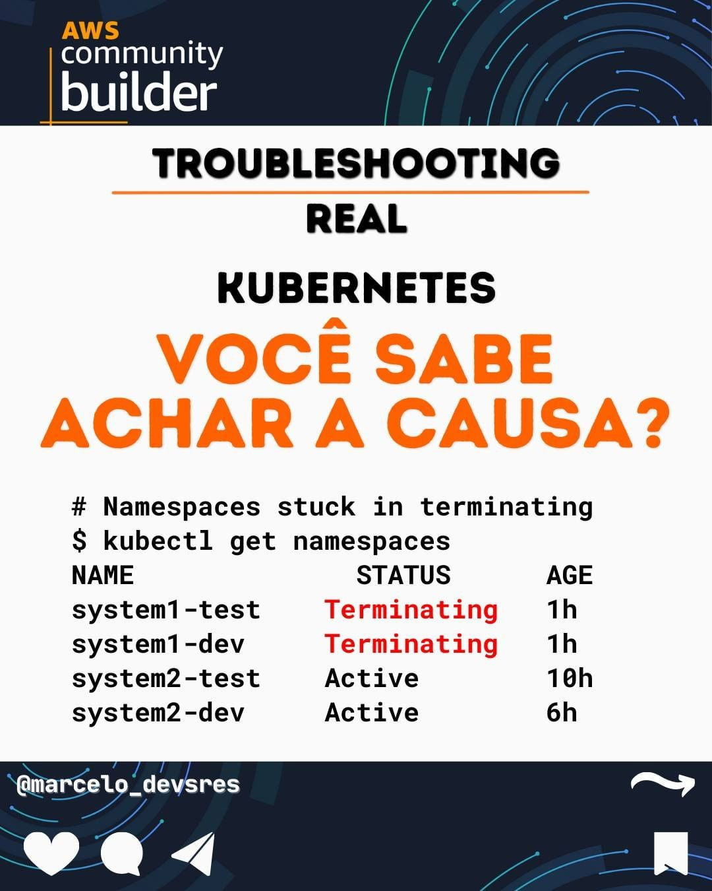

Como um time SRE resolveria esta bronca de Kubernetes? Você sabe o que pode estar acontecendo?

Cola aí que você vai curtir - não é o tipo de conteúdo que você vai ver normalmente por aqui!

Primeiro, vamos usar um pouco do "linguajar SRE": se tiver alguma dúvida com os termos usados, pergunta aí! O que não vimos até agora veremos à medida que a série sobre SREs progrida.

Se o seu time é responsável por manter clusters Kubernetes, é imprescindível entender como todas as "partes móveis" funcionam, para evitar descartar problemas com testes inadequados - como os descritos neste post.

Me conta aí se você aprendeu algo novo hoje comigo! Se foi o caso, aproveita e siga as instruçòes da última tela para dar aquela força!

#kubernetes #sre #devops #cloudnative #devsres

# Post 
[https://www.instagram.com/p/CZj7HaItP2F](https://www.instagram.com/p/CZj7HaItP2F)

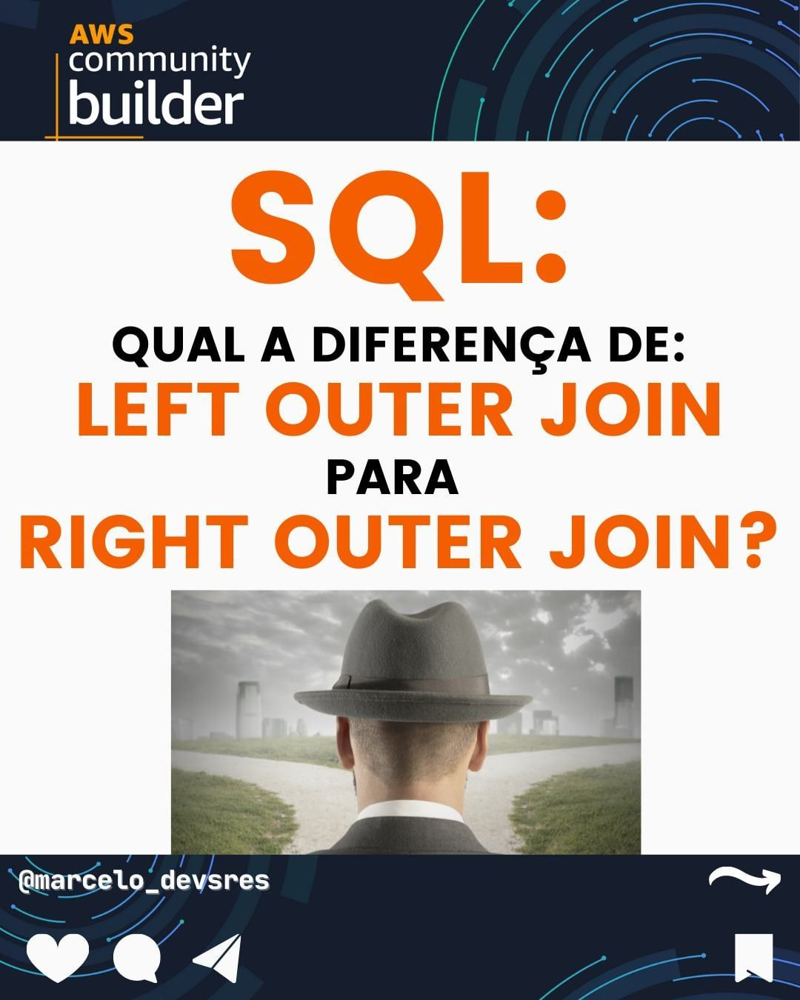

Recentemente, tive que lidar com um time Ops que falou: "a gente não precisa saber SQL". Você concorda ou discorda?

É um post atípico, eu concordo, mas achei relevante pontuar este assunto.

Não sou nenhum super DBA nem especialista em bancos de dados, mas entenda: SQL tem uma penetração muito maior que apenas ser usado para consultar bancos de aplicações por desenvolvedores backend. Quer um exemplo? Rola o feed do meu perfil um pouco para baixo e procura as três maneiras de você usar SQL para consultar arquivos texto no Athena - algo que você pode precisar para acessar logs de auditoria rapidamente.

# Post 
[https://www.instagram.com/p/CZhWXcwu3x1](https://www.instagram.com/p/CZhWXcwu3x1)

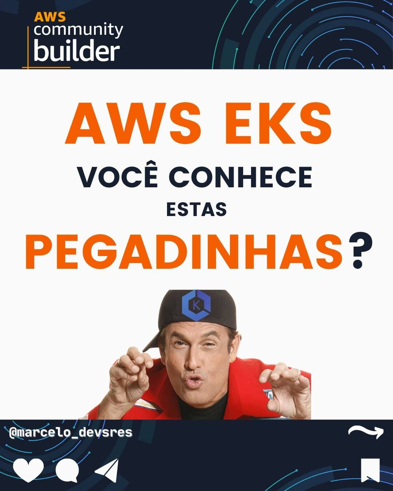

Aposto que você não conhece estas pegadinhas do EKS! 

Assistindo uma apresentação fechada de uma Youtuber, ela falou que é necessário aprender a jogar com os algoritmos das redes sociais. A partir de hoje, teremos apenas posts com títulos de Clickbait e , em um futuro bem próximo, talvez Reels! Vou fazer igual ao Sérgio Mallandro aí da capa e fazer uma harmonização facial também - com a idade, estou precisando!

Te peguei na zoeira! Na realidade, estava relembrando sobre estes assuntos em particular após investigar sobre um outro assunto para o meu artigo no Dev.to (https://dev.to/marcelo_devsres, link na Bio), e algumas particularidades deixam o queixo cair de tão bizarras!

Não gostou do Sérgio Malandro? Se quiser ler a versão séria, vai lá no dev.to.

Mas e ai, qual dessas você já conhecia?

#aws #eks #kubernetes #devops #devsres

# Post 
[https://www.instagram.com/p/CZexg7NpR3W](https://www.instagram.com/p/CZexg7NpR3W)

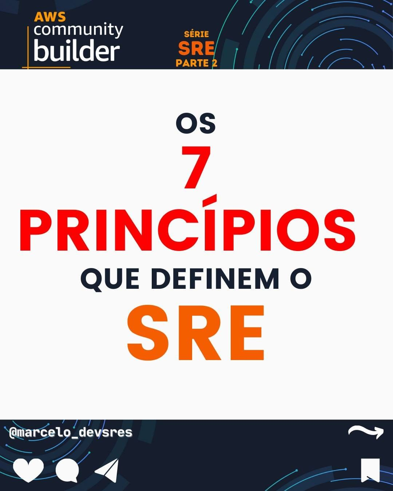

Você conhece os 7 pilares que norteiam o SRE?

Demorou, mas saiu! Aqui está a parte 2 da Série SRE, inspirada no livro Site Reliability Engineering - How Google Runs Production Systems.

SRE já se transformou em um cargo nas mais variadas empresas, basta olhar no Linkedin. 

Naturalmente, poucas delas se assemelham ao Google e efetivamente tratam SRE exatamente como foi originalmente idealizado. 

Como é daqui que vem a inspiração, é importante decifrar exatamente o que fez essa sigla de três letras tão especial a ponto de se transformar em um padrão de mercado. Só assim é possível ter uma ideia do que te espera em uma vaga dessa natureza, ainda que, talvez, sutilmente diluida para uma realidade mais próxima das "pessoas comuns".

#sre #devops #devsres

# Post 
[https://www.instagram.com/p/CY_yhbtrwIO](https://www.instagram.com/p/CY_yhbtrwIO)

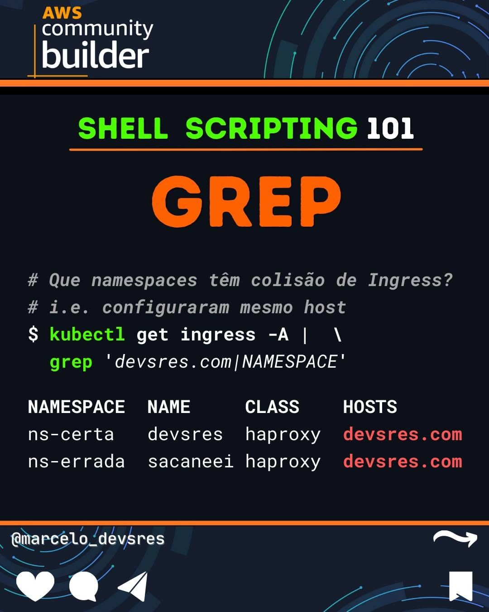

Ah... grep, um daqueles comandos de nome obscuro que basicamente faz dela um novo sentido, um novo substantivo e até mesmo um novo verbo ("grepa esse negócio aí").

Eu poderia fazer uma sequência de imagens explicando de onde veio o nome (uma operação do editor ed, g/re/p) e dando um ou dois exemplos sem graça, como todos os outros fazem, mas você não está neste perfil para isso, certo?

Acompanhe-me enquanto te mostro algumas das flags mais legais do grep que talvez você ainda não conheça.

Provavelmente faça um outro post com mais flags, já que aqui não deu para cumprir nem com a metade do que eu queria!

Quer MAIS grep? Comenta aí!

#linux #devops #sysadmin #devsres

# Post 
[https://www.instagram.com/p/CYtzIGIl6Pu](https://www.instagram.com/p/CYtzIGIl6Pu)

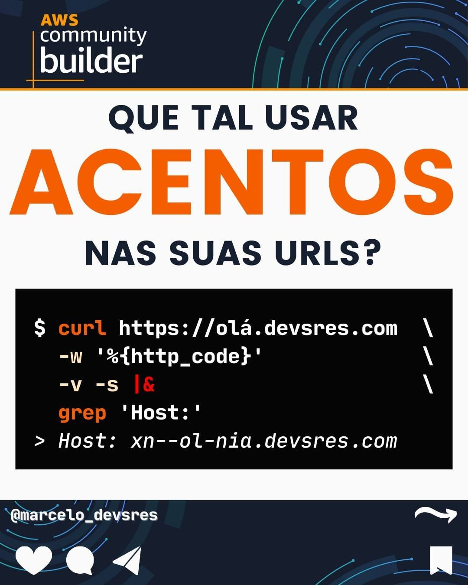

Em uma nota completamente não relacionada: domínios e URLs com acentos!

Você já viu alguma? Não? Sabia que dá para registrar domínios com acentos (e já faz um tempinho?).

Achou estúpido e desnecessário? Bem, muita gente não acha, em especial os asiáticos:  o domíno рф foi um sucesso estrondoso de registros no seu lançamento, e só a índia conta com 7 top level domains em IDN disponíveis: .ভাৰত, .ভারত, .भारत, .భారత్, .ભારત,.ਭਾਰਤ, .ଭାରତ e .இந்தியா.

Temos opções em árabe (لسعودية.), chinês (中国 e 中國) e coreano (.한국). A Grécia (ελ) também tem o dela, bem como a União Européia (ευ).

Enfim, se isso não te motivou o suficiente, pelo menos entenda como funciona aqui neste post, especialmente porque não é incomum ter que lidar com isso do ponto de vista de segurança de sistemas.

#devpos #devsres

# Post 
[https://www.instagram.com/p/CYeVZQwJlKM](https://www.instagram.com/p/CYeVZQwJlKM)

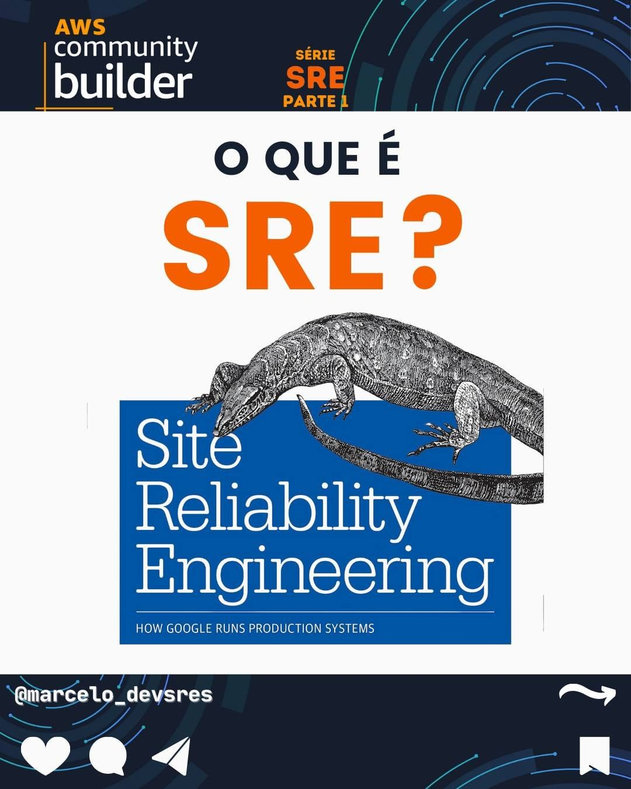

O que é um SRE? O que faz um SRE?

Decidi fazer uma série de posts para tentar ajudar você a entender o que é o tal do "SRE", aparentemente um tipo de profissional excepcionalmente desejado no mercado mas que pouca gente consegue explicar exatamente o que é.

Infelizmente, como eu sofro de sérios problemas de capacidade de síntese, não vou conseguir explicar em um único post o que é um SRE - ou mesmo Devops. Por duas razões:

- Existe um "gap" entre o sentido original de ambas as palavras e o que é praticado hoje no mercado.

- As necessidades das empresas variam em níveis absurdos, em especial no que diz respeito à excelência operacional e níveis de maturidade tecnológicos; 

É bastante comum acreditar que uma solução idealizada por um líder de mercado ou empresa de referência seja a resposta definitiva para um problema. Normalmente não é o caso: a adesão de algumas práticas podem depender de pré-requisitos ou premissas que sua empresa não atende ou não está disposta a atender.

Ainda assim, é relevante entender as metodologias adotadas - em especial suas origens - para tentar buscar alguma alternativa para melhoria contínua.

Espero que gostem deste post introdutório! Se quiser ler o resto, não esquece do follow!

#sre #devops #cloudnative #devsres

# Post 
[https://www.instagram.com/p/CYAQK1PB9jF](https://www.instagram.com/p/CYAQK1PB9jF)

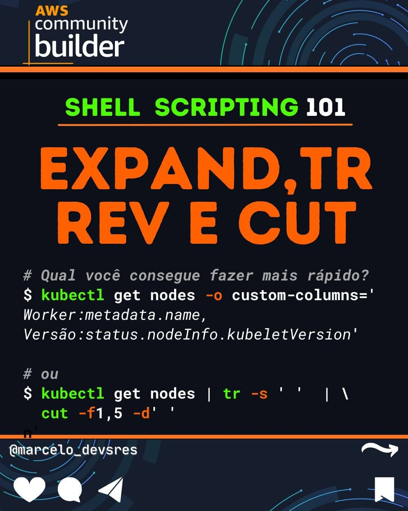

Shell scrips Linux: fazendo ETL antes de ETL ser "cool"!

No Linux, tudo é "arquivo". Por isso, temos dezenas (centenas?) de programas apropriados para lidar com arquivos e "streams" livres. Provavelmente existe um programa para cada necessidade obscura que você possa ter na linha de comando.

Isso é excepcionalmente útil, já que grande parte do trabalho é executar comandos, adequar suas saídas para que "encaixem" como entradas válidas para os próximos comandos.

Antes de seguirmos para exemplos mais complexos (como, por exemplo, gerar jsons em linha de comando para posts com curl :O), vamos analisar alguns velhos conhecidos para os usos mais convencionais das suas necessidades de scripts em bash.

#linux #bash #shellscripting #devsres

# Post 
[https://www.instagram.com/p/CXmgN07t3LH](https://www.instagram.com/p/CXmgN07t3LH)

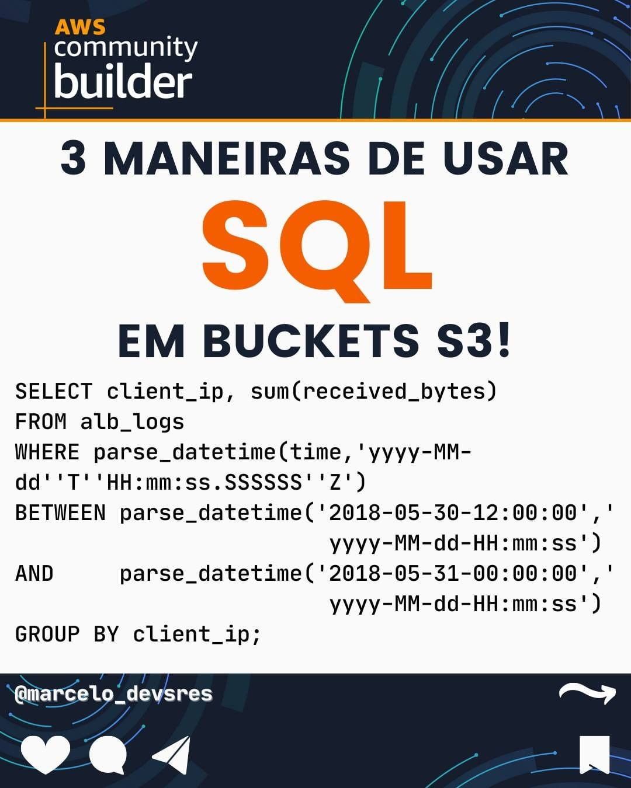

Essa vai para a galera que diz que SQL está morto! Que tal usar SQL para consultar arquivos armazenados nos buckets S3?

Claro que, idealmente, você não deve depender de algo desse tipo para visuar e analizar seus logs. Mas quando a necessidade surgir, você sabe se virar?

Se você tem interesse em AWS, provavelmente já se deparou com alguns dos problemas que eu descrevo neste post. E se você estuda para as provas, provavelmente conhece uma das maneiras que eu listei aqui. 

E as outras duas, você conhecia?

#aws #cloud #devops #devsres

# Post 
[https://www.instagram.com/p/CXj7bTAsuHJ](https://www.instagram.com/p/CXj7bTAsuHJ)

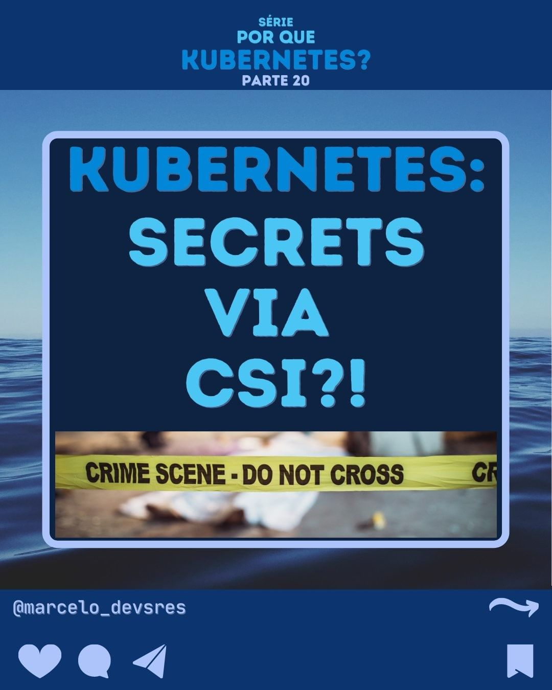

Como você lida com Secrets no Kubernetes?

Não é necessariamente uma novidade, mas apresento uma alternativa não tão conhecida para a solução do problema de integrar clusters Kubernetes com sistemas de armazenamento especializados em segurança, como os vários "vaults" dos Cloud providers ou o software da Hashicorp.

Talvez eu tenha "pulado etapas" e devesse mostrar as demais alternativas antes, mas inclusive do ponto de vista "gitops", acredito que o Secrets Store CSI driver é a opção mais interessante que vi para lidar com o assunto.

#kubernetes #security #aws #devops #devsres

# Post 
[https://www.instagram.com/p/CXPn21HNKzy](https://www.instagram.com/p/CXPn21HNKzy)

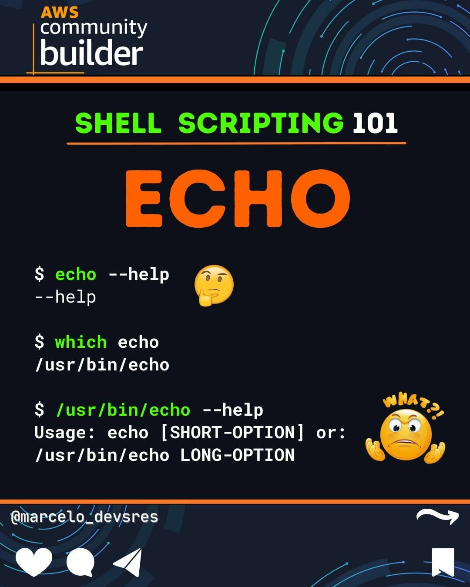

Revisitando o básico!

Você certamente já usou o comando echo alguma vez. Mas... você sabe explicar o que está acontecendo aí na imagem da capa? Se não, acredito que vale a pena dar uma olhadinha no resto  do post!

Não há muito o que explorar sobre o comando echo; ainda assim, espero que gostem do compilado!

#bash #linux #devops #devsres

# Post 
[https://www.instagram.com/p/CXMwRM3rAk6](https://www.instagram.com/p/CXMwRM3rAk6)

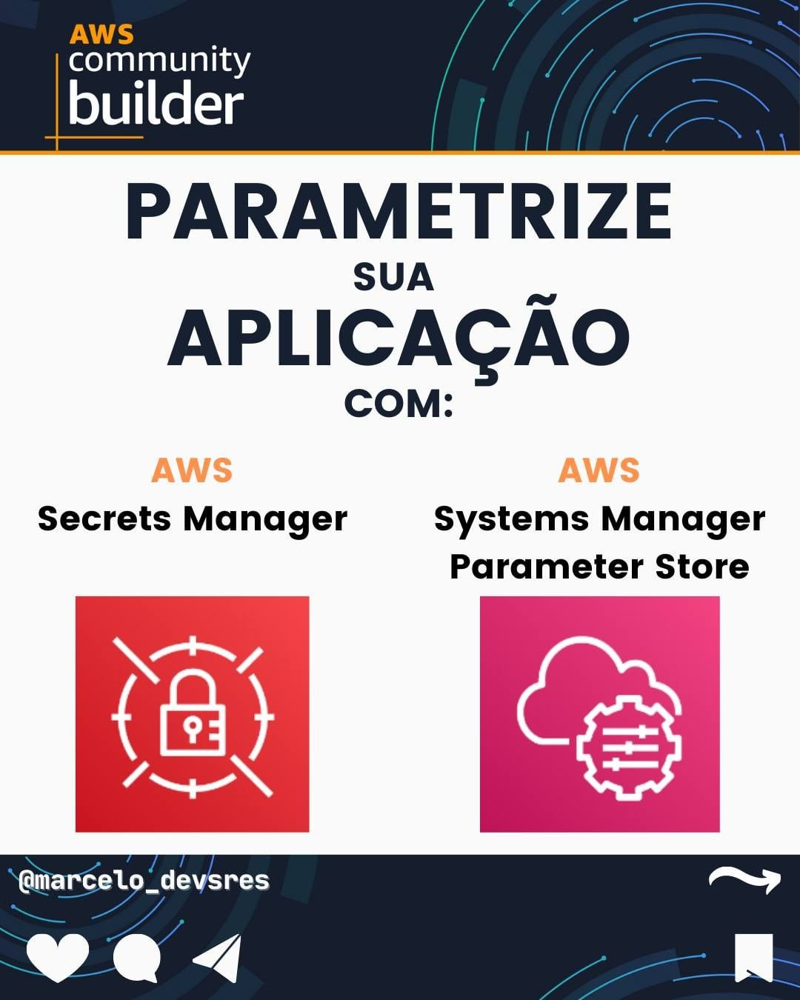

Como desacoplar as configurações das suas aplicações na AWS?

Preciso introduzir este tema para poder abordá-lo na série de Secrets de Kubernetes! Então vamos lá!

Temos dois serviços para esta finalidade: O Secrets Manager, mais simples, imediato, conveniente  e intuitivo para essa finalidade (e também mais caro!).

Mas também podemos usar um dos submódulos do Systems Manager, a suíte de administração de ambientes da AWS. O SSM conta com uma seção conhecida como Parameter Store, bem completa (e mais complexa!) que o Secrets Manager, que oferece funcionalidades muito semelhantes - e o melhor, na maioria das vezes, de *graça*! Assim fica difícil competir, certo?

Apresento um pouco das duas soluções da AWS hoje. Você já usou alguma delas?

Atenção: não confundir o AWS KMS, serviço de chaves criptográficas (amplamente usado por ambos os serviços) como serviço de armazenamento de parâmetros. Ele *não* faz isso!

#aws #cloud #cloudarchitect

# Post 
[https://www.instagram.com/p/CXKLeU5tYc5](https://www.instagram.com/p/CXKLeU5tYc5)

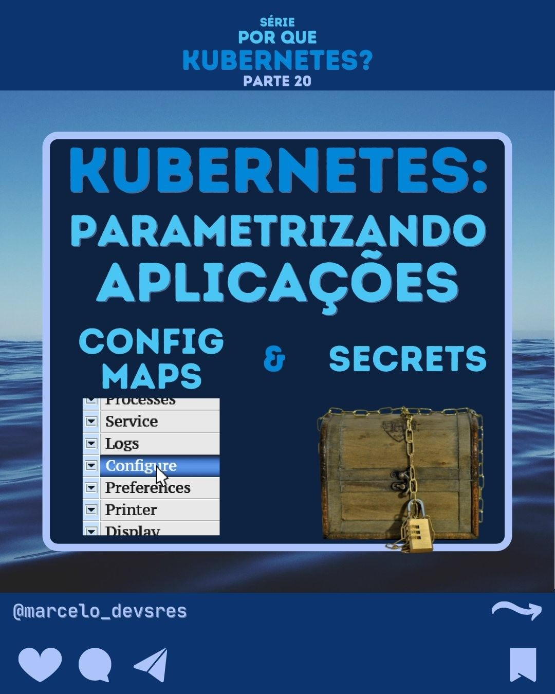

Como parametrizar minhas aplicações em clusters Kubernetes?

Semana passada, fiz uma enquete em que perguntei o que vocês queriam ver por aqui. Foram poucas resposta (6, salvo engano), mas quase todas pediram a mesma coisa: fale de segurança.

Portanto, vou encerrar a série "Por que Kubernetes?" com este post sobre parametrização de aplicações com ConfigMaps para poder abordar um dos assuntos que é a maior fonte de dor de cabeça do ponto de vista de segurança: os Secrets!

Os Secrets tem basicamente um único propósito, que é isolar os dados sigilosos dos não sigilosos. Assim como execução de containers, redes e armazenamento, o Kubernetes não quer resolver o problema de armazenamento de Secrets: ele quer *delegar* essa responsabilidade para alguém que faça isso bem.

Nas próximas semanas, vamos ver algumas opções para viabilizar o uso de Secrets de maneira segura em ambientes de cloud e on-prem!

#kubernetes #devops #cloudnative #k8s #devsres

# Post 
[https://www.instagram.com/p/CXCdFO2tJwY](https://www.instagram.com/p/CXCdFO2tJwY)

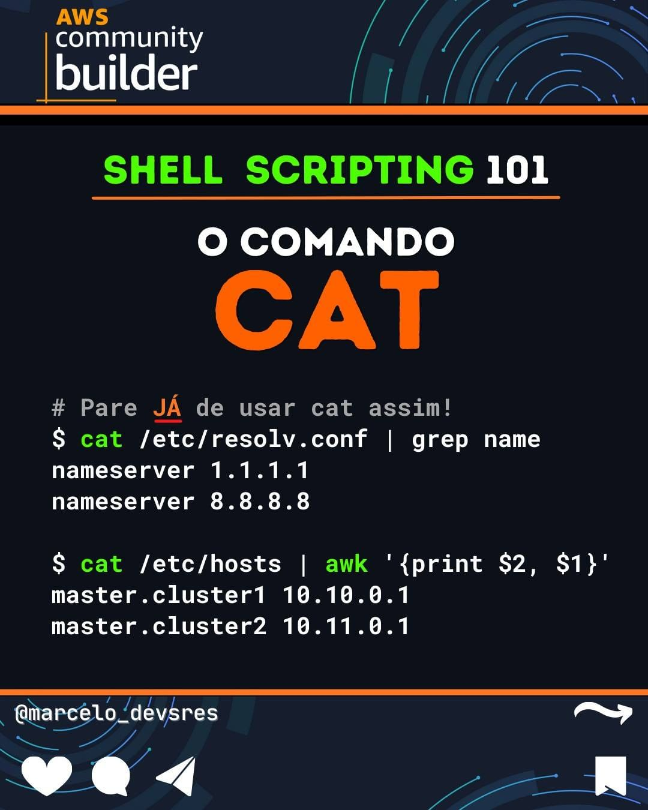

Você quer aprender shell scripts em Bash? 

Para aprender a programar em uma linguagem, você precisa aprender a sintaxe e as diversas bibliotecas/módulos/pacotes disponíveis, tanto builtins quanto as elaboradas por outras pessoas.

O Shell Linux não é diferente. Você tem as estruturas de controle, e você tem as "bibliotecas", que pode ser literalmente qualquer comando disponível no sistema operacional.

Normalmente, nas linguagens, você aprende primeiro as estruturas de controle, e depois a usar as bibliotecas. No Linux, acredito que o melhor caminho é entender um conjunto de comandos do tipo "pau para toda obra" primeiro, aceitar as funcionalidades e limitações, posteriormente passando para integrá-los em códigos harmônicos em shell scripts.

Vamos falar do cat hoje?

#bash #linux

# Post 
[https://www.instagram.com/p/CW-98ABonlk](https://www.instagram.com/p/CW-98ABonlk)

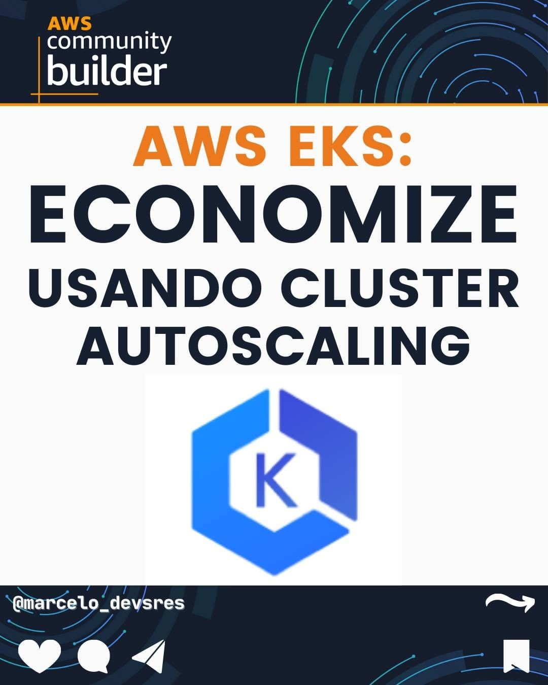

O Kubernetes é um excelente "framework" de infraestrutura para lançar suas aplicações. Ele pode instanciar mais réplicas para atender a demanda crescente, e pode remover instâncias ociosas para gerar economia.

Mas... espera aí: gera economia mesmo? Se eu estiver usando instâncias EC2, eu pago por instância, não por consumo de processamento. E o Kubernetes não oferece uma maneira de escalar clusters nativamente!

Neste post, falo sobre o Kubernetes Cluster Autoscaler, a solução normalmente usada para esta finalidade. E especificamente tratando de clusters Kubernetes na AWS, apresento o Karpenter, software que já existe há algum tempo, mas apenas recentemente foi considerado "GA" e pronto para produção.

#kubernetes #eks #devops #cloud

# Post 
[https://www.instagram.com/p/CW8cyKXMsZs](https://www.instagram.com/p/CW8cyKXMsZs)

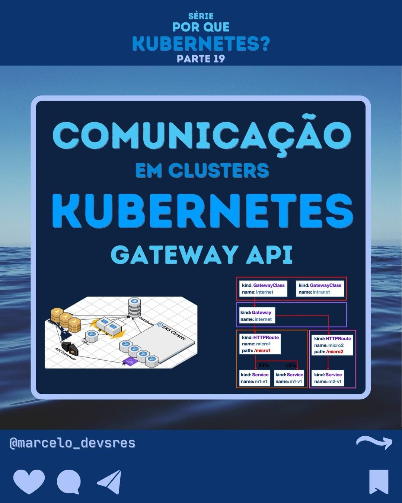

O último post relevante da série Comunicação em Clusters Kubernetes fala sobre Gateway API, uma nova implementação do Kubernetes que tem como objetivo resolver alguns problemas históricos da abordagem atualmente usada para tráfego de entrada.

Esta funcionalidade ainda não é considerada pronta para uso, mas você pode testar (e contribuir!) com o modelo caso nenhum dos outros modelos seja capaz de atender você perfeitamente.

Ah, mas e qual a relação da Gateway API com os API Gateways? Bem, nada. Embora alguns conjuntos de funcionalidades possam parecer coincidentes, o modelo de Gateway API é bem mais abrangente, suportando TCPRoutes e UDPRoutes. Não menciono essas funcionalidades no post porque, no fim das contas, o importante é saber que essa API existe e provavelmente é o que você usará como padrão daqui a alguns anos.

#kubernetes #devops #cloud

# Post 
[https://www.instagram.com/p/CWZqeLxNS2m](https://www.instagram.com/p/CWZqeLxNS2m)

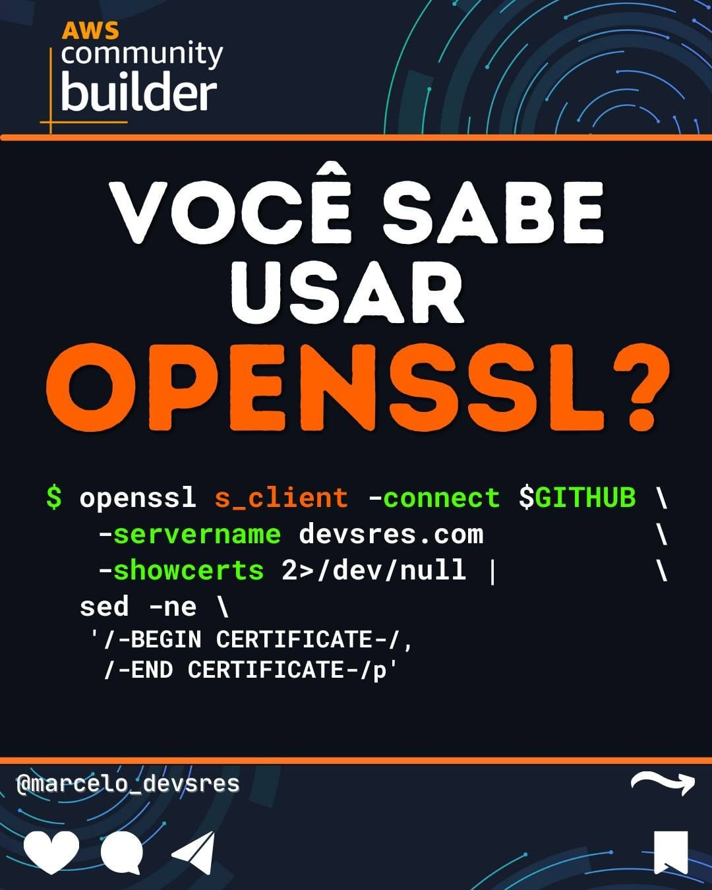

Você sabe usar Openssl?

Talvez você devesse aprender um pouco mais sobre este comando para ajudar nos seus processos de investigação de problemas. 

Não é incomum que programas falhem a maneira mais misteriosa possível quando conexões TLS falham em se estabelecer. Entender um pouco mais deste protocolo e de seu ecossistema de ferramentas pode te ajudar a fazer diagnósticos mais rápidos.

Como hoje é o dia do post prático, não vamos discutir tantos conceitos e teorias, e sim mão na massa com o comando openssl!

#linux #devops

# Post 
[https://www.instagram.com/p/CWWJXz2r4Gg](https://www.instagram.com/p/CWWJXz2r4Gg)

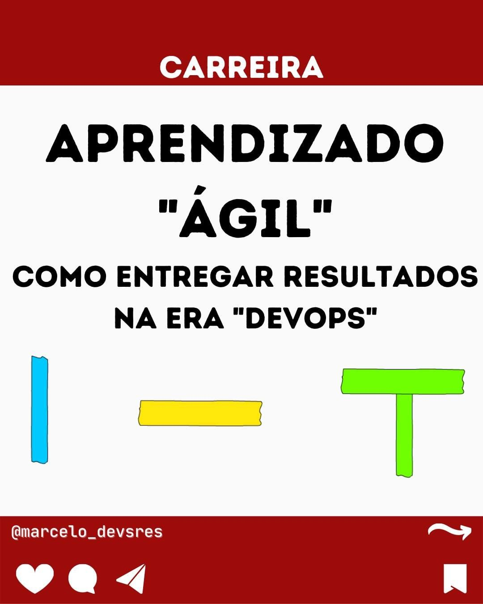

Como você estuda?

Como você faz para entregar resultados na época ridiculamente dinâmica em que vivemos?
Muita gente me pergunta como eu faço para estudar e entregar resultados no ritmo que eu entrego - i.e., trabalhar 12h por dia e ainda por cima tirar 12 certificações profissionais em 12 meses.

Não tem mistério: você tem que se dedicar ao que faz se quiser resultados, e isso não varia nem na profissão nem no hobby,. 

Se alguém te falasse que vale a pena deixar aquela balada de lado por 2 anos para garantir seus próximos 20 anos, você o faria?

Hoje vou compartilhar um conteúdo atípico com vocês: bases teóricas para o aprendizado que você deveria tentar usar consigo mesmo para se tornar um profissional melhor.

#devops #it

# Post 
[https://www.instagram.com/p/CWMk9WEFqz7](https://www.instagram.com/p/CWMk9WEFqz7)

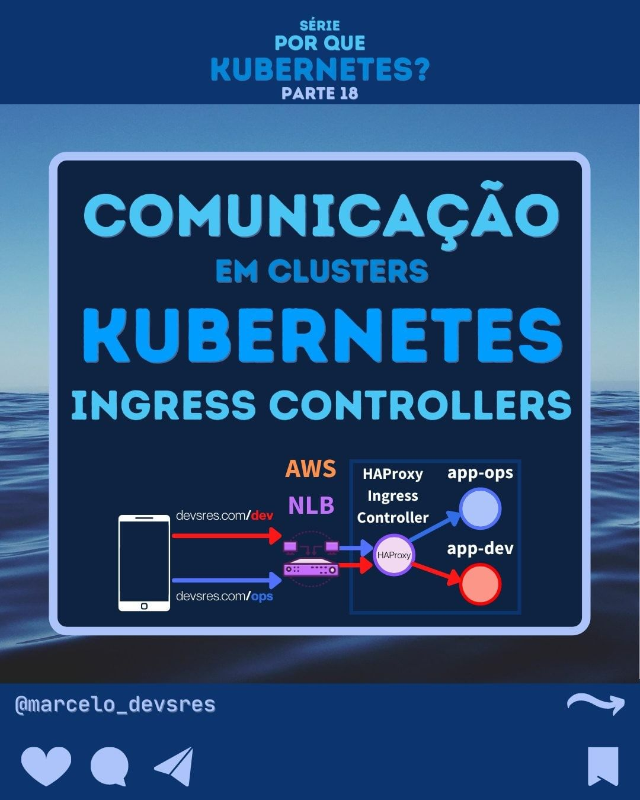

Atendendo a pedidos, mais Ingress Controller!

Como é um tópico brutalmente complexo, vou avaliar se faço uma série de posts separada só para ele e continuo com o resto do assunto ou se sigo nele como tópico principal até esgotar!

Hoje vemos quais os problemas do objeto Ingress e porque ele é possivelmente a escolha mais difícil que você vai precisar fazer para o seu cluster.

#kubernetes #cloudnative #devops #devsres

# Post 
[https://www.instagram.com/p/CWCWwjwsmIr](https://www.instagram.com/p/CWCWwjwsmIr)

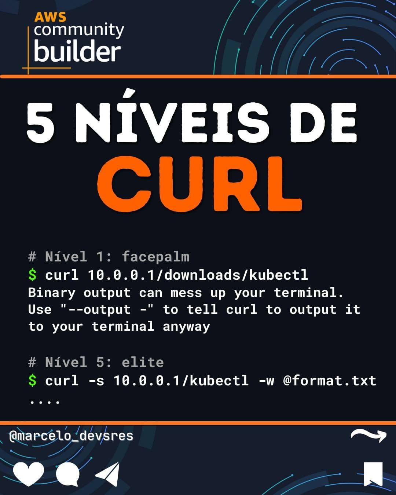

Um dos meus posts que faz mais sucesso na verdade foi um não post: o destaque sobre curl em que apresento como medir tempos (e o que cada um significa), disponível nas bolinhas lá em cima.

Resolvi transformar os stories em um post aqui. Espero que descubram alguma outra novidade neste post!

#linux #devops #devsres

# Post 
[https://www.instagram.com/p/CV-jMfPsaBF](https://www.instagram.com/p/CV-jMfPsaBF)

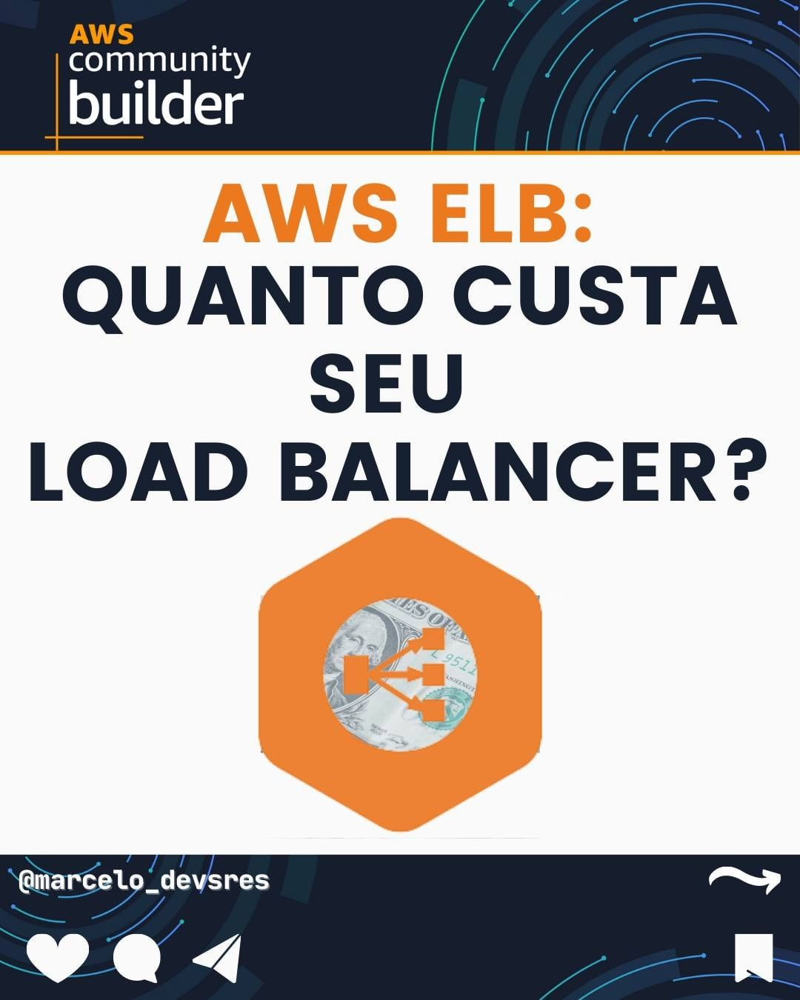

Você sabe o quão difícil é dimensionar custos em clouds públicas? Talvez você ache que sabe. 

Eu vou dar um exemplo que quase vai te fazer querer fazer desistir.

Como fazer um "forecast" adequado do uso de um Load Balancer na AWS? Um dos componentes mais simples e, possivelmente, imprescindíveis para a maioria das arquiteturas.

Passa as imagens do post. Dá uma olhada.

Não pegue este exemplo como justificativa para desistir da Cloud - até porque provavelmente essa decisão não cabe a você. Use para se conscientizar de que você precisa *realmente* saber quais são as dimensões de preço nas quais você pode vir a ser cobrado. Estude. E estude mais ainda quando achar que está sabendo tudo!

#aws #cloud

# Post 
[https://www.instagram.com/p/CV76ZWFrz3i](https://www.instagram.com/p/CV76ZWFrz3i)

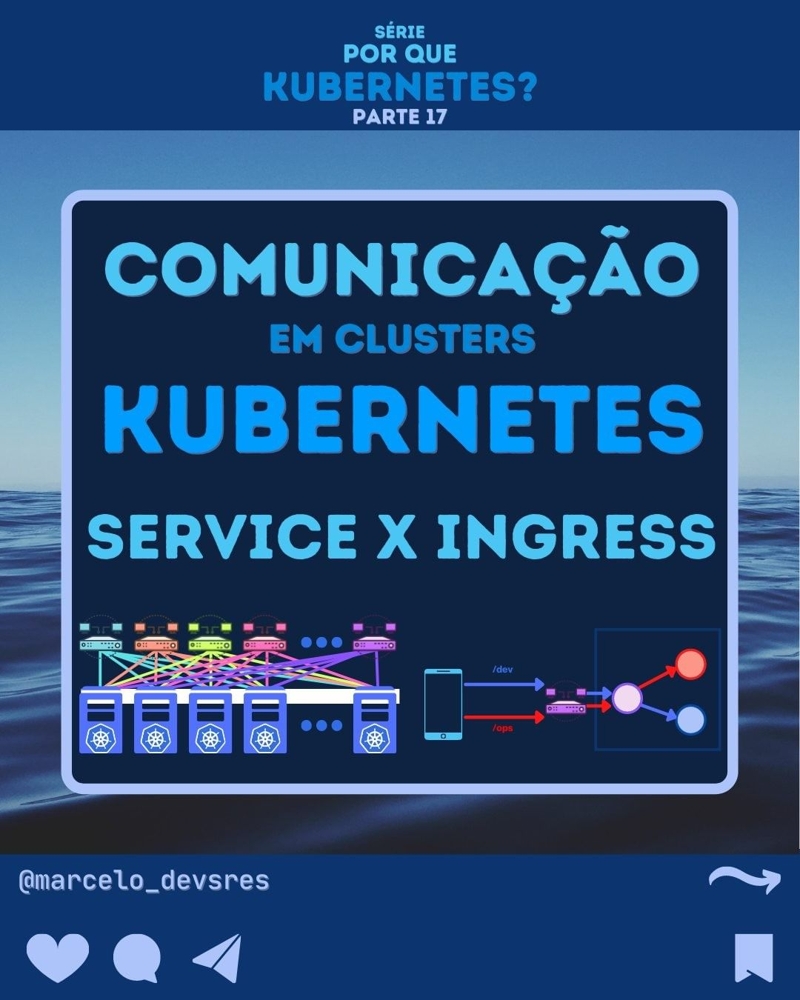

Se já temos os Services do tipo Load Balancer, precisamos de mais alguma coisa? 

A ideia hoje é entender a principal motivação por trás do recurso Ingress. Não tem jeito melhor que não fazer um estudo de caso simples de um cluster Kubernetes operando com cerca de 100 microsserviços. 

Vocês acham que este post sobre Ingress é suficiente ou vale a pena perder mais uma semana nesse assunto? Me conta o que você pensa aí!

#kubernetes #cloud #devops #aws #devsres

# Post 
[https://www.instagram.com/p/CV4KO7YMSbc](https://www.instagram.com/p/CV4KO7YMSbc)

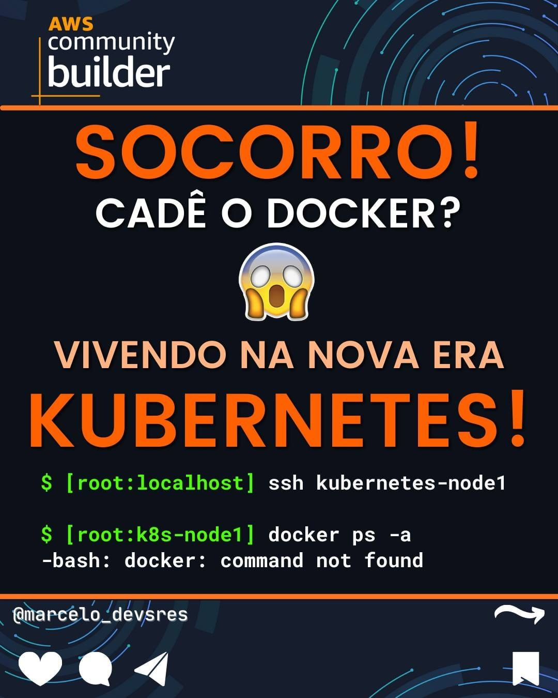

Um relatório de segurança apontou um container do seu cluster como possivelmente comprometido. Este é o ID do container. Ele está em execução neste nó. Como você descobre quem é o Pod comprometido?

Normalmente, eu exploraria a máquina com o docker para achar o culpado, mas... não tem docker! E agora?

O post de hoje segue temático combinado com o anterior - com foco na certificação CKS -, mas com um estudo de caso mais mão na massa como normalmente são os posts da minha "terceira coluna" aqui no Instagram.

Como bônus, um pouquinho de nada de Falco - o software que geraria o alerta fictício em questão!

#kubernetes #cks #devops #cloud #devsres

# Post 
[https://www.instagram.com/p/CV0Pd1hN5oI](https://www.instagram.com/p/CV0Pd1hN5oI)

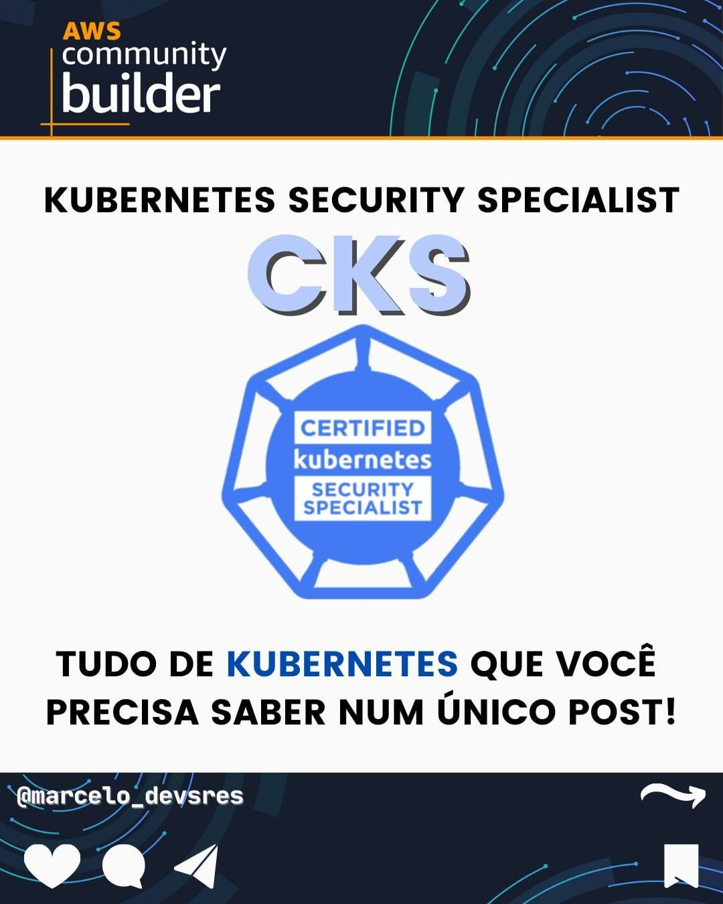

TUDO que você precisa saber sobre Kubernetes para o CKS em um único post!

Deveria fazer um título estilo clockbait com "Estude ISSO e você garantirá seu CKS!", mas não levo jeito para essas coisas!

Para mim, o CKS não é a prova mais difícil de Kubernetes da CNCF. Mas muito provavelmente é a prova mais difícil de Linux que eu já fiz (e eu já fiz RHCE uma vez!.

Ainda que você seja um Kubernetes Security Specialist e saiba tudo de Kubernetes, se você não for um ás pilotando o terminal - essa prova pode se mostrar excessivamente desafiadora, se não impossível.

Por outro lado, se você for "fraco" em segurança, mas está com a fluência em comandos em dia, a prova - honestamente - não é tão desafiadora assim.

Quer ouvir mais da experiência com o CKS? Sábado, 21:30, no Twitch!

#kubernetes #cks #devops #cloudnative #devsres

# Post 
[https://www.instagram.com/p/CVg7-NQgV3U](https://www.instagram.com/p/CVg7-NQgV3U)

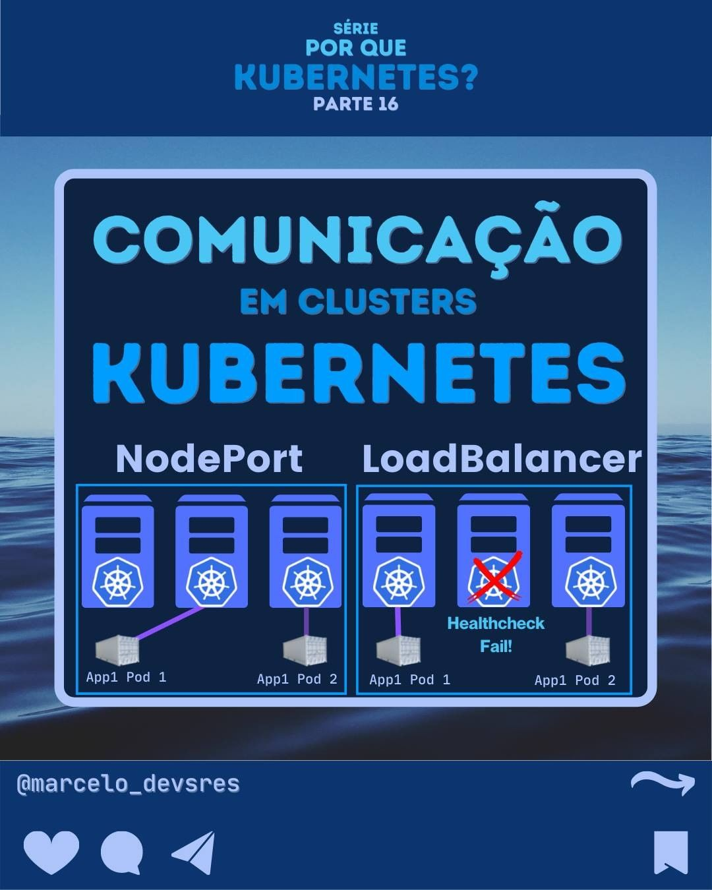

Você, que sabe tudo de Kubernetes: já viu como os Service LoadBalancers são implementados na AWS? Se não, vai até o fim do post que talvez aprenda uma coisa ou outra!

Hoje o assunto é: comunicação de "fora" para "dentro" de clusters Kubernetes usando Services. Vamos falar sobre NodePort e sobre os famosos services do tipo LoadBalancer.

Services do tipo LoadBalancer disparam a ação de um outro tipo de controller ("cloud controller"), externo ao kube-controller-manager, que executa operações diretamente no provedor de Cloud quando percebe que o usuário solicitou um Load Balancer. 

Quem trabalha on-prem fica chupando o dedo, pois normalmente não conta com esse controller.

Você já sabia do "truque" da última imagem usado pela AWS? 

E o seu Cloud Provider, implementa LBs como? Você sabe?

#kubernetes #cloud #devops #aws

# Post 
[https://www.instagram.com/p/CVdA7pZLo8f](https://www.instagram.com/p/CVdA7pZLo8f)

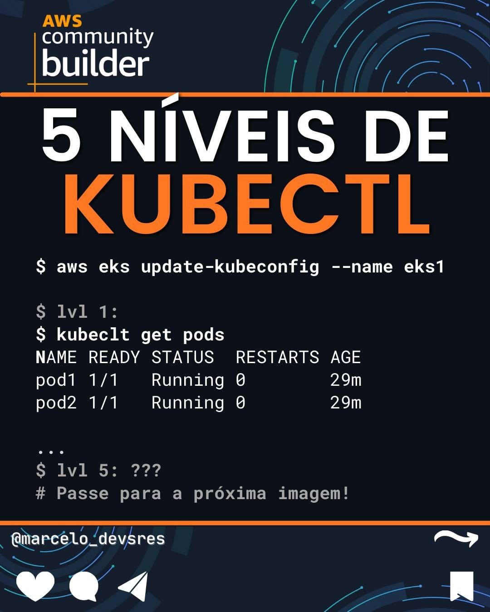

kubectl ainda é a ferramenta do dia-a-dia para interfacear com clusters Kubernetes - embora você devesse considerar alternativas!

Mas, na hora daquela apuração especial para recuperar dados, dificilmente tem algo mais rápido do que tratar a saída do kubectl.

A maior parte das pessoas que precisam de saída avançada do kubectl opta pela saída via json em pipe com o novo-porém-clássico comando jq.

Mas é possível fazer algumas coisas interessantes a partir desse binário! Confere neste post algumas delas!

#kubernetes #cka #ckad #devops

# Post 
[https://www.instagram.com/p/CVXz5QuMffT](https://www.instagram.com/p/CVXz5QuMffT)

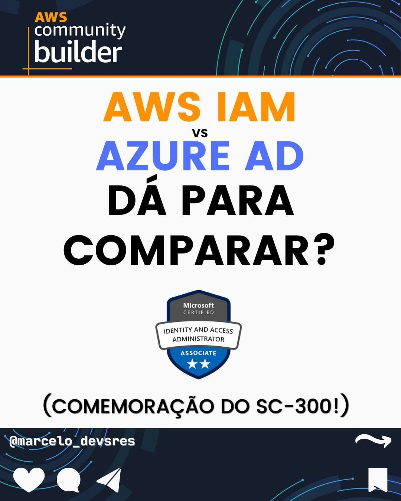

Para comemorar minha certificação SC-300, o que teoricamente me credita o título de Microsoft Identity and Access Administrator, trago um post para tentar dar insights sobre a comparação direta do que seriam os dois "serviços concorrentes" de cada nuvem.

A primeira pergunta: será que eles são realmente "concorrentes" entre si?

A segunda: dá para fazer uma comapração direta entre as funcionalidades de ambos?

Eu sei que a maior parte das pessoas que trabalham em TI tem pouco ou nenhum interesse em trabalhar nessas áreas de "soluções de identidade", "governança de identidade", "compliance" e afins... A gente gosta mesmo é de subir container, cluster Kubernetes e levantar serviço que aguenta 1 milhão de requisições por segundo sem suar.

Mas espero contribuir aqui com um pouco dos meus últimos 2 meses de estudo sobre o assunto.

#aws #azure #cloud #devops #devsres

# Post 
[https://www.instagram.com/p/CVQFswah8B-](https://www.instagram.com/p/CVQFswah8B-)

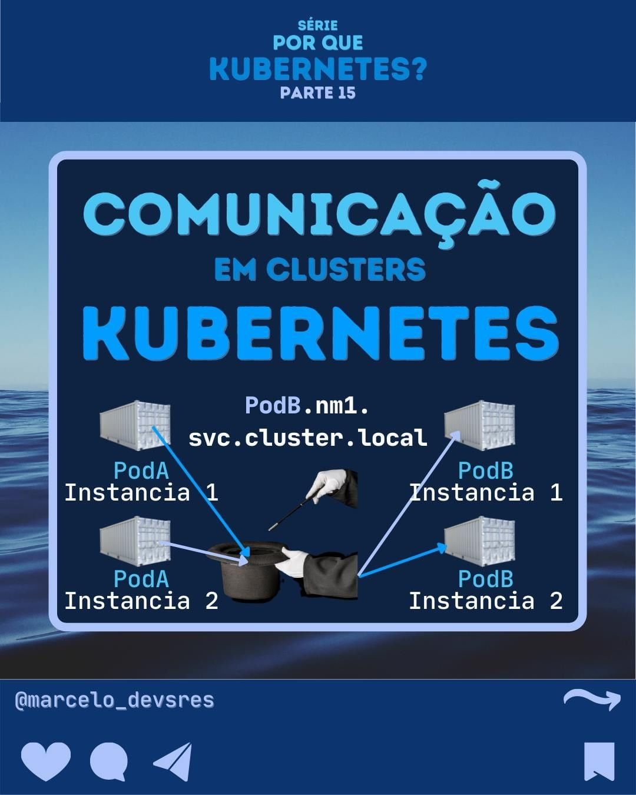

Arthur C. Clarke, em 1962, publicou um livro chamado Perfil do Futuro. A famosa terceira lei diz:

"Qualquer tecnologia avançada o suficiente é indistinguível de magia."

Hoje vamos entender como o Kubernetes garante o balanceamento de comunicações saindo dos Pods em direção aos Services.

Quero que vocês me digam se já chegamos ao patamar previsto por Clarke ou não.

#kubernetes #cloud #devops #devsres

# Post 
[https://www.instagram.com/p/CVK770uPAAV](https://www.instagram.com/p/CVK770uPAAV)

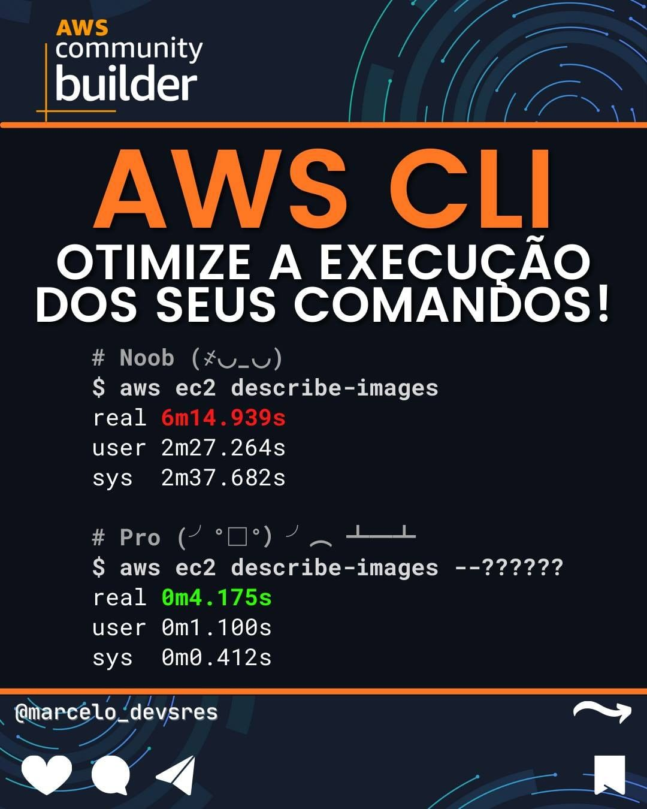

Passei o fim de semana executando muitos comandos na AWS com a CLI, e tive a oportunidade e exercitar bastante minhas "querying" skills para compor scripts em bash para automatizar certas ações e extrações de dados.

Embora muita gente chame o uso da opção de --query de "filtro", pois ele permite exibir apenas os registros que te interessam, existe também uma opção ---filter, que tem um funcionamento radicalmente diferente e pode reduzir, de maneira surreal, algumas execuções de comandos contra a API da AWS.

#aws #cloud #devops #devsres

# Post 
[https://www.instagram.com/p/CVCGFSYM0pY](https://www.instagram.com/p/CVCGFSYM0pY)

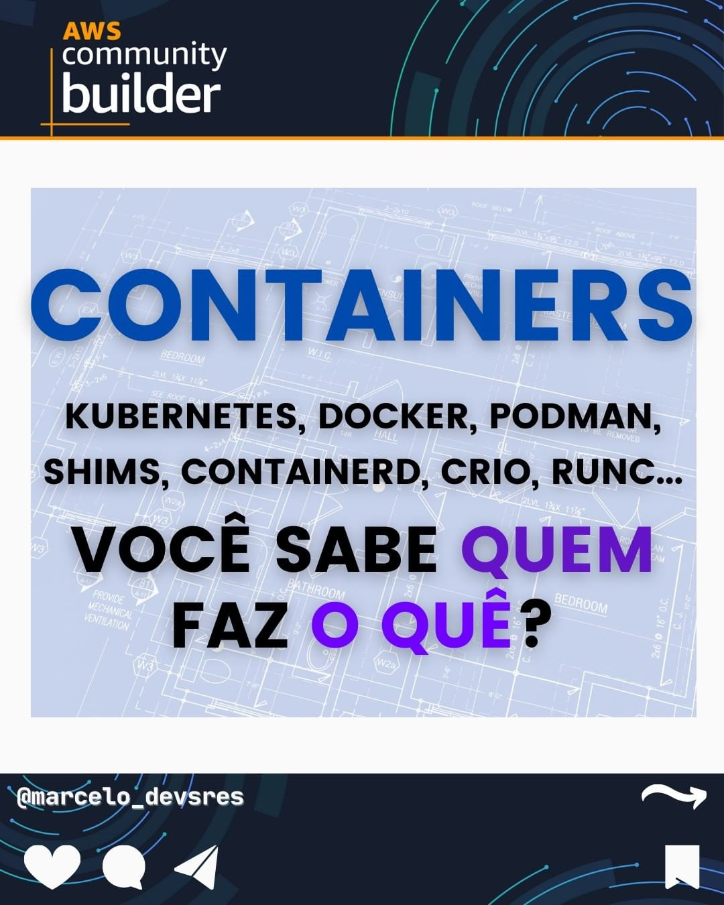

Você *realmente sabe* o que são as diversas ferramentas do universo de containers e para que elas servem?

Eu sou AWS Community Builder da "especialidade" containers. Então nada melhor do que celebrar minha especialidade mostrando um pouco sobre containers: o que cada software faz, quais as ferramentas redundantes entre si e como elas todas se integram no final.

Este post obviamente não é uma tentativa de exaurir o assunto - nem a imagem do fim está 100% completa! A ideia é fazer o que eu sempre tento fazer com os posts, com as lives e com as apresentações: esclarecer assutos que, por muitas vezes, parecem extremamente nebulosos.

Este post deu *bastante trabalho* de fazer. Se você gostou, manda ele para alguém que você ache que vai fazer diferença!

#kubernetes #containers #docker #devops #cloud

# Post 
[https://www.instagram.com/p/CU4zgaaJDVb](https://www.instagram.com/p/CU4zgaaJDVb)

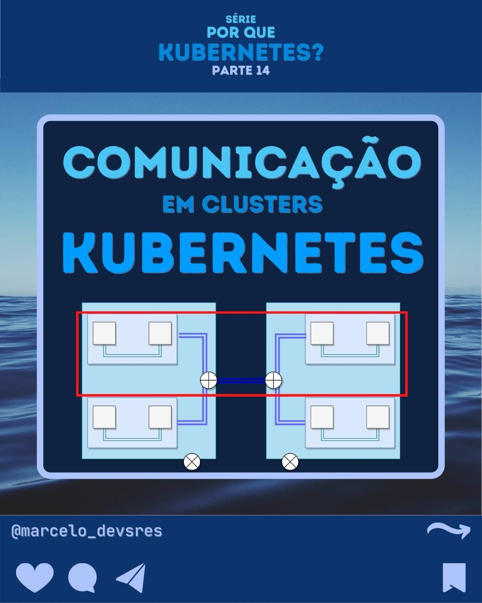

Como o Kubernetes define que deve acontecer a comunicação entre dois Pods de nós diferentes?

A resposta é: ele praticamente não define nada além de que "a comunicação deve ocorrer sem NAT".

Essa é a deixa para que os diversos plugins existentes para CNI definam sua própria estratégia de comunicação.

Hoje vamos observar como dois plugins de CNI diferentes operam no Kubernetes de maneira radicalmente diferente para viabilizar a comunicação entre Pods do mesmo cluster, mas hospedados em diferentes nós.

(Querem uma análise de plugins CNI de cloud providers? Se sim, comentem aí!)

#kubernetes #cloud #devops #networking

# Post 
[https://www.instagram.com/p/CUwBpCLMPug](https://www.instagram.com/p/CUwBpCLMPug)

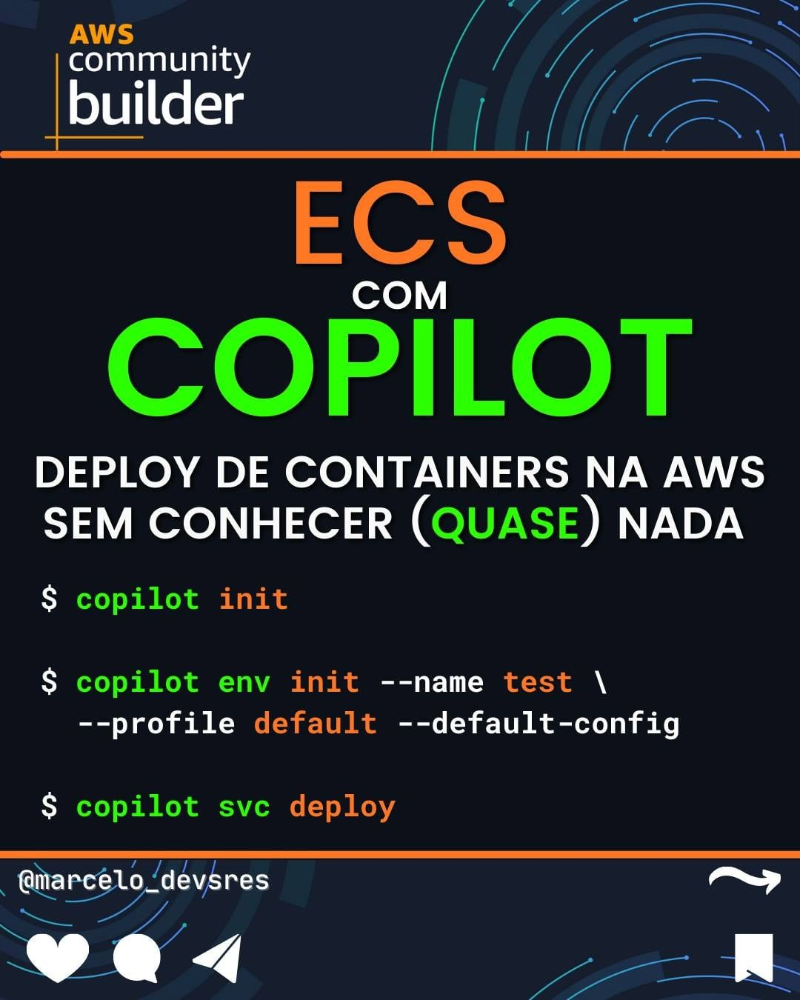

Ontem, falei que uma das características do ECS sobre EKS que pode ser entendido como vantagem para alguns é o fato de ser mais simples e 100% AWS - uma equipe com expertise em AWS não deve ter dificuldade em incorporar o uso de ECS no seu dia-a-dia.

A adoção do EKS não é tão direta e pode causar 
 ores de cabeça não previstas - faça uma busca no Google por "argo workflows attacks" e veja você mesmo!

Mas e se sua equipe *também* não tem lá tanta expertise com ECS? Ele não é tão simples e direto quanto parece.

Conheça então o AWS Copilot, utilitário de linha de comando que trivializa a criação de workloads em clusters ECS.

Sua aplicação no ar em questão de minutos!

#aws #cloud #ecs #devops

# Post 
[https://www.instagram.com/p/CUtXEY-lGtn](https://www.instagram.com/p/CUtXEY-lGtn)

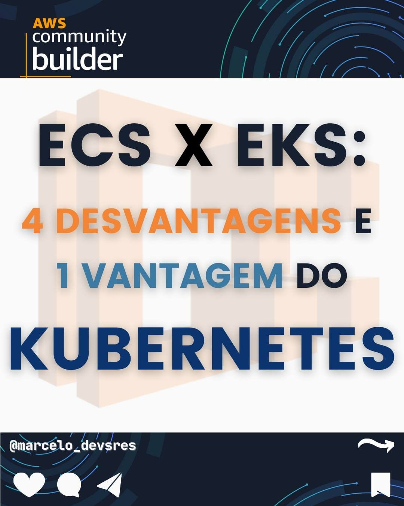

Alô pessoas! Este é o meu primeiro post como AWS Community Builder! Recebi a notícia que fui aceito neste programa da AWS semana passada, na disciplina de containers (é claro!). 

Para celebrar, vamos analisar quatro desvantagens e uma vantagem do Kubernetes  em comparação ao Elastic Container Service - ECS da AWS!

Mas o que muda com a minha participação? Bem, por enquanto, só o layout do post - fora isso, o conteúdo segue o mesmo. Se tiver novidades, conto para vocês!

#aws #cloud #ks #ecs

# Post 
[https://www.instagram.com/p/CUi7MKIF31a](https://www.instagram.com/p/CUi7MKIF31a)

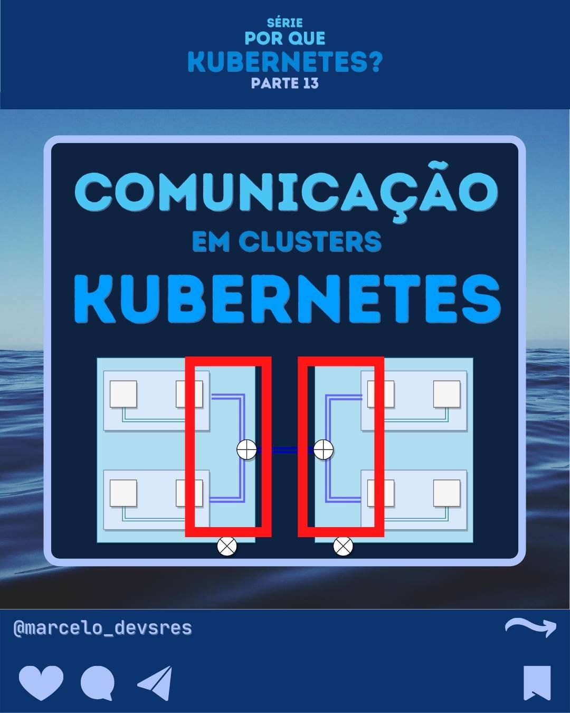

Você já viu "por dentro" como funciona a comunicação de Pods em clusters Kubernetes?

O Kubernetes faz poucas exigências sobre como deve ser o modelo de comunicação entre Pods, seja ele em um mesmo nó ou entre nós. As três considerações feitas eu listo aqui neste post.

Além disso, vamos averiguar o que acontece em um host Linux ao executar Pods!

Se quiser ao vivo, entra na live do Twitch hoje! Link na bio.

#kubernetes #cka #devops #cloud

# Post 
[https://www.instagram.com/p/CUOj92hMNDP](https://www.instagram.com/p/CUOj92hMNDP)

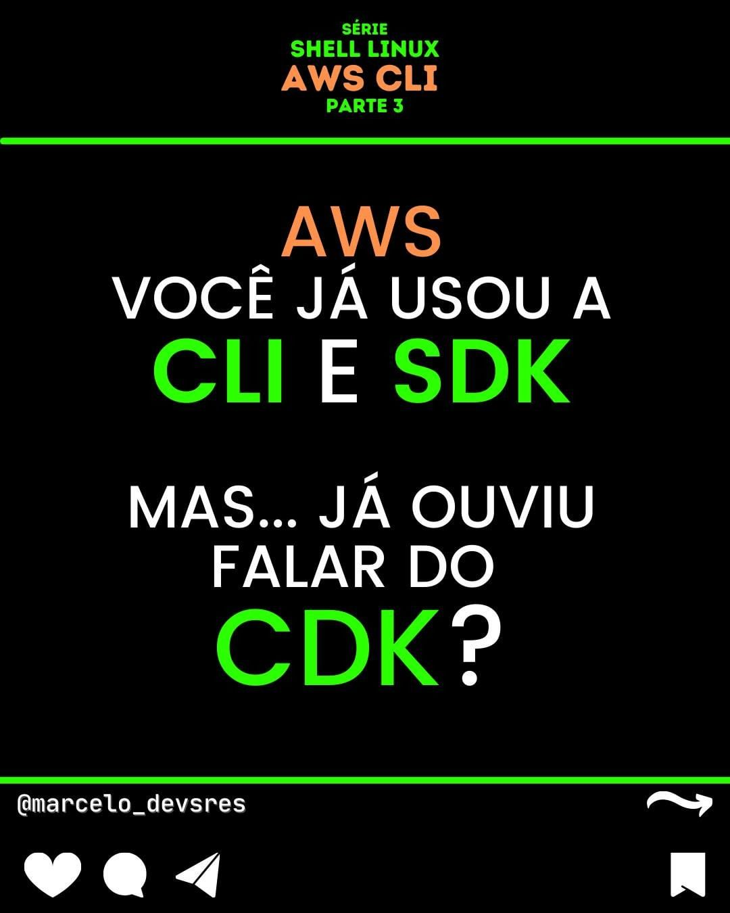

Em uma entrevista de emprego, o recrutador técnico da empresa me perguntou se eu teria dificuldade em escrever um programa em Python que criasse objetos na AWS usando a SDK.

Eu falei que não via problema, mas que certamente daria preferência a escrever esse mesmo programa usando a CDK em vez da SDK, algo que soaria bem mais natural para o propósito  de infraestrutura como código.

Não consegui a vaga, porque o entrevistador achou que eu estava inventando coisas!

Você conhece a CDK AWS para gerenciar seus recursos desse cloud provider usando IaC? 

Esse é um assunto ruim de exemplificar em posts de Instagram; se não conhece, dá uma olhadinha e veja o que acha!

#aws #iac #cloud #devops

# Post 
[https://www.instagram.com/p/CUJD7ZTh6SK](https://www.instagram.com/p/CUJD7ZTh6SK)

Como você lida com a concorrência na execução de códigos Terraform?

Terraform state locking? Não, não é essa concorrência que estou falando.

Depois de falarmos sobre os problemas com Terraform State, vamos abordar um outro problema que nem todo mundo presta atenção - ao menos, não antes dele causar problemas.

Já encontrou ele antes? 

#terraform #devops #cloud #iac

# Post 
[https://www.instagram.com/p/CUD6RnsrB4J](https://www.instagram.com/p/CUD6RnsrB4J)

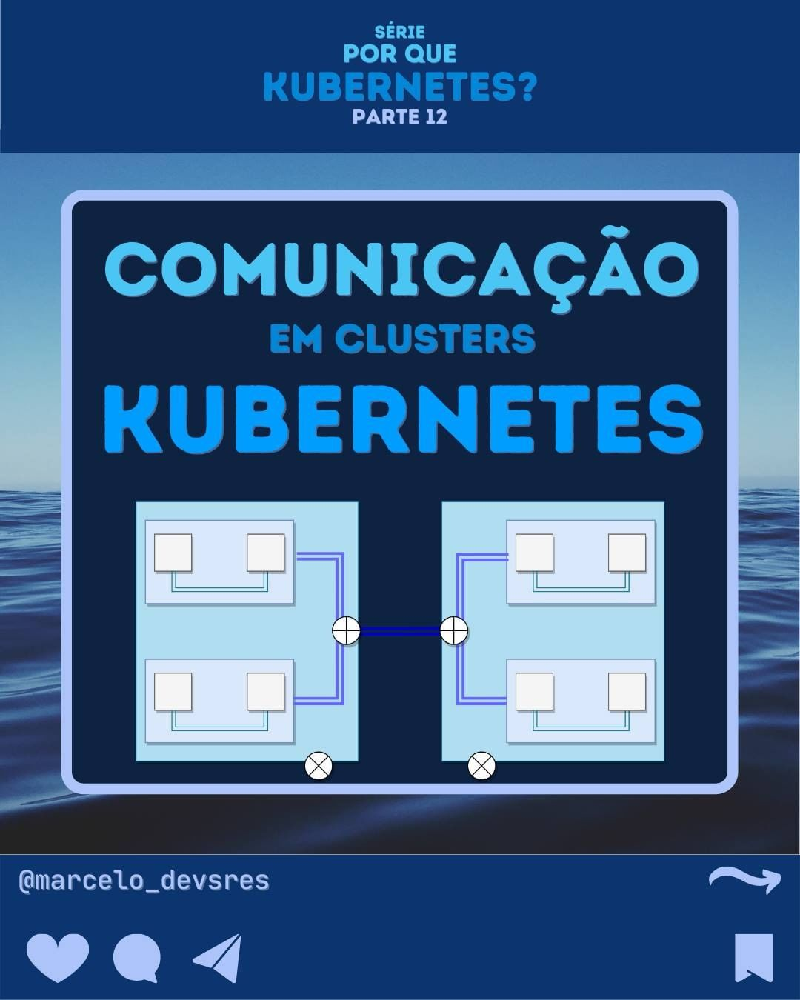

Você conhece todos os detalhes do modelo de comunicação do Kubernetes? Não? Então vem comigo que eu te explico!

Kubernetes não define apenas como orquestrar contêineres; ele adota algumas abstrações (como a ideia do Pod ser uma entidade única, ainda que multicontainer) e faz definições sobre seu modelo de conectividade bem específicas: por exemplo, Pods devem ser capazes de se comunicarem com outros Pods sem sofrer qualquer tipo de NAT.

Nesta nova série sobre Kubernetes, vamos avaliar sobre estes modelos de comunicação, começando com como os contêineres do mesmo Pod se comunicam. 

#kubernetes #cka #devops #cloud

# Post 
[https://www.instagram.com/p/CTsdTCpFHwu](https://www.instagram.com/p/CTsdTCpFHwu)

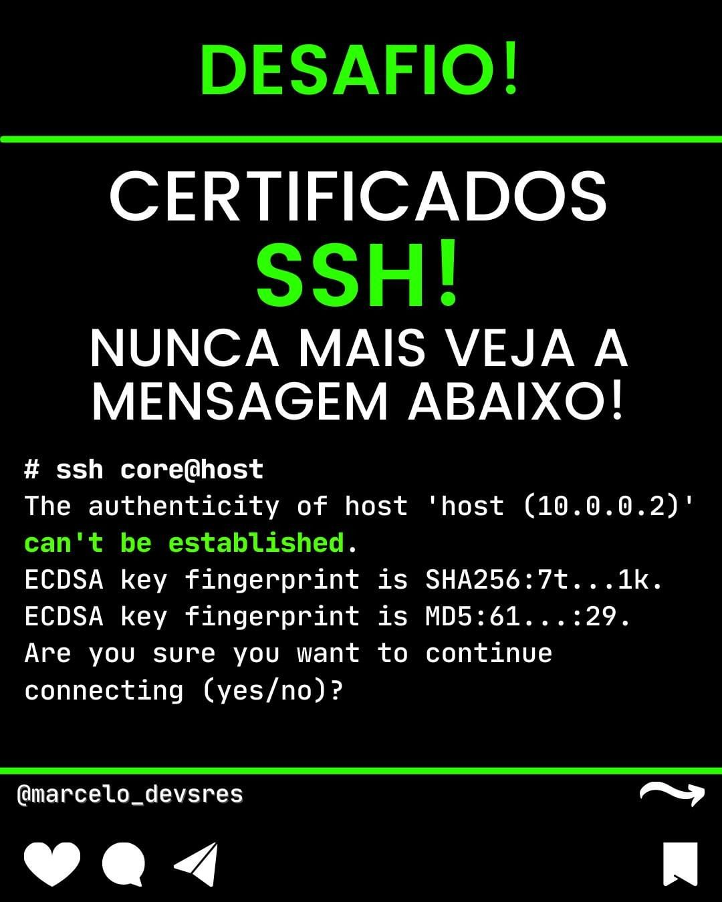

Você já usou ou ouviu falar de certificados SSH?

Eu já fiz um "desafio" (está lá perdido nos posts, dá uma olhada!) explicando porque você leva esse YES/NO e como esse é o momento mais crítico da comunicação SSH.

A solução definitiva deste tipo de problema é por meio da geração de certificados SSH para suas máquinas.

Só que esse é o problema menos inconveniente que eu resolvi com esse recurso.

Existe um segundo problema, bem mais chato, que é justamente como viabilizar o acesso às suas máquinas por parte dos administradores. Normalmente as pessoas fazem isso por meio de listas de authorized_keys distribuídas para cada máquina.

E se um administrador entra na empresa? Como atualiza? E se um sai? Como remove? É um problema que demanda automação e processos bem definidos - e relativamente trabalhosos.

Vocês querem saber como resolve a segunda parte do problema? Pede aí nos comentários!

#linux #ssh

# Post 
[https://www.instagram.com/p/CTdniLkDPcK](https://www.instagram.com/p/CTdniLkDPcK)

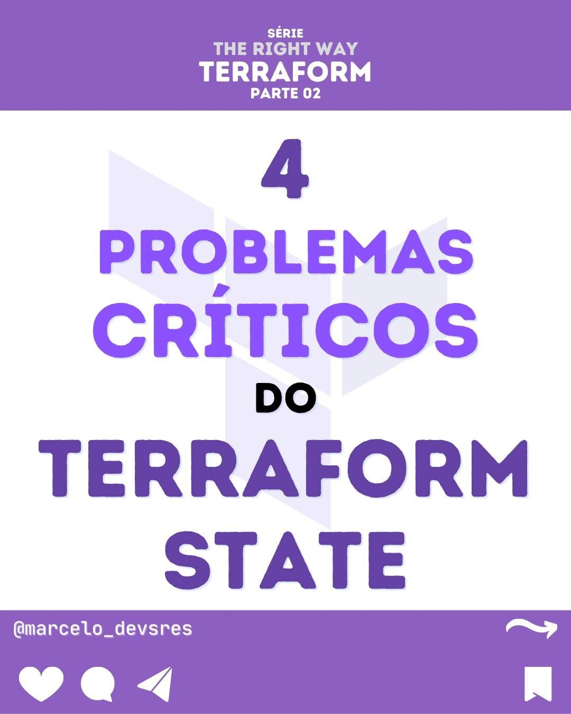

Como você guarda o Terraform state?

De longe o ponto mais sensível do uso do Terraform, as dificuldades de lidar com o Terraform State são apresentadas assim que você começa a aprender sobre a tecnologia.

Resolver o problema de gerência do arquivo de state é apenas o primeiro passo no caminho do "jeito certo" de se trabalhar com Terraform!

#terraform #devops #cloud #aws

# Post 
[https://www.instagram.com/p/CTTjEqasVOe](https://www.instagram.com/p/CTTjEqasVOe)

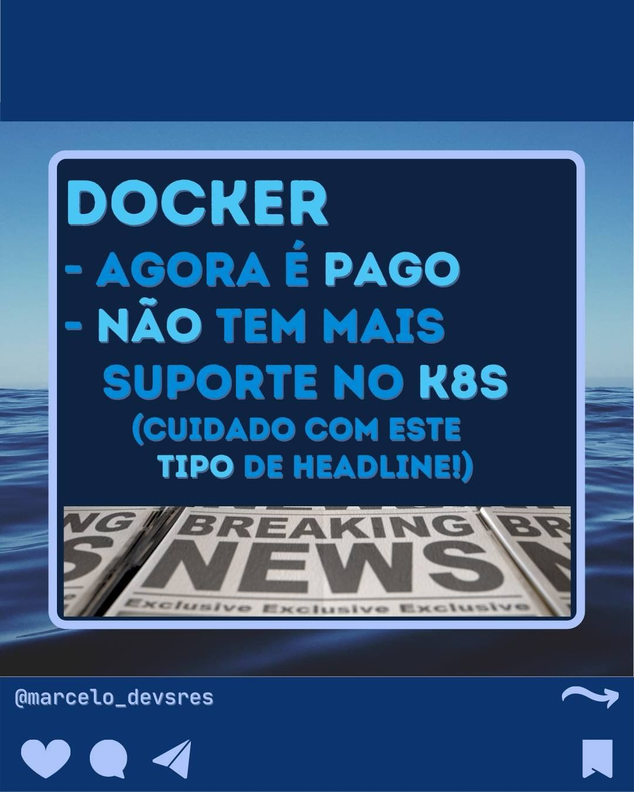

OMG o Docker agora é pago! Mas não chega a ser um problema, né? O Kubernetes já descontinuou o uso dele mesmo...

Acho que não seria necessário dizer, nos tempos de hoje, que você deve tomar muito cuidado ao se informar apenas com "headlines" - títulos de notícias - ou tweets de 100 caracteres.

A Internet amplificou bastante a capacidade de reprodução de informações. Só que o processo de comunicação vem sempre acompanhado de ruído, e dependendo do quanto - e de onde passa - está submetido, a mensagem pode chegar completamente distorcida e deformada.

Hoje vou falar sobre os dois principais exemplos de distorção da informação a partir de duas notícias com relação ao Docker: a primeira, "fresquinha", que indica que agora ele será pago para uso empresarial. A segunda, já conhecida, é a de que o Kubernetes marcou Docker para deprecation.

Espero que curtam!

#kubernetes #docker #devops #cloud

# Post 
[https://www.instagram.com/p/CTQ7O80F82a](https://www.instagram.com/p/CTQ7O80F82a)

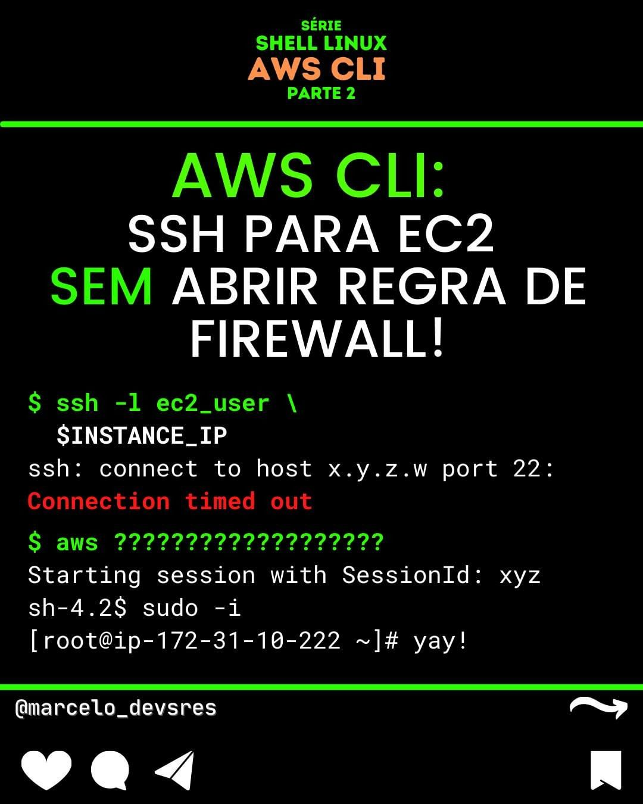

E se eu te falasse que você não precisa de SSH para acessar as suas instâncias Linux via SSH?

Já comentei sobre este recurso em algum momento da AWS de viabilizar, por meio de um dos seus sistemas internos, maneiras para que você possa se conectar aos seus hosts sem precisar abrir portas para a Internet.

Hoje resolvi falar E mostrar o que você precisa fazer para fazer isso funcionar!

Ps: como obviamente o espaço não ajuda nem um pouco com dumps de json dos arquivos do IAM, vou fazer uma versão extendida deste post em devsres.com/marcelo; quem quiser seguir o roteiro pode usar o que tiver lá!

#aws #cloud #linux #bash #devops

# Post 
[https://www.instagram.com/p/CTOO_7xLgmP](https://www.instagram.com/p/CTOO_7xLgmP)

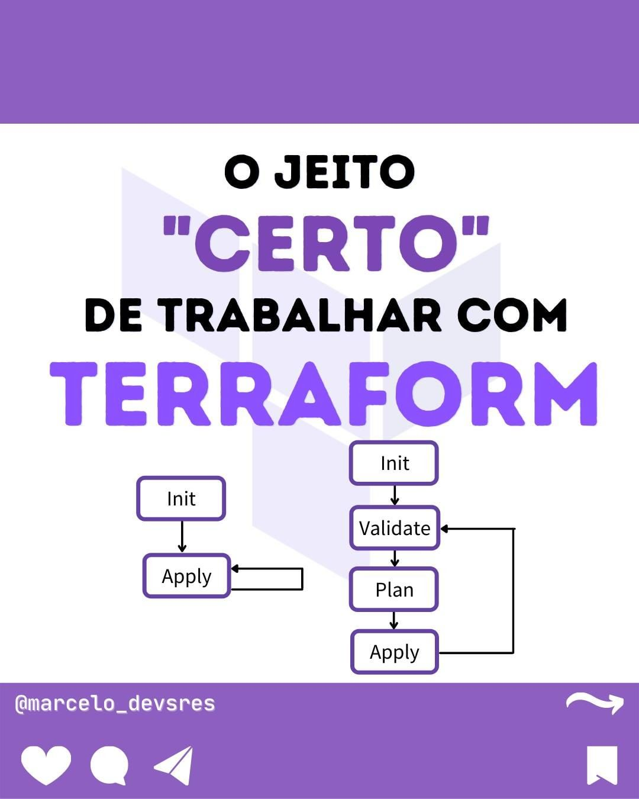

Existem duas etapas bem distintas toda vez que alguém começa a aprender a usar Terraform:

- A paixão: "vou usar Terraform PARA TUDO", é uma ferramenta fantástica, meu deus como vivi sem isso antes.

E, eventualmente, chega na etapa seguinte, que é:

- A realidade: "como é que faz para usar isso aqui do jeito certo?".

Obviamente que o "jeito certo" vai depender de organização para organização. E a maioria das pessoas não vai precisar decidir nada - as empresas já contam com um uso internalizado da ferramenta.

Ainda assim, um começo "mal implementado" pode começar aparentemente sem problemas e eventualmente se tornar um pesadelo em termos de manutenibilidade.

A verdade é que o Terraform precisa de bastante atenção a pontos críticos do seu funcionamento para que ele não se torne um problema ainda maior do que os que você pretendia resolver com ele.

Ps: o objetivo do post de hoje não é esgotar o assunto, mas sim apresentar os problemas que abordarei mais na frente!

#terraform #devops #cloud

# Post 
[https://www.instagram.com/p/CTD2XIqLVJj](https://www.instagram.com/p/CTD2XIqLVJj)

Quer fazer uma prova de CKA/CKAD tranquila? Aqui estão algumas dicas para você.

Além de, é claro, estudar bastante todos os conceitos básicos e praticar bastante com kubectl e yamls, você precisa preparar uma *estratégia* para a prova. 

Sem algum grau de preparo específico para a realização da prova, você pode reprovar por simples besteiras, como por exemplo tentar fazer as questões na ordem, criar coisas na namespace errada por desatenção, perder tempo demais fazendo buscas na documentação ou ainda remover um objeto do cluster indispensável para a prova.

A maioria das dicas que estão aí você provavelmente encontra em outros lugares, mas deixei minha opiniao sobre alguns assuntos que raramente vejo alguém comentado e que acho importante.

#kubernetes #cka #ckad

# Post 
[https://www.instagram.com/p/CTBQAQXL3ZR](https://www.instagram.com/p/CTBQAQXL3ZR)

Assisti hoje à live do @devfullcycle com o Juliano Martins e outros dois profissionais de referência do Mercado Livre falando sobre mensageria e a forma de trabalho da empresa com seus 16 mil microsserviços e 52 milhões de mensagens por minuto.

Mas a parte mais valiosa da live foi puxada pelo Wesley na frase que resumi na imagem acima: "Não delegue a gestão da sua carreira para a sua empresa". 

Não é nenhum grande segredo ou novidade, mas isso sempre me lembra que passei pelo menos 2/3 dos meus 15 anos como funcionário de empresa pública estagnado, apenas trabalhando e "fazendo o que tem que ser feito".

Um detalhe importante: o outro terço só foi diferente porque a própria empresa apresentou uma proposta de mudança de foco de trabalho que resultou na construção de um profissional radicalmente diferente hoje. Ou seja, tive *sorte*; não posso sequer tomar para mim o mérito dessa decisão.

A lei da Inércia que funciona na física também funciona na vida real. Meu conselho a todos: matenham-se sempre em movimento. Parados não chegamos a lugar nenhum.

# Post 
[https://www.instagram.com/p/CS-7BlCraU7](https://www.instagram.com/p/CS-7BlCraU7)

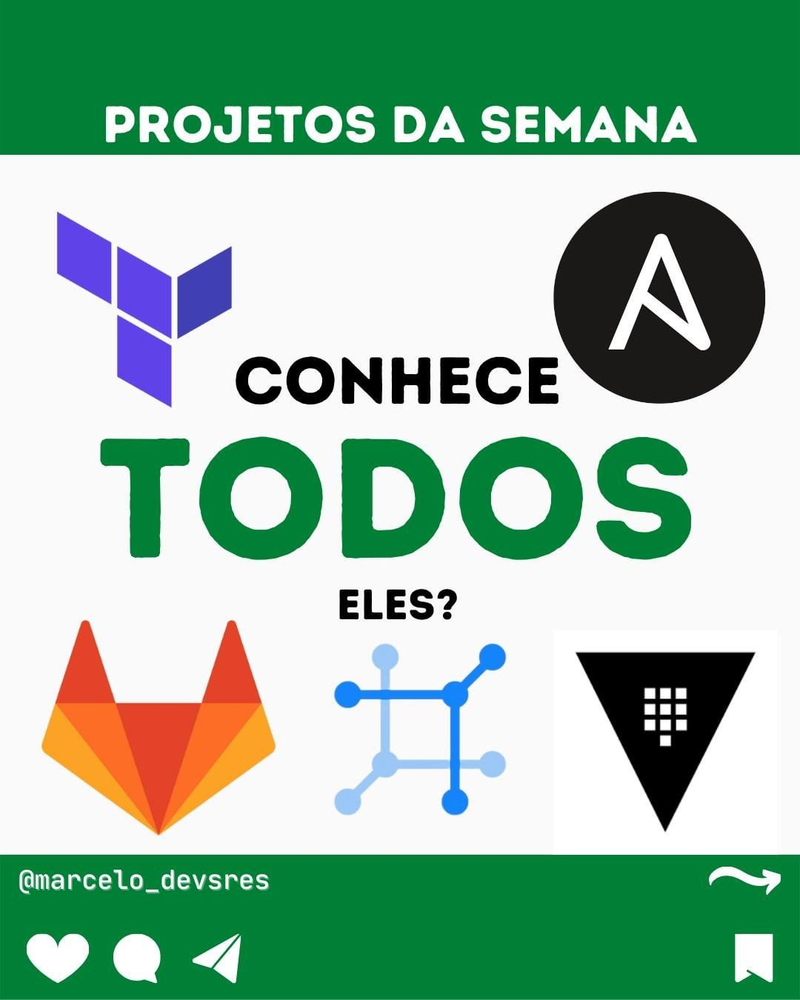

Esta é a minha programação para esta semana. Você conhece - e domina - todas estas tecnologias?

Curtiu os projetos? Tem interesse em um deles e quer que eu fale mais sobre? Fala aí!

#devops

# Post 
[https://www.instagram.com/p/CS2ZPuPF-LV](https://www.instagram.com/p/CS2ZPuPF-LV)

Nesta terceira série de kubectl para CKA/D, faço uma abordagem um pouco menos detalhada do comando kubectl create associado aos elementos de RBAC para ficar "menos chato". 

Hoje temos um "estudo de caso": como criar uma clusterrole e uma clusterrolebinding para um Pod de prometheus garantindo a ele acesso a Pods, Services e Endpoints?

Tentei imaginar um cenário real plausível de ser cobrado em prova, não apenas com a resolução mas explicando uma maneira de você validar que seu procedimento funcionou a partir de um Pod com shell e curl!

Perdeu os demais da série "Domine o kubectl"? Está tudo aqui no perfil, pode aproveitar!

#kubernetes #kubectl #cka #ckad

# Post 
[https://www.instagram.com/p/CSyEtJdNma-](https://www.instagram.com/p/CSyEtJdNma-)

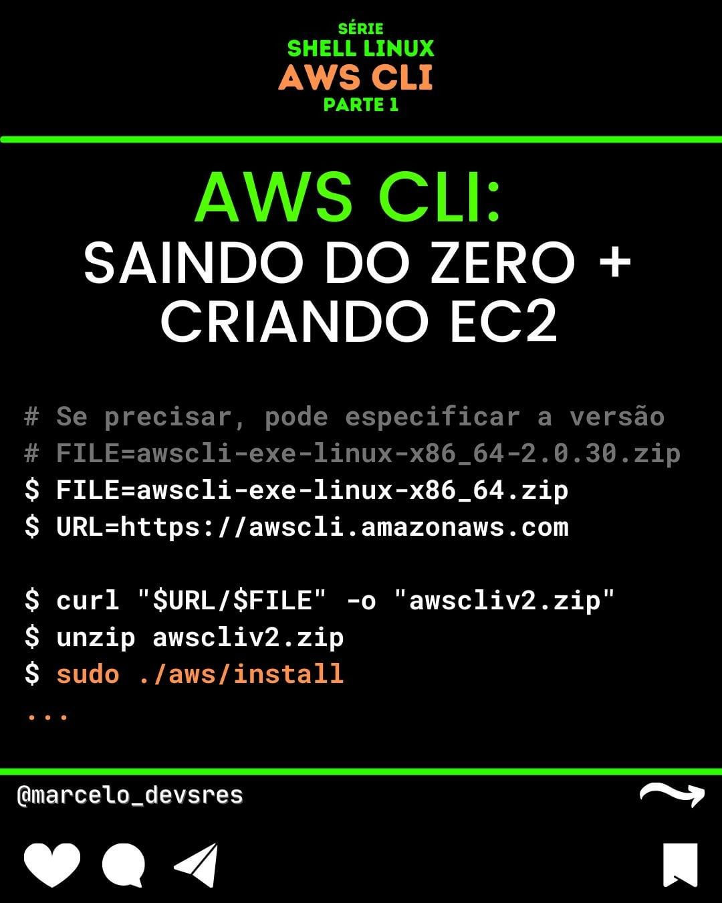

Vamos criar um EC2 usando o AWS CLI?

Para que os exemplos não fiquem exageradamente simplórios, apimentei os comandos com:

- algumas pitadas de JMESPath nas consultas: você já conhecia essas técnicas?

- a URL da AWS que você pode usar para descobrir seu próprio IP

- como recuperar o ID mais recente de um tipo de AMI a partir do Systems Manager.

Aprendeu alguma coisa nova com este post?

Me diz ai!

#linux #bash #aws

# Post 
[https://www.instagram.com/p/CSm_wTyF0s8](https://www.instagram.com/p/CSm_wTyF0s8)

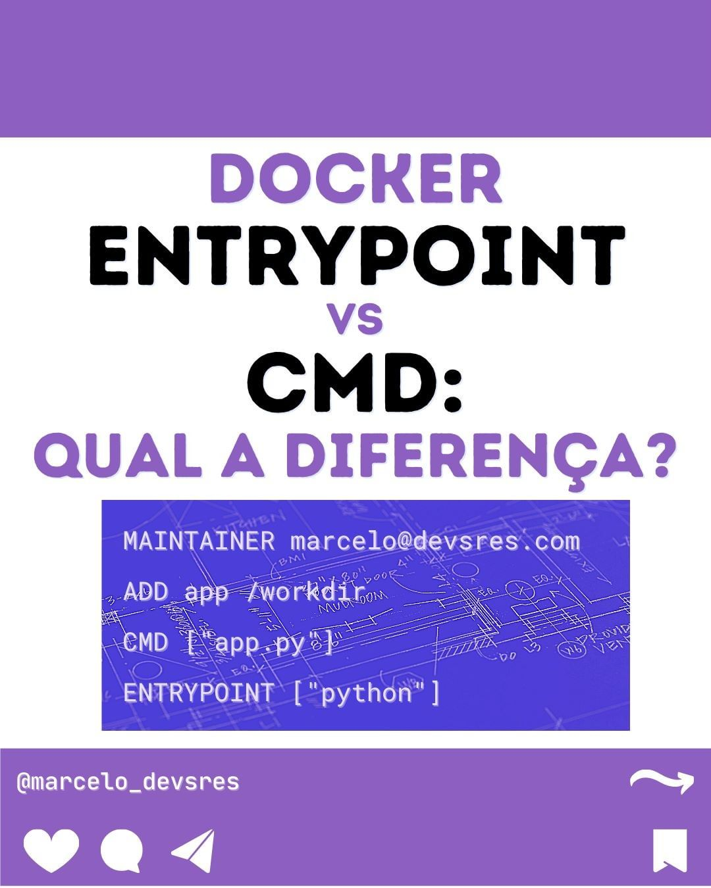

Ao usar Dockerfiles, depois do dilema entre ADD ou COPY, a próxima etapa é sempre: ENTRYPOINT ou CMD? Qual o jeito "certo" de trabalhar?

O post de hoje conta com algumas particularidades destas duas instruções de Dockerfiles, além de como fazer o override de ambas as instruções!

#docker #devops #kubernetes

# Post 
[https://www.instagram.com/p/CSk0403Ds0x](https://www.instagram.com/p/CSk0403Ds0x)

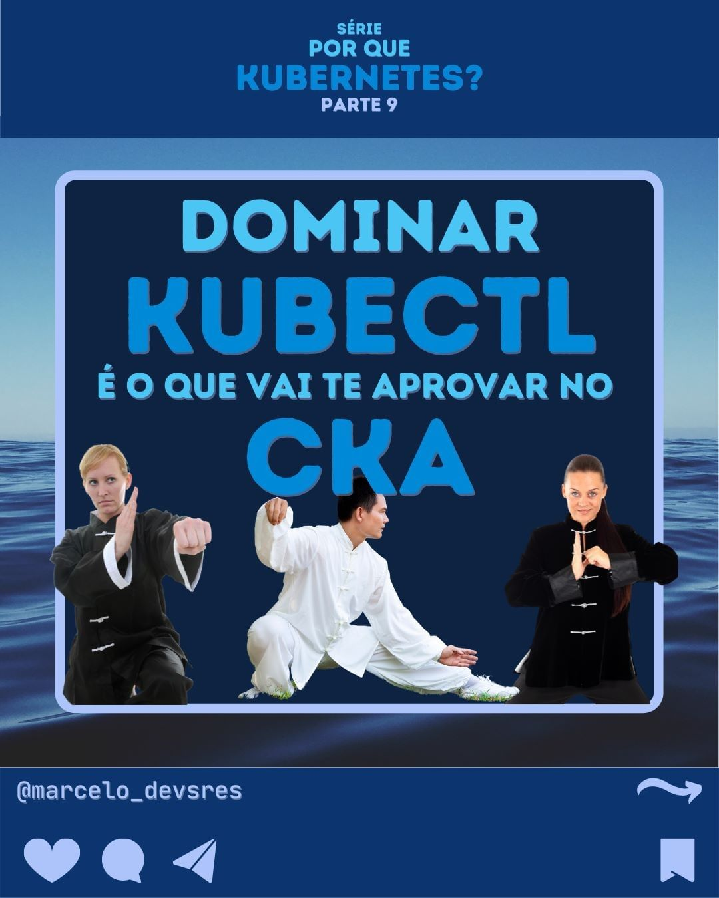

O kubectl create provavelmente não vai ser suficiente para resolver tudo que você precisa para lidar com services ou deployments. Mas com certeza é um comando que pode agilizar bastante a criação de configmaps e secrets.

No post de hoje, mostro como a estratégia de comandos imperativos podem economizar alguns bons minutos na prova do CKA!

Não sabe nada de Kubernetes, configmaps ou secrets? Todo sábado, 21:30, estou live no Twitch falando sobre e tirando quaisquer dúvidas que você tenha! Link na bio!

#kubernetes #cka #ckad

# Post 
[https://www.instagram.com/p/CSVmorLsWaY](https://www.instagram.com/p/CSVmorLsWaY)

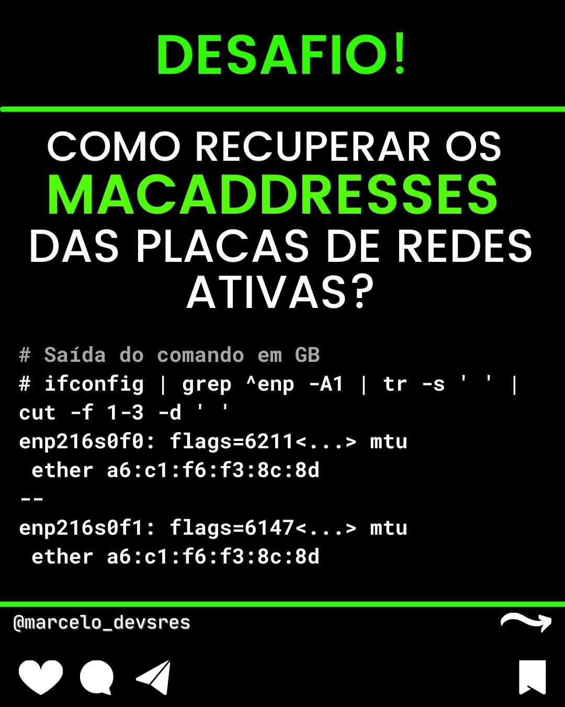

Como você faria para recuperar os MacAddresses das suas placas de rede físicas no Linux?

Cat, grep, cut, sed, awk... Vão até um ponto. E tratar saída de comandos no Linux é algo que pode ser uma armadilha.

Você já explorou alguns dos pontos que eu explorei nesse post? Conta aí!

Ps: cuidado com bonds e placas de rede; dependendo do uso, eles mudam o MacAddress das placas para o sistema operacional (última imagem). Você pode recuperar o MacAddress original a partir do /proc/net/bonding/nome-do-bond.

A lista completa de atributos das placas pode ser conferido em https://www.kernel.org/doc/Documentation/ABI/testing/sysfs-class-net

#linux

# Post 
[https://www.instagram.com/p/CSQVM7dLvHp](https://www.instagram.com/p/CSQVM7dLvHp)

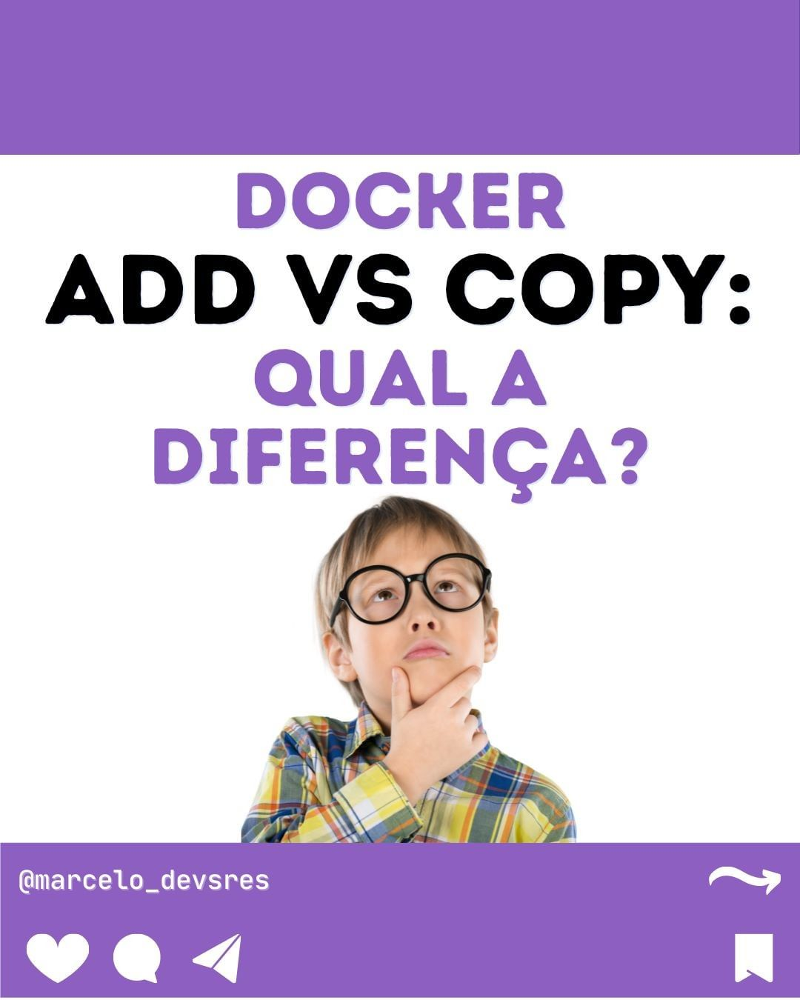

Você sabe a diferença entre COPY e ADD?

Talvez você até saiba; mas mesmo assim, arrasta para o lado, acredito que você vai encontrar pelo menos uma coisa que não sabe ai no meio!

#docker #devops

# Post 
[https://www.instagram.com/p/CSNxDTJlz9T](https://www.instagram.com/p/CSNxDTJlz9T)

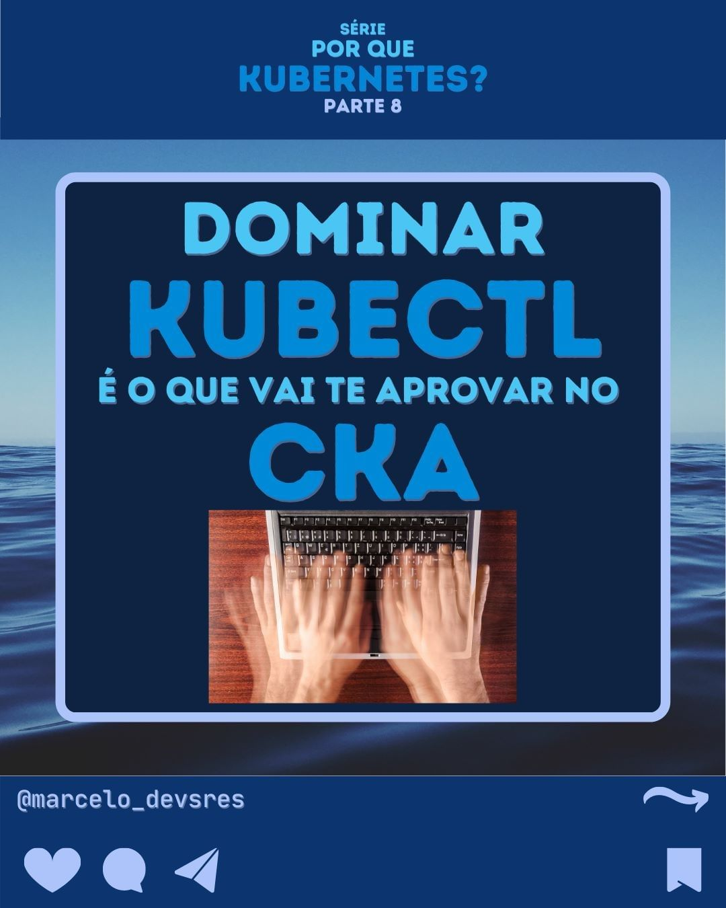

Em outro post, eu falei que o CKA pode te fazer um profissional pior. Isso porque, em uma prova com limite de tempo tão extremo, você precisa usar os comandos que te permitam poupar tempo, e não trabalhar "do jeito certo". 

Quanto tempo você demoraria para acessar a documentação, copiar e colar um yaml de template, editar com os parâmetros corretos e depois executar um apply? Se você puder criar um pod com um "one-liner", é muito melhor, correto?

Então explorar o kubectl e conhecer a fundo os limites deste programa vai te poupar valiosos minutos para conquistar a certificação CKA e CKAD.

Atenção para os desenvolvedores: na minha experiência, a prova CKAD demanda MUITO MAIS habilidade com kubectl que CKA! Cuidado com o que parece um assunto menor: as questões geralmente cobram coisas bem mais trabalhosas.

#kubernetes #cka #ckad

# Post 
[https://www.instagram.com/p/CSKMM9MtgIx](https://www.instagram.com/p/CSKMM9MtgIx)

Socorro! O Linux comeu minha memória RAM!

Você já passou ou já viu alguém em pânico porque o Linux lista pouquíssima memória RAM como livre? Essa é uma das primeiras pegadinhas do Linux com administradores novatos.

Abordo um pouco desse assunto aqui.

E se você acha que não é principiante, te desafio a ler as duas últimas imagens. Depois vem aqui me dizer que já sabia do que estava lá!

#linux

# Post 
[https://www.instagram.com/p/CSHVlenpST5](https://www.instagram.com/p/CSHVlenpST5)

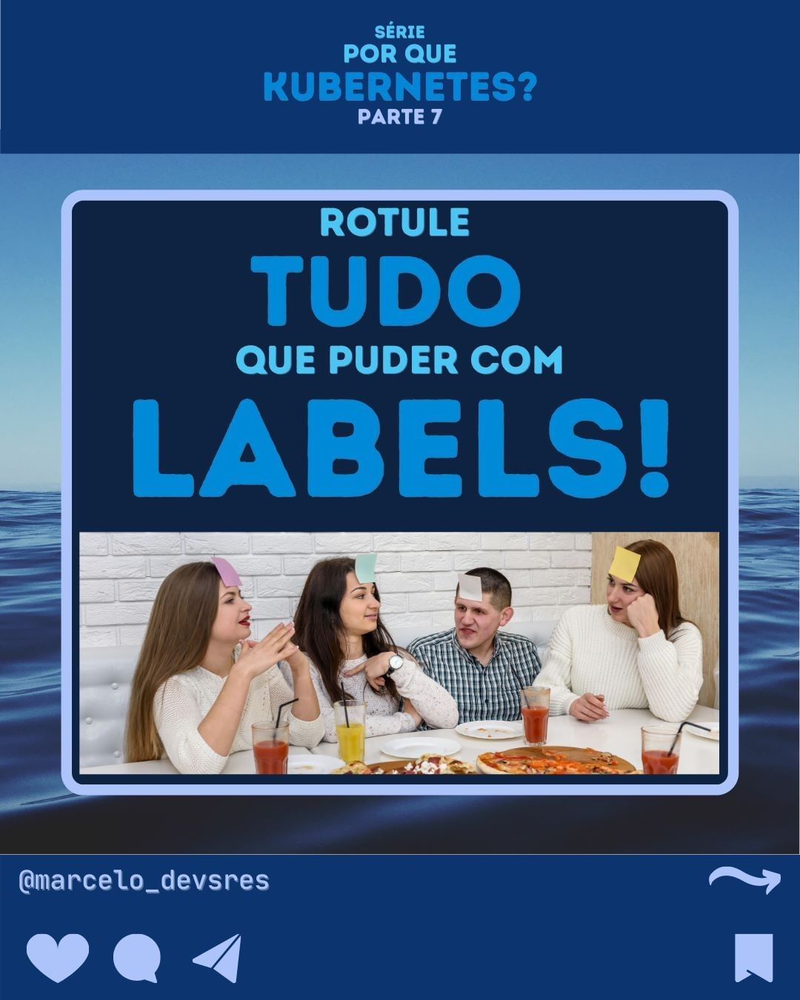

Você não gosta de rótulos? Bem, o Kubernetes adora!

O uso de labels viabiliza a implementação do dinamismo desejável para a plataforma. Após imerso em Kubernetes por um tempo, você vai se perguntar como as coisas no mundo funcionam sem esse recurso!

Vamos tentar entender um pouco desta feature importantíssima para arquitetura do Kubernetes.

#kubernetes #cka #ckad #devops

# Post 
[https://www.instagram.com/p/CSFEaaWF8Cc](https://www.instagram.com/p/CSFEaaWF8Cc)

Quando eu comecei a usar Kubernetes, as certificações sequer existiam (elas saíram em 2017). Posterguei sua realização até 2020 porque não via muito valor em fazê-las - acredito que meus cinco anos de experiência em deploy com ambientes on-premises falam por si só.

De qualquer forma, eu, mais do que ninguém, gosto de usar certificações como ponto de partida para meus estudos. E normalmente as experiências são positivas: o aprendizado é bom quando bem direcionado.

As provas de certificação de Kubernetes são todas práticas, e naturalmente isso vem com seus prós e contras - que abordo neste post.

Confesso que estou curioso para saber que rumos essa provas receberão, já que, à medida que a tecnologia evolui e se consolida, os administradores e desenvolvedores executam cada vez menos o que lhes são cobrados nesses exames.

#kubernetes #cka #ckad

# Post 
[https://www.instagram.com/p/CSCsB_rrwEW](https://www.instagram.com/p/CSCsB_rrwEW)

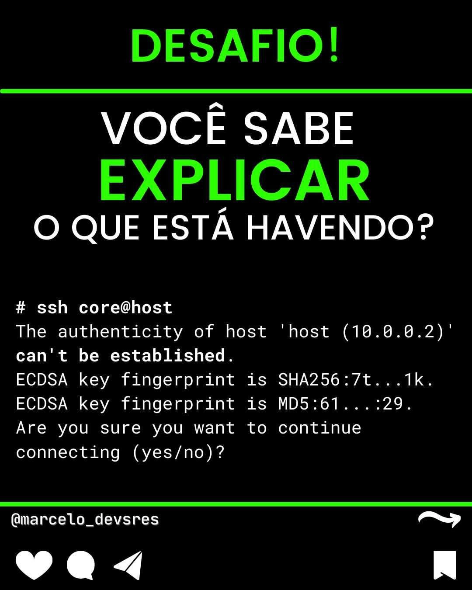

Ok ok... Eu sei o que você vai responder neste desafio.

Mas acompanhe meu raciocínio: você já pensou exatamente o que essa mensagem quer dizer? E o porquê de, toda vez que você vai realizar o primeiro acesso SSH, ela aparece?

Te convido para ler as 8 imagens do post até o fim para refletir um pouco sobre o uso de SSH no seu ambiente.

Se você ler alguma novidade, pode ser que o seu ambiente não seja tão seguro assim!

#linux #ssh

# Post 
[https://www.instagram.com/p/CR__wxMN_gl](https://www.instagram.com/p/CR__wxMN_gl)

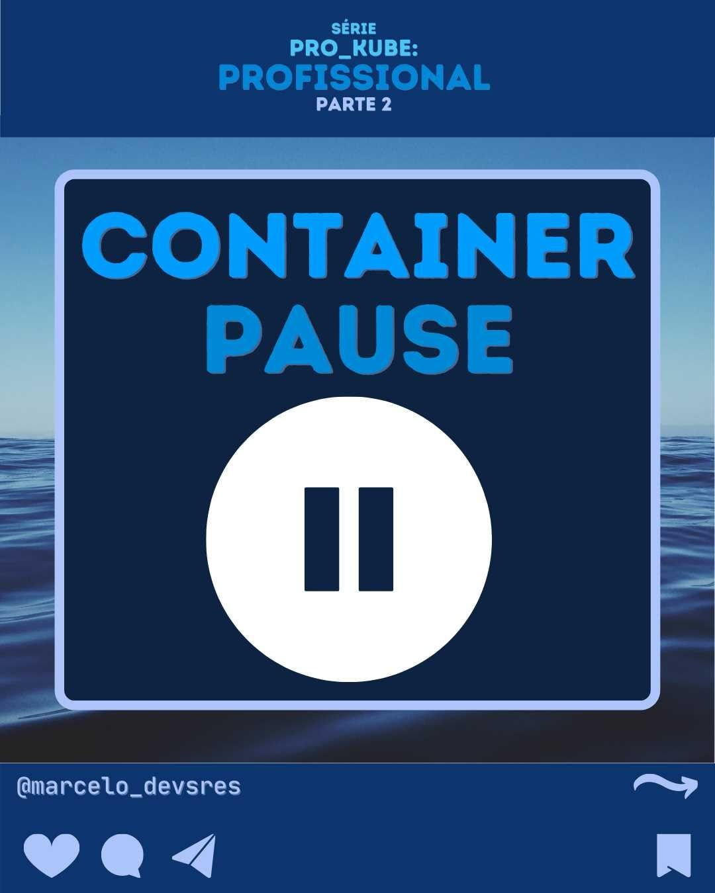

Um artigo no Linkedin lista 4 das perguntas mais comuns em entrevistas de emprego envolvendo Kubernetes. A primeira dela é: para que serve o container Pause  no Kubernetes?

Neste post, eu te dou a resposta.

Ps: falar que ele não faz absolutamente nada não é 100%  correto; o container implementa algumas capturas de sinais, a mais importante delas sendo o sigreap que permite fazer o zombie reaping de processos filhos. Entretanto, essa funcionalidade perdeu bastante a utilidade quando o Kubernetes mudou o comportamento padrão de shared process namespaces 1.8. Ele ainda serve para isso se você habilitar esse recurso.

#kubernetes

# Post 
[https://www.instagram.com/p/CR-eqYjN42I](https://www.instagram.com/p/CR-eqYjN42I)

Se o título clickbait chamou sua atenção, aproveite o momento para fazer uma reflexão sobre a unidade básica de orquestração de container: o Pod.

Você já parou para pensar por que escolheram usar essa abstração em vez de simplesmente falar "containers"?

As vantagens de poder compartilhar o mesmo espaço de redes, volumes e até mesmo área de processos (para viabilizar o envio de sinais entre containers) são um excelente diferencial na hora de implementar certos requisitos de arquitetura.

Também aproveite e acompanhe o post para refletir como, na essência (pelo menos com runtime em containerd e cri-o) todo Pod nasce multicontainer.

#kubernetes #cka

# Post 
[https://www.instagram.com/p/CR8NjUGDCHV](https://www.instagram.com/p/CR8NjUGDCHV)

Você, que se auto intitula SRE, qual seu grau de comprometimento com o SLO do seu sistema?

Inauguro hoje a série PRO_KUBE, para servir de contrapeso à série "Por que Kubernetes?", que apresenta o conteúdo básico sobre esta tecnologia.

Já parou para pensar se o seu Continuous Delivery não está impactando nos seus SLOs?

O Kubernetes é um software extremamente eficiente nas operações dentro do cluster. Mas será que ele integra bem com as outras tecnologias necessárias para viabilizar o acesso externo ao ambiente?

O post de hoje é sobre Readiness Gates, uma iniciativa para tentar minimizar o impacto de atualizações de aplicações na experiência do usuário.

#kubernetes #devops

# Post 
[https://www.instagram.com/p/CRcnoVuo4fx](https://www.instagram.com/p/CRcnoVuo4fx)

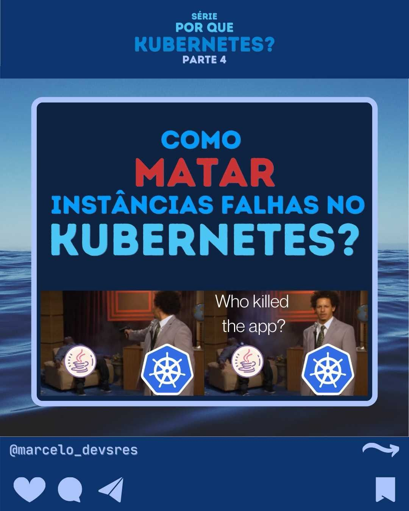

Você já tentou desligar e ligar de novo?

No post anterior (dois posts no mesmo dia? Uau!), vimos as Readiness Probes atuando para remover instâncias falhas do balanceamento interno do Kubernetes.

Isso resolve o problema de garantir que o cliente não fique insatisfeito por estar preso a uma instância quebrada, mas e aí? Faz o que com a aplicação problemática?

Bem, ela continua lá consumindo recursos e gerando custos, especialmente se executar na nuvem. Além disso, pode levar sua aplicação a apresentar menos performance por contar com menos réplicas para atender o tráfego.

Readiness Probes são úteis se acreditarmos que a aplicação é capaz de se auto recuperar. Se não for, melhor usar a milenar arte de TI de "desligar" para ver se, quando ela ligar novamente, ela volta a funcionar!

#kubernetes #cka #ckad

# Post 
[https://www.instagram.com/p/CRccXRrMERQ](https://www.instagram.com/p/CRccXRrMERQ)

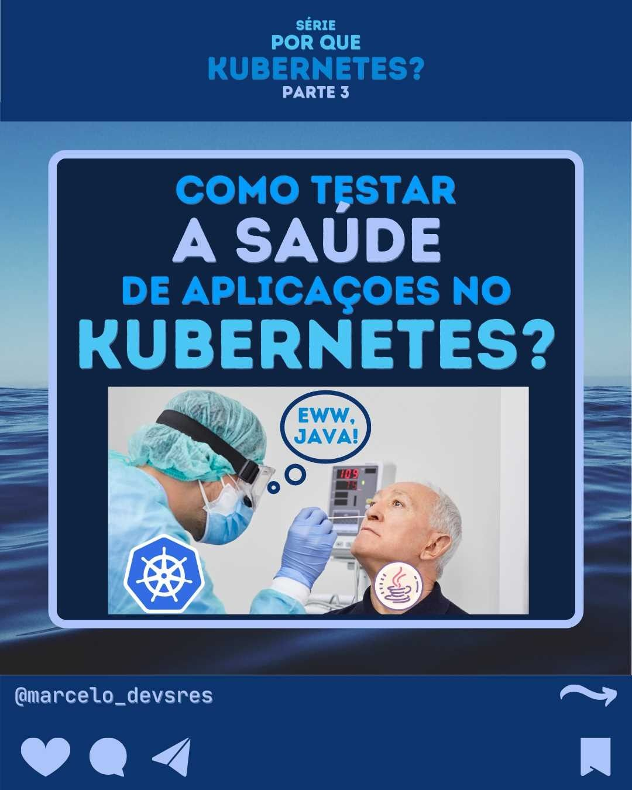

Sua aplicação tem 10 réplicas. 3 falham. O que acontece?

Uma das maiores dificuldades no meio da computação é detectar falhas o mais rápido possível para que o serviço final não seja impactado. 

Normalmente, em soluções de balanceamento dentro e fora da nuvem, você pode aplicar alguns conjuntos de healthchecks para que os balanceadores possam remover as instâncias problemáticas do seu pool, assim evitando clientes irritados.

O Kubernetes apresenta uma vantagem sobre tecnologias que fazem esses testes: quem conduz todas as operações de testes e validaçòes é o próprio Kubelet que executa no nó em que a aplicação está instalada, apresentando a possibilidade de fazer testes com intervalos menores e com respostas mais rápidas!

O assunto deste post são os Readiness checks, que identificam falhas e retiram as instâncias do balanceamento interno do Kubernetes.

#kubernetes #cka #ckad

# Post 
[https://www.instagram.com/p/CRKmAtvo4B3](https://www.instagram.com/p/CRKmAtvo4B3)

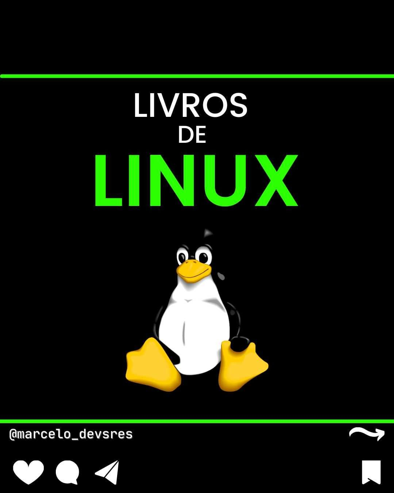

Por quais livros estudar Linux?

Bem, provavelmente a melhor resposta é nenhum; como todo assunto de tecnologia, livros tendem a envelhecer mal e ficarem rapidamente datados. Especialmente com a excelente quantidade de conteúdo online, provavelmente poucos livros realmente valem o investimento.

Justamente por isso não posso indicar nenhum dos que eu li quando estava começando - levando em consideração que eu comecei em 1998! A maioria dos livros que eu li não contam com novas edições desde 2010.

De qualquer forma, nem sempre você pode estar no computador estudando, e muitas vezes estudar no celular também não é viável.

Fiz uma seleção de alguns dos poucos livros que conheci na história recente. Confesso que não li nenhum deles; mas a maneira como os assuntos foram escolhidos e estão estruturados me passarem ser os melhores dos 50+ a que tive aceso.

Se alguém tem uma dica de livro que vale a pena, seja em português ou inglês, comenta aqui para eu dar uma olhada!

#linux

# Post 
[https://www.instagram.com/p/CRJs31ksgVm](https://www.instagram.com/p/CRJs31ksgVm)

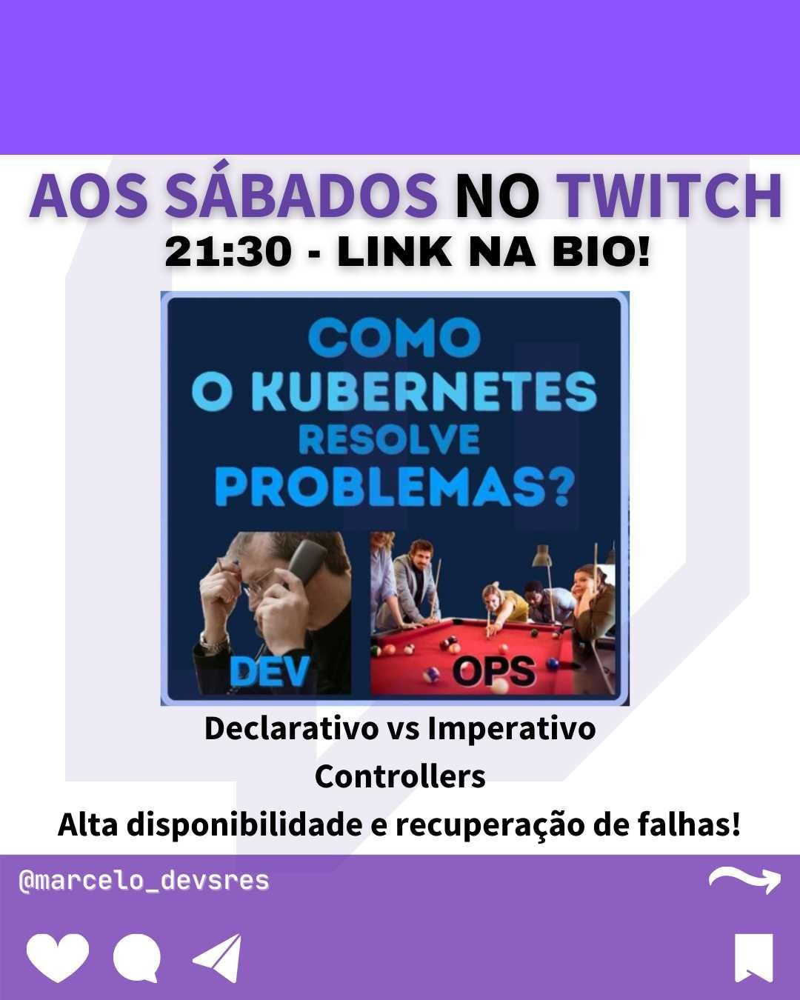

Achou o post superficial? Entra na live do Twitch hoje que a gente conversa com mais profundidade!

21:30, @marcelo_devsres - link na bio!

#kubernetes #cka #ckad

# Post 
[https://www.instagram.com/p/CRJsHw6sdz9](https://www.instagram.com/p/CRJsHw6sdz9)

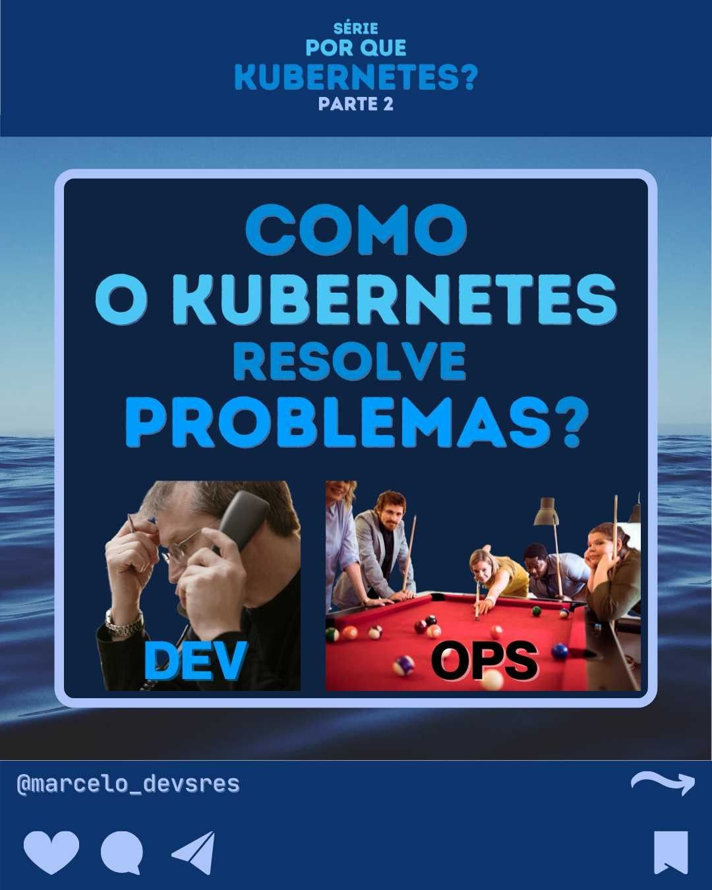

# Post 
[https://www.instagram.com/p/CRFwT63IDFe](https://www.instagram.com/p/CRFwT63IDFe)

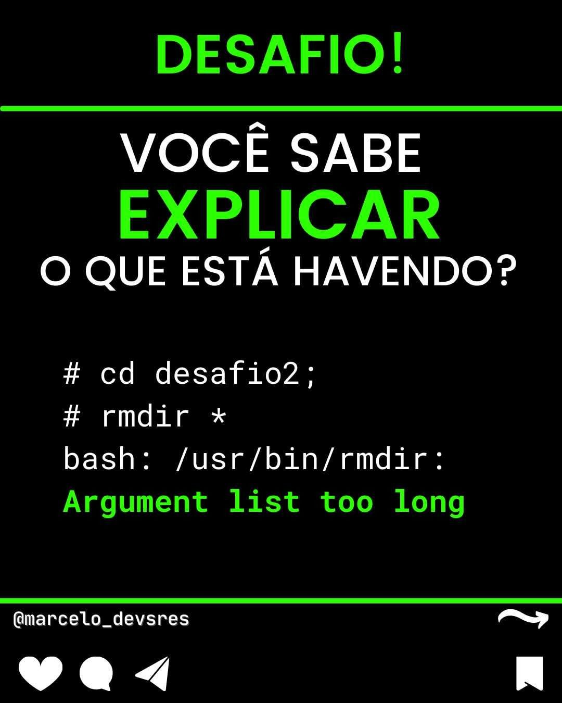

Você REALMENTE sabe explicar o que está havendo na execução do comando acima?

Tá, você sabe resolver, mas não foi isso que eu perguntei. Você sabe *EXPLICAR* o que está havendo?

Se você aprendeu alguma coisa que não sabia, comenta aí e me diz! 

Muita gente entende vagamente o que acontece, busca por uma solução no Google, resolve e passa para a próxima bronca. Te convido a entender um pouquinho mais sobre como a interação shell/SO funciona!

#linux #shellscript

# Post 
[https://www.instagram.com/p/CQ4Cm9yMLgm](https://www.instagram.com/p/CQ4Cm9yMLgm)

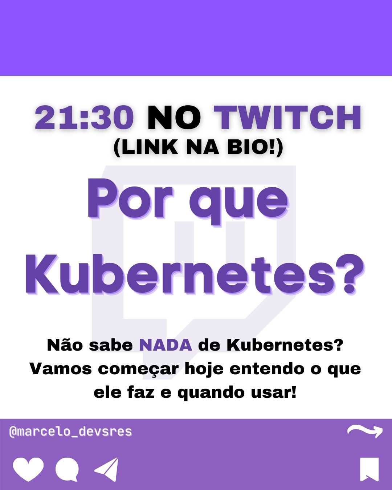

Tá sem programa para sábado à noite? Aparece na live do Twitch para falarmos sobre Kubernetes!

Uma coisa que eu percebo é a sanha em aprender novas tecnologias, buscando o aprendizado prático e hands-on. 

Vamos fazer algo diferente hoje? Estudar a "história" da infraestrutura vai ajudar a entender a motivação de usar uma tecnologia deste tipo no seu ambiente - ou não!

Se o básico não te interessa, aparece de qualquer jeito! Depois de terminar a "pauta principal" vou ficar interagindo com o chat e respondendo quaisquer dúvidas que você tenha que eu saiba algo - de Kubernetes a Terraform, passando por Cloud, Ansible ou Gitlab CI!

#kubernetes

# Post 
[https://www.instagram.com/p/CQyst1WC_Eo](https://www.instagram.com/p/CQyst1WC_Eo)

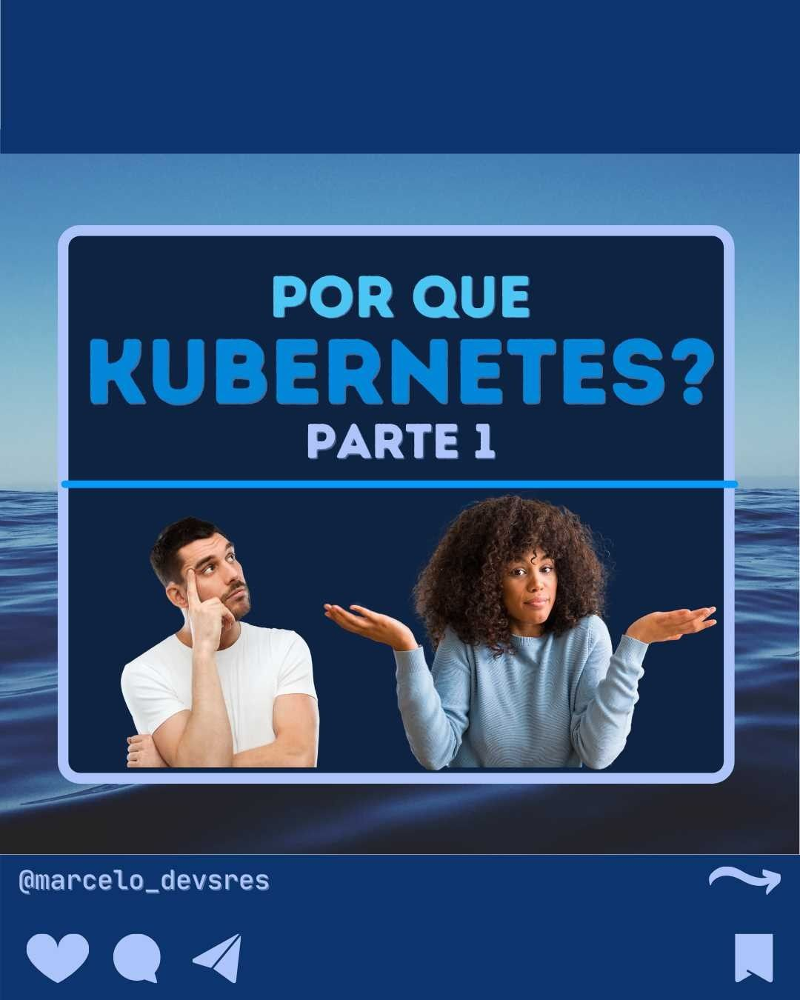

Eu quero fazer de VOCÊ, que não sabe nada de Kubernetes,  um administrador com CKA - ou um desenvolvedor com CKAD, você que escolhe!

O que vou cobrar por isso? 

Nada. só me acompanhe poraqui e no meu canal do Twitch - quem quiser o link, está na Bio.

Não tem tempo para live? Tudo bem, vou deixar gravado e subir pro Youtube depois.

Tem alguma dúvida sobre Kubernetes que não diz respeito ao que falei aí em cima? Passa no Twitch que eu te respondo ao vivo!

#kubernetes #cka #ckad

# Post 
[https://www.instagram.com/p/CQxYlnXITDZ](https://www.instagram.com/p/CQxYlnXITDZ)

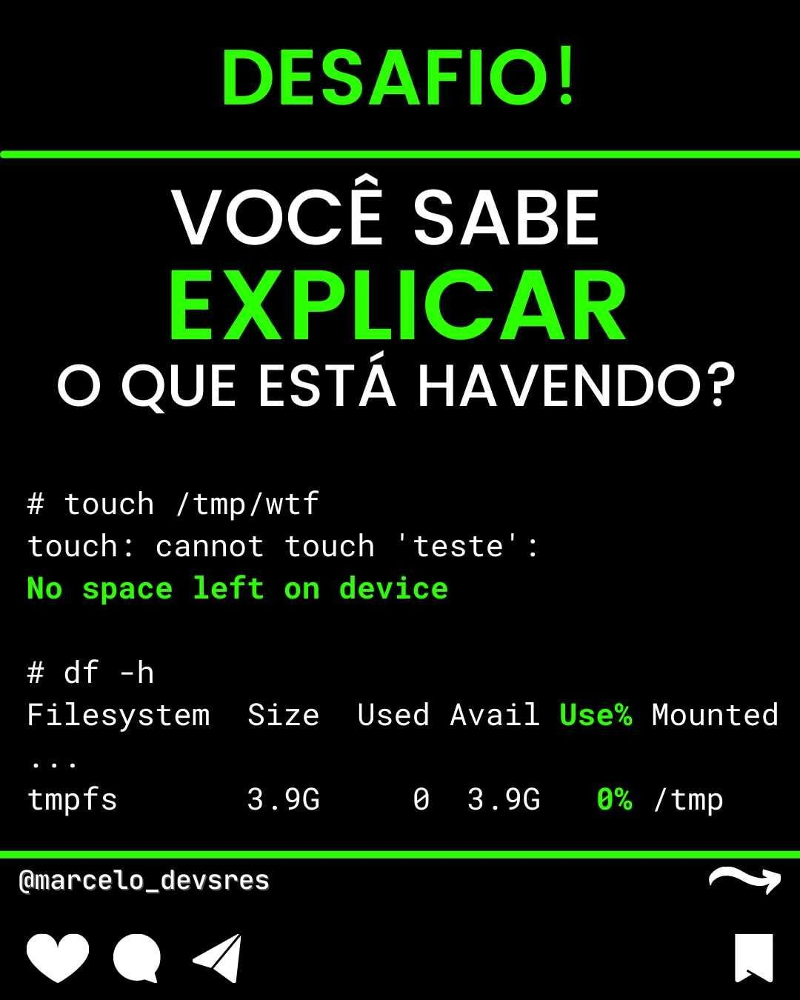

A Carol me contou que perguntaram ISSO para ela em uma entrevista de emprego! 

E aí, você passaria ou reprovaria?

Se não sabe, a resposta está no fim do carrossel!

#linux #sysadmin

# Post 
[https://www.instagram.com/p/CQfNFd7IKFB](https://www.instagram.com/p/CQfNFd7IKFB)

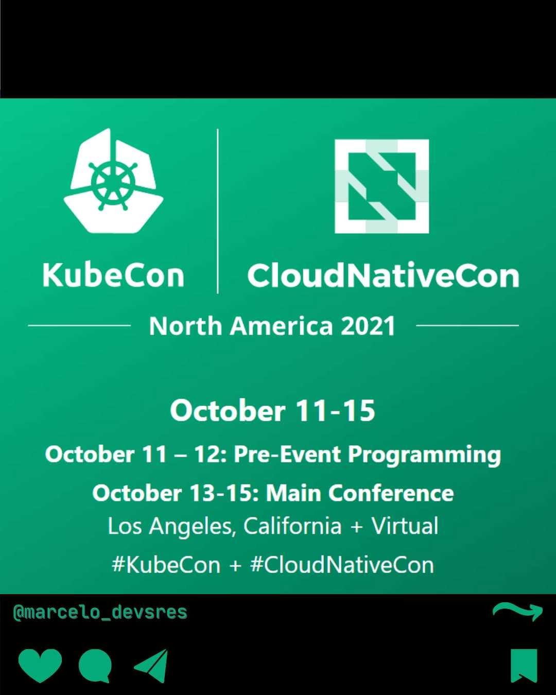

Você, que não me seguia há meses atrás e vacilou na hora de se inscrever para a Kubecon, aqui está sua segunda chance!

Kubecon North America acabou de abrir suas inscrições. E tem aquele precinho camarada de "Early bird" para a conferência virtual: U$ 10,00.

Fim do mês ainda está longe, e o cartão já está estourado? Bem, você tem até o dia 5 de julho para fazer sua inscrição!

"Mas por que eu me inscreveria nesse evento?", você pode perguntar. Depois as palestras vão para o Youtube mesmo, vou só jogar uma onça fora.

ERRADO!

Se você tem interesse em aprender mais sobre Kubernetes para impressionar na sua próxima entrevista de emprego, os ingressos para a Kubecon te garantem um voucher de desconto de 50% em uma das três provas de certificação - CKA, CKAD ou CKS, que em vez de custar U$ 300,00 sairiam por U$ 150,00.

"Mas eu não sei nada de Kubernetes! Para que vou comprar um voucher, não tenho chance na certificação!"

Você vai ter um ano para fazer a prova. Dá (e sobra) tempo até lá. Os descontos podem ser aplicados nas certificações e também nos bundles de treinamento.

"Mas olha o preço desses bundles! Não dá para comprar esses treinamentos." Se for assim, comenta aí embaixo que você quer aprender Kubernetes de graça comigo no Twitch. Se muita gente se entusiasmar, quem sabe eu não começo a preparar um treinamento de graça nas lives toda semana?

#kubernetes #kubecon #cka

# Post 
[https://www.instagram.com/p/CQXmxyEoDx6](https://www.instagram.com/p/CQXmxyEoDx6)

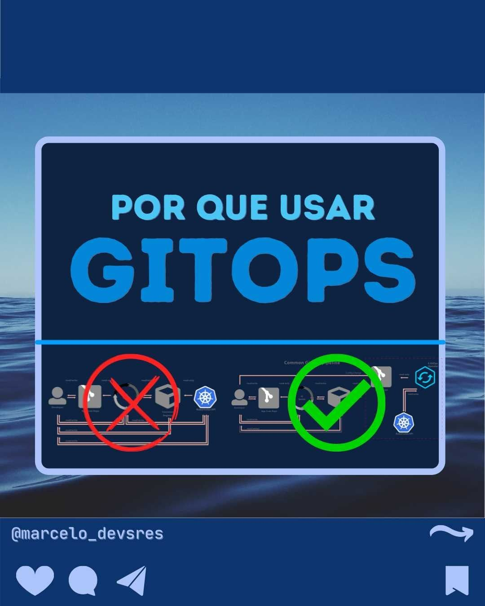

GitOps! Mais importante talvez até mesmo que entender o que é GitOps é entender por que usar GitOps.

Embora tenha surgido no universo Kubernetes, este termo - criado pela Weave -  não se refere a um programa ou a uma tecnologia, e sim a uma (excelente) ideia. 

À medida que se fala cada vez menos de times "Ops", chegando a se pensar em NoOps, GitOps vem lembrar a equipes "puro dev" que, assim como o software que desenvolvem, a infraestrutura também deve ser tratada como código, e, como tal, adequadamente parametrizada E versionada.

Evite cair em uma armadilha para si próprio escrevendo diversos pipelines que fazem deploy diretamente nos ambientes; pare um pouco, leia sobre GitOps e entenda as diversas vantagens em adotar um modelo pull-based baseado em agentes e merge-requests com sua infraestrutura devidamente versionada em Git. 

Seu eu do futuro irá te agradecer!

# Post 
[https://www.instagram.com/p/CQRnT0eMH6w](https://www.instagram.com/p/CQRnT0eMH6w)

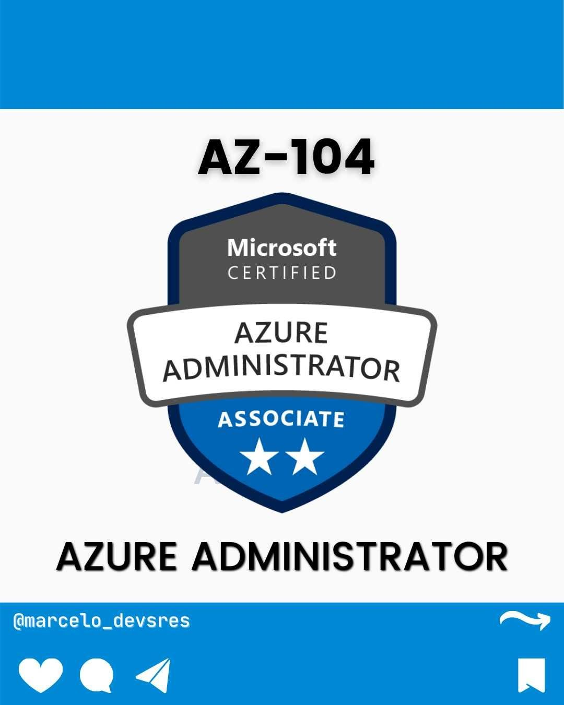

Peço desculpas a vocês pela inércia das últimas semanas, mas eu havia colocado um desafio para mim em janeiro, que era deixar de ser um zero à esquerda em Azure e ser capaz de discutir implantações (ainda que básicas) em seis meses.

Marquei a prova AZ104 para junho e férias para maio, para poder me dedicar a estudar e praticar de verdade.

Infelizmente, o COVID me roubou maio, então usei todo o tempo livre disponível para atingir meu objetivo. A certificação é um feliz efeito colateral que comprova este objetivo.

Obrigado a todos!

# Post 
[https://www.instagram.com/p/CQB_6LzMIio](https://www.instagram.com/p/CQB_6LzMIio)

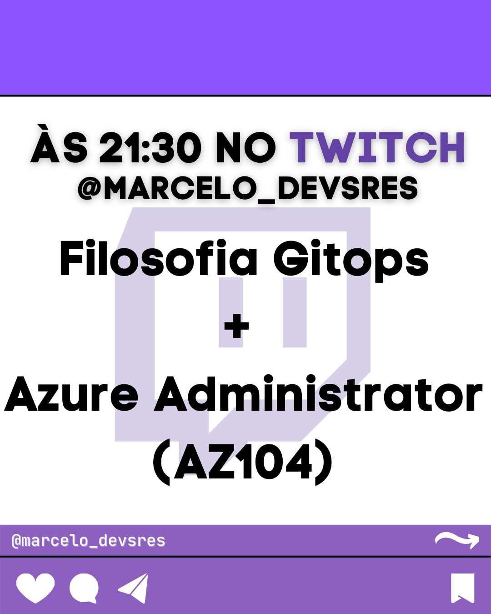

Não tem o que fazer no dia dos namorados e cansou de passar horas procurando filme no Netflix e cochilar sem assistir nada?

Bem, hoje vou fazer live no Twitch às 21:30, vou falar sobre GitOps para servir de gancho para que vocês assistam a apresentação que fiz junto do canal Azuretar do Youtube (que deve entrar no ar em breve). 

Mas se você curte preparação para certificações, também ver como está minha preparação para AZ104 fazendo alguns simulados.

Se você quer tirar dúvida de Kubernetes, Devops ou mesmo como dar o pontapé inicial para seguir essa carreira - e não estiver curtindo sua cara metade -, passa lá que a interação é que torna esse modelo mais divertido!

#kubernetes #devops

# Post 
[https://www.instagram.com/p/CP7HhSRohUJ](https://www.instagram.com/p/CP7HhSRohUJ)

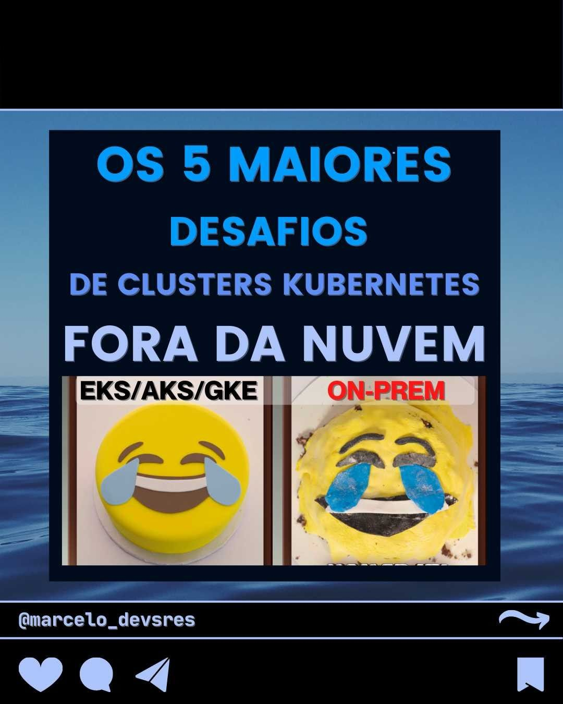

Seu cluster Kubernetes parece com a foto da esquerda ou da direita?

Recentemente pude trocar ideias com outros funcionários públicos que têm a ideia de implantar Kubernetes em seus ambientes on-premises, já que normalmente cloud não é uma opção por diversos motivos.

A maior dificuldade que vejo em usar clusters Kubernetes em ambientes não servidos por cloud providers é que, para iniciantes, são cobradas diversas decisões antes mesmo da implantação, quando você claramente não está preparado para tomá-las. E se o cluster subir para produção e tiver um SLA apertado, "mudar de ideia" no meio do caminho pode se mostrar inviável.

Elenquei neste post os 5 elementos que oferecem maior dificuldade, listados na ordem em que você precisa resolver - 4 e 5 não serão problemas de imediato, mas podem se tornar bem na hora de colocar em produção!

#kubernetes

# Post 
[https://www.instagram.com/p/CP3gY19sv0n](https://www.instagram.com/p/CP3gY19sv0n)

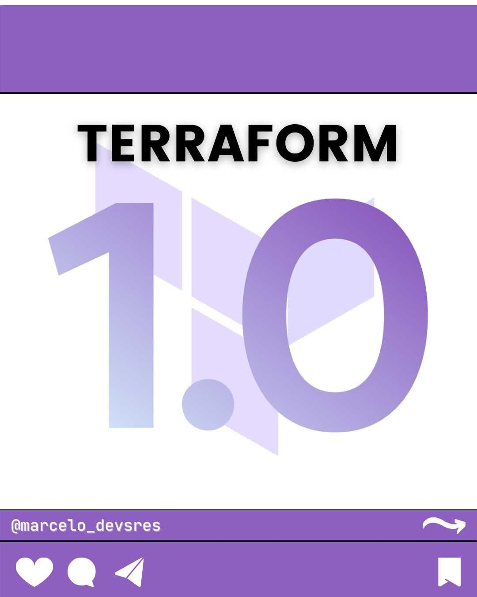

Terraform 1.0 chegou! 

Para abrir a Hashiconf Europe, a empresa decidiu anunciar que Terraform agora é considerado um produto "generally available". Passaram-se apenas 10 anos!

O que mudou na 1.0? Bem, em termos técnicos, não mudou muito com relação à última versão 0.15. 

As principais mudanças que a versão GA trouxe já foram aplicadas na árvore anterior. Os principais esforços são direcionados à buscar estabilidade e interoperabilidade entre as versões o código e os arquivos de estado -  problema clássico de Terraform. 

Junto com a estabilidade vem a ideia de manter suporte à versão 1 pelos próximos 18 meses, no mínimo. E o mais importante: a promessa de que você não vai precisar refatorar o código a cada novo lançamento de minor versions (quem trabalha a mais tempo, antes da 0.12, sabe da enorme diferença que isso faz)!

Você já está pronto para adotar o Terraform 1.0? Ou ainda está executando código que precisa ser migrado? Conta para mim!

#terraform #devops

# Post 
[https://www.instagram.com/p/CONveMXM3gD](https://www.instagram.com/p/CONveMXM3gD)

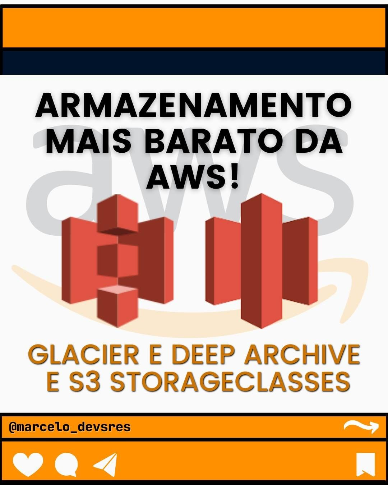

Uma pergunta séria: você conhece o S3? Se você respondeu "sim", tem certerza que conhece *de verdade*?

Hoje vou falar um pouco sobre como a AWS meio que "descontinuou" o serviço Glacier em prol do uso de StorageClasses Glacier e Glacier Deep Archive nativamente a partir do S3.

O armazenamento mais barato da AWS, o Glacier Deep Acrhive *não* está disponível a partir da API Glacier, ele existe apenas como uma opção de StorageClass (ou tier do Intelligent Tiering). Os arquivos do S3 que pertencem a essa StorageClass *não* aparecem em vaults na interface da Console do Glacier - a AWS usa estratégias internas para garantir seu arquivamento e posterior recuperação.

E ainda temos o Intelligent Tiering, StorageClass própria da AWS que te cobra um "pedágio" para modificar o tipo de cobrança do objeto a partir de métricas de acesso deste. E, desde 11/2020, agora suporta também dois tiers adicionais customizáveis: transição para Archive e Deep Archive, dois nomes diferentes mas idênticos em funcionalidades, preços e prazos às StorageClasses Glacier.

Muito cuidado com essas transições automáticas: o custo de mudança de lifecycle não é barato, e você pode ter surpresas desagradabilíssimas se seus buckets tiverem muitos arquivos pequenos!

#aws #s3 #cloudarchitect

# Post 
[https://www.instagram.com/p/COMxHZMsTtp](https://www.instagram.com/p/COMxHZMsTtp)

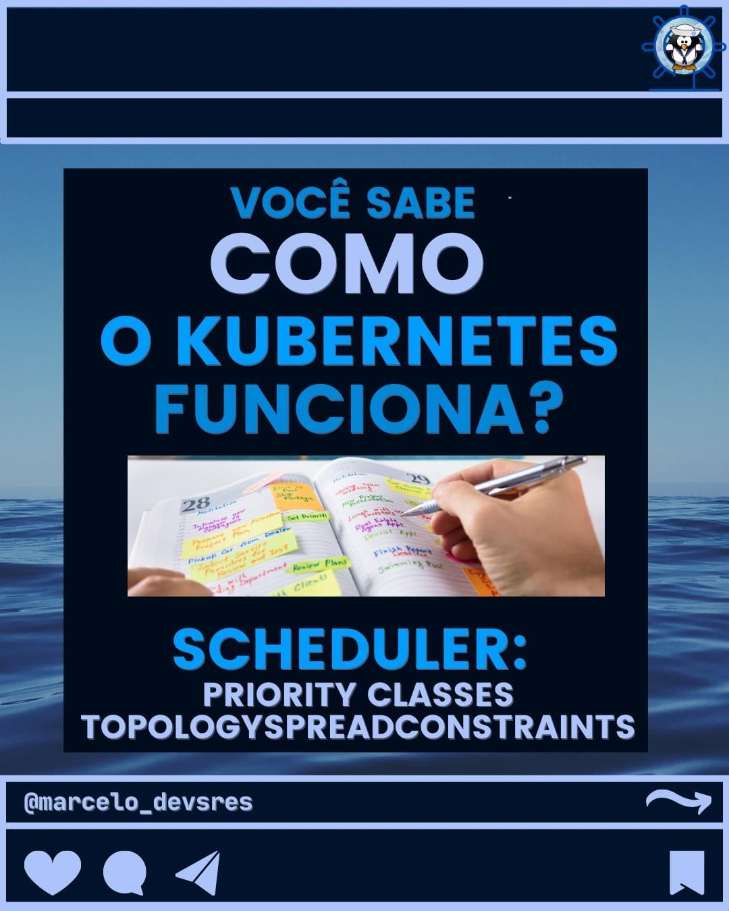

Semana passada falei das interferências
mais básicas que podemos usar para manipular os
resultados do Kubernetes Scheduler.

Como não deu tempo de preparar o próximo assunto
(foi mal!), vou aproveitar para seguir falando de outras
maneiras de manipular o Scheduler, estas bem menos
conhecidas pelo "público leigo".

Se você está se preparando para o CKA/CKAD, eu
acredito que este assunto seja "offlimits"; mas não há
razão para não saber pelo menos que ele existe,
correto?

#kubernetes #ckad #cka

# Post 
[https://www.instagram.com/p/COG_QKiojU-](https://www.instagram.com/p/COG_QKiojU-)

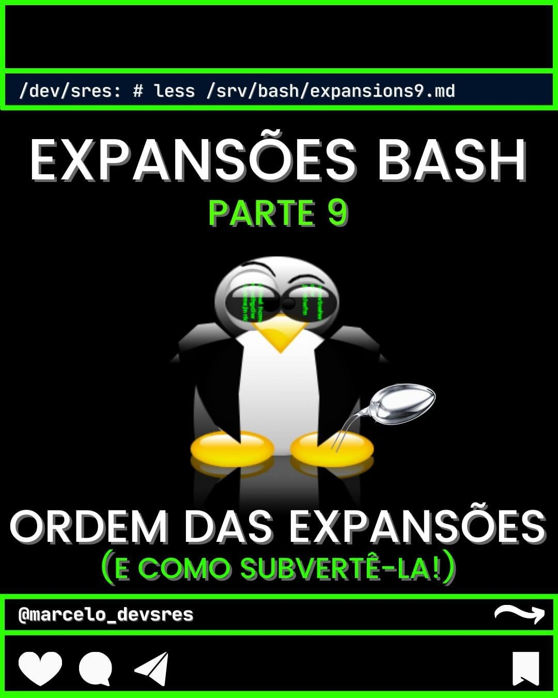

Nos últimos dois meses, eu falei, neste perfil, sobre todas as "transformações" que o Bash faz nas linhas de comando processadas por ele antes da execução do comando final. Semana passada, dei por encerrado esse assunto.

Entretanto, é possível que eu tenha sugerido, de maneira implícita, que as expansões, substituições e outras operações ocorrem na ordem que apresentei nos posts. Não é o caso!

Neste post, mostro a ordem em que o Bash efetivamente processa os parâmetros digitados, apresento uma maneira de "subverter" o processo em caso de necessidade, e enfatizo os riscos associados à essa estratégia!

#linux #bash #shellscripting

# Post 
[https://www.instagram.com/p/CN9ABHBoi75](https://www.instagram.com/p/CN9ABHBoi75)

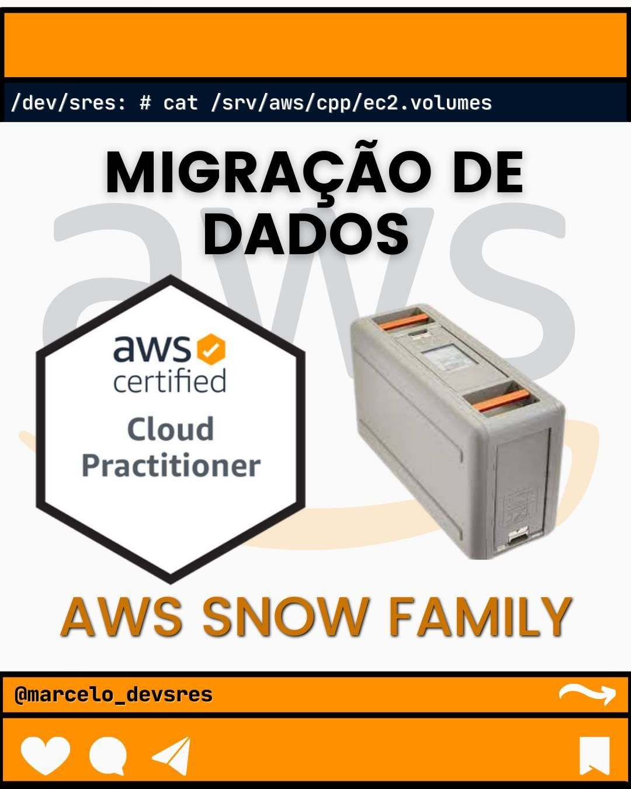

Como migrar grandes quantidades de dados para a AWS?

Parece folclore, mas, por vezes, a maneira mais eficiente não só em preço quanto em tempo para transferir grandes volumes de dados é literalmente salvar tudo em HDs e enviar por transportadora.

Se as alternativas online não forem viáveis por alguma razão, a AWS oferece uma família de serviços integralmente dedicada para essa operação, a "Família Snow", descrita neste post.

Observe que, com a importância de levar capacidade de processamento cada vez mais próxima para o usuário, os serviços Snow estão se adaptando para também viabilizar capacidades de Edge Computing, não sendo apenas um cofre de dados para transferência de arquivos de um lado para o outro.

Observação importante: não confundir estas tecnologias com o AWS S3 Glacier, serviço de armazenamento de baixíssimo custo (porém não online) oferecidos pela AWS. Glacier pode ser entendido como um "tier" do serviço S3.

#aws #cloudpractioner

# Post 
[https://www.instagram.com/p/CN2rUxuDdtz](https://www.instagram.com/p/CN2rUxuDdtz)

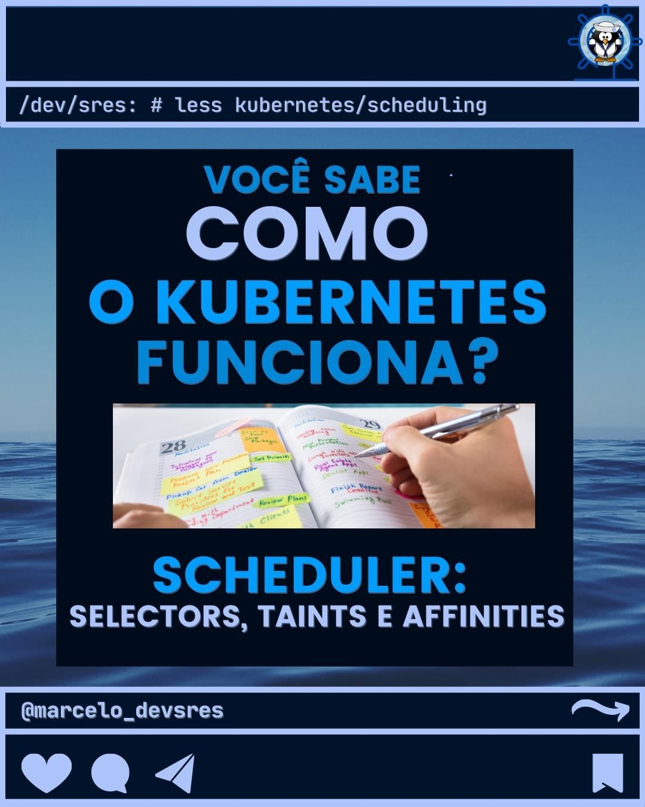

Semana passada falei dos vários Controllers do Kubernetes, mas com ênfase no Kube-controller. Que tal falar um pouco do Scheduler hoje?

Na verdade, falar do Scheduler em si é algo ridiculamente complexo; como o conceito de scheduling é um problema de otimização, e problemas de otimização normalmente são bem complicado, os casos de uso de customização de algoritmo de pontuação e de filtros são igualmente terríveis de se entender.

Mas existe um conjunto básico de coisas que qualquer pessoa que trabalhe com Kubernetes precisa saber, que é como interferir no processo do Scheduling usando nodeSelectors, taints e affinities.

Se você quer fazer as provas de certificação CKA/CKAD, precisa entender e saber implementar esses comportamentos na hora da prova!

#kubernetes #cka #ckad

# Post 
[https://www.instagram.com/p/CN1N1PyId5k](https://www.instagram.com/p/CN1N1PyId5k)

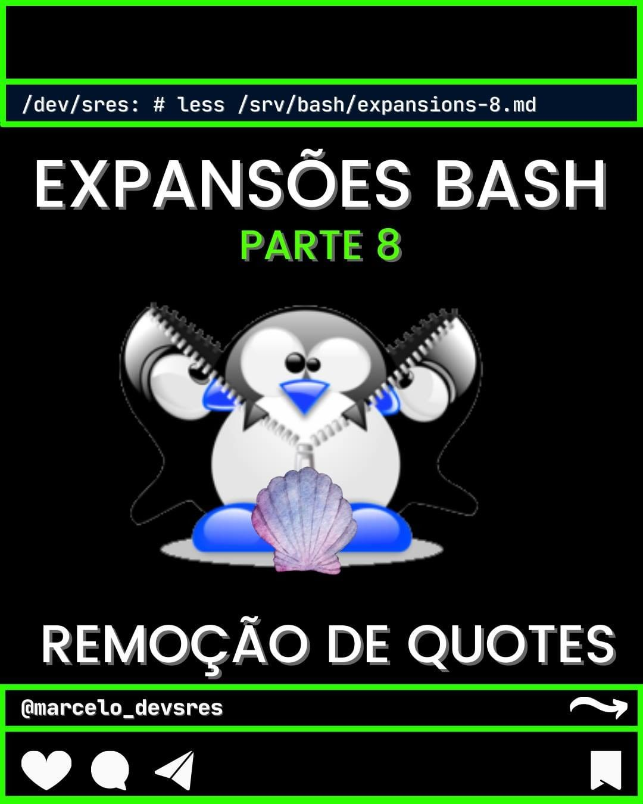

Último capítulo da minha série Expansões Bash: remoção de quotes.

Não há muito do que falar sobre remoção de quotes. Ao fim de tudo, o Bash remove as 'quotes' das linhas digitas / processadas em um script.

O que sobrou é entender para que ele faz isso, e obviamente tem a ver com a função primária do shell, que é a solicitar a execução de comandos por parte do sistema operacional.

Todo o resto é só 'fru fru' executado pelo shell para enriquecer as linhas e tornar nossa vida "mais fácil"!

#linux #shellscripting #bash

# Post 
[https://www.instagram.com/p/CNqf4s1s1Tf](https://www.instagram.com/p/CNqf4s1s1Tf)

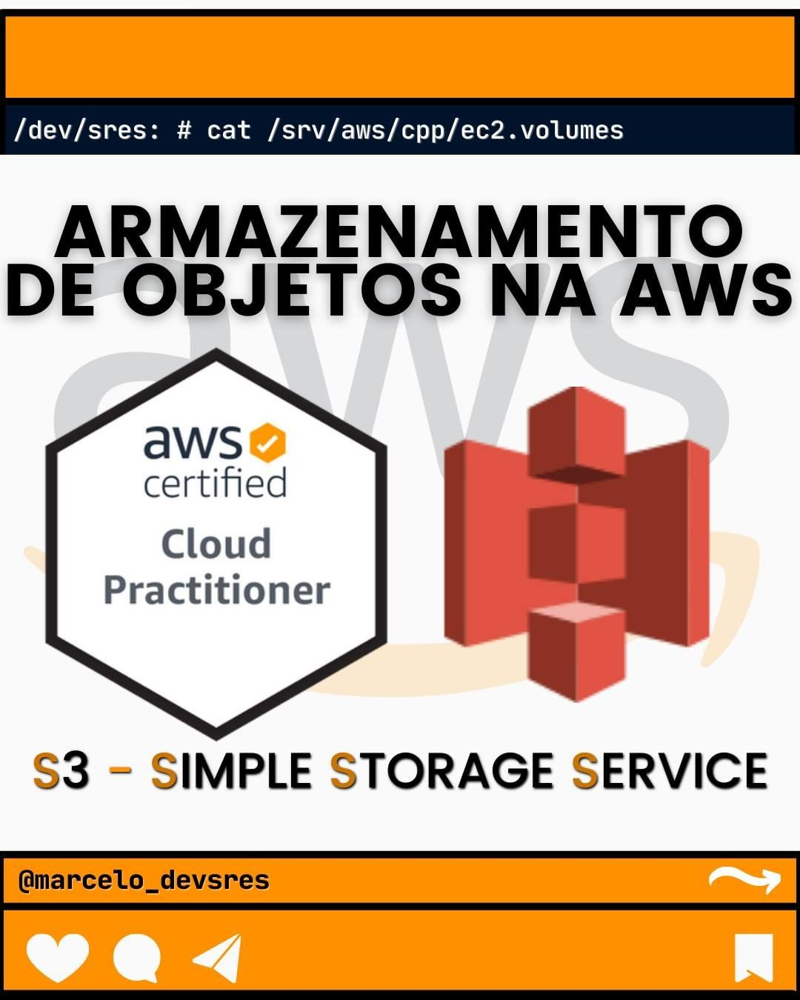

O AWS S3 é um dos serviços mais usados e mais versáteis da AWS. 

Com a promessa de armazenamento "infinito" e confiabilidade de 11 9s (99,999999999%) a um custo relativamente baixo, acabou se transmutando de simples serviço de backup a uma das maiores fontes de dados para websites do mundo, e agora também bastante explorado como origem para datalake e analytics.

No post de hoje, vemos um pouco do básico do S3, e uma informação relativamente "nova" que nem todo mundo conhece!

#aws #cloud

# Post 
[https://www.instagram.com/p/CNlWTcaoawz](https://www.instagram.com/p/CNlWTcaoawz)

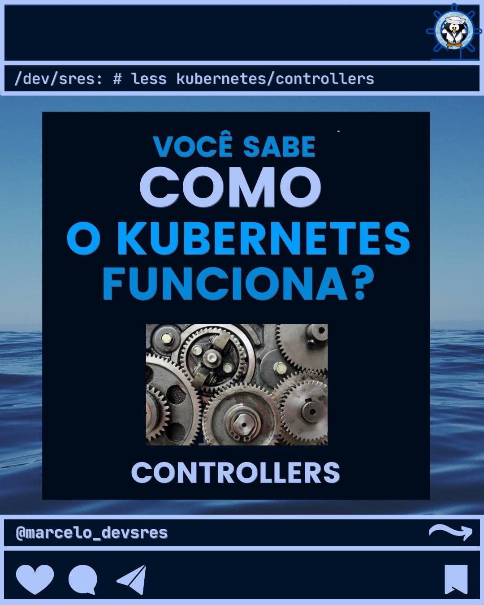

Quer entender como é que o Kubernetes funciona? Veja as imagens deste post!

Não entendeu alguma coisa? Pode perguntar que eu respondo!

Entender a filosofia por trás do "Controller Pattern" e como ele se dissocia do MVC tradicional é imprescindível para dar os primeiros passos no desenvolvimento de extensões para o Kubernetes. 

E se você não tem planos para programar controllers ou criar operators, entender como os controllers se relacionam vai te ajudar no troubleshooting do dia-a-dia, bem como te deixar mais afiado para descobrir com rapidez a causa do problema em alguma questão da prova CKA/CKAD!

#Kubernetes #CKAD #CKA

# Post 
[https://www.instagram.com/p/CNdn-jxFoaG](https://www.instagram.com/p/CNdn-jxFoaG)

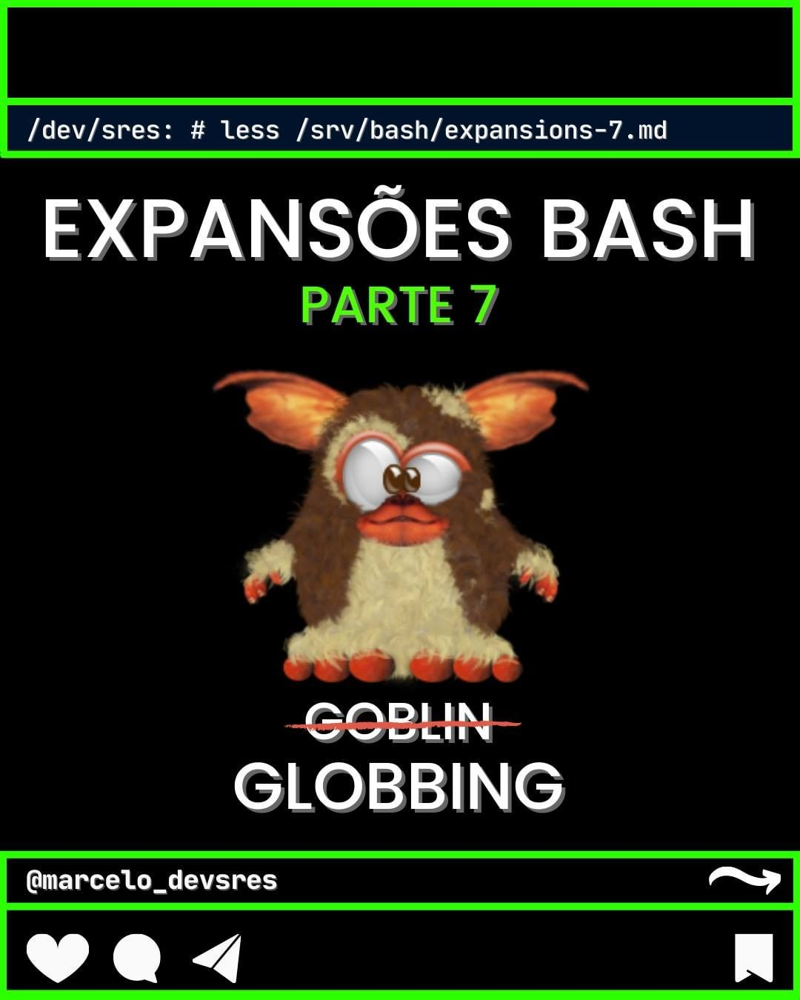

Todo mundo sabe usar * na linha de comando. Mas você realmente entende o que está acontecendo? 

A expansão de arquivos, também conhecida como 'file globbing' (o nome esquisito é herança do Unix) corresponde a um casamento de padrões simples contra arquivos existentes. 

A frase mais importante deste post que possivelmente vai te ecomizar bastante sofrimento: Globbing não é Expressão Regular. A despeito do uso de metacaracteres comuns, são duas coisas completamente diferentes. Entender isso vai tornar o aprendizado de expressões regulares bem menos doloroso.

(Ps: também existem os extended globs! Mas não falo deles aqui).

#linux #shellscripting #bash

# Post 
[https://www.instagram.com/p/CNYeahuo49X](https://www.instagram.com/p/CNYeahuo49X)

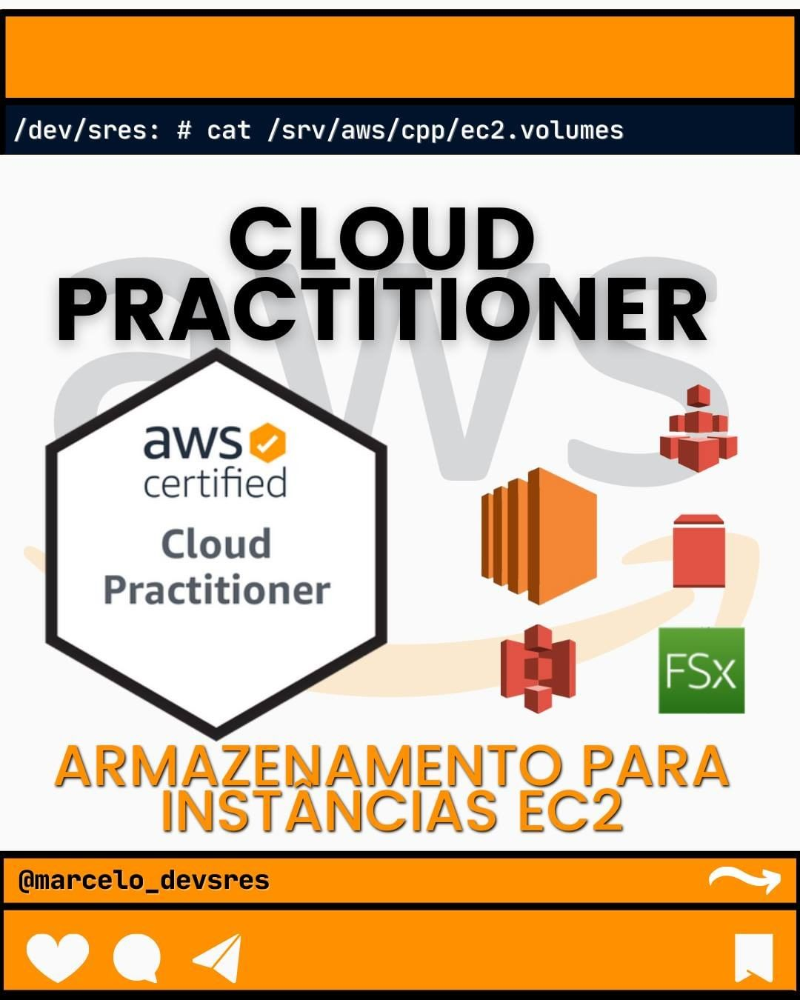

Nem tudo é passível de armazenamento em bancos de dados, então talvez você se depare com o problema de como garantir acesso a arquivos para suas instâncias EC2.

A recomendação óbvia é o uso do AWS S3, um serviço global, altamente disponível e extremamente resiliente  em termos de durabilidade para servir de repositório de arquivos. Entretanto, nem sempre é uma opção, seja por latência, seja pelo problema da consistência eventual. 

A AWS oferece cinco opções de serviços para montagem de blocos ou sistemas de arquivos para instâncias EC2. Para as provas de Cloud Practitioner e Architect Associate, espera-se que você seja capaz de associar o caso de uso mais comum de cada uma das ofertas disponíveis.

#aws #CloudPractitioner

# Post 
[https://www.instagram.com/p/CNTU0aOIA36](https://www.instagram.com/p/CNTU0aOIA36)

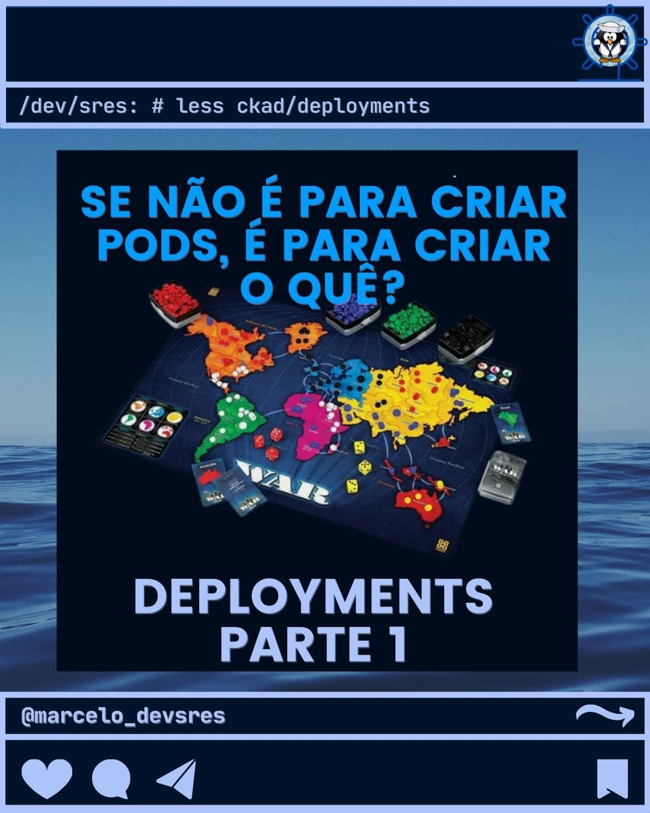

Precisamos conversar sobre controle.

Semana passada vimos que Pods são a unidade básica de orquestração de Kubernetes; um ou mais containers agrupados de maneira lógica e instanciado em algum lugar pelo Kubernetes. Aproveitei para falar que você NÃO deve instanciar Pods diretamente, ou eles sumirão do mapa na primeira adversidade.

Se Pod é a unidade básica de orquestração do Kubernetes, o Deployment é a unidade básica de orquestração do usuário. Você irá mapear sua aplicação (ou pedaços delas) em deployments, o que te permitirá versioná-la adequadamente e garantir que sempre haja instâncias dela em execução em um dado momento.

Agora quem garante a manutenção da execução da sua aplicação em caso de falhas? Não é o Deployment em si, e sim um componente-chave do Kubernetes que é justamente o que diferencia esta tecnologia das demais.

Siga as imagens para entender como tudo se amarra!

#Kubernetes #CKAD

# Post 
[https://www.instagram.com/p/CNLV4N-JMi8](https://www.instagram.com/p/CNLV4N-JMi8)

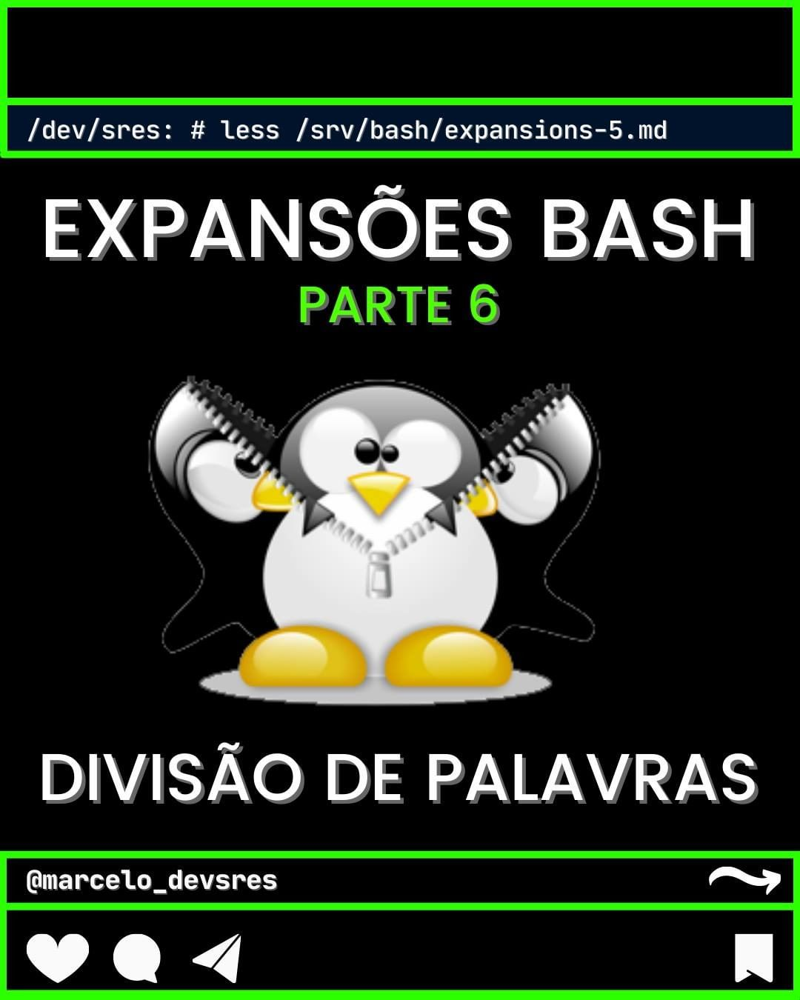

Parece um assunto bobo, mas você já foi no "limite" do shell com relação a divisão de palavras? É um assunto que dá para encher um capítulo de livro tentando explicar, com muitas nuances e explicações extremamente crípticas a serem exploradas.

Vou dar um exemplo: Any character in IFS that is not IFS whitespace, along with any adjacent IFS whitespace characters, delimits a field. A sequence of IFS whitespace characters is also treated as a delimiter. If the value of IFS is null, no word splitting occurs.

Entendeu? Não? Bem, um dia a gente chega lá.

Consolido aqui um pouco da ideia básica do word splitting e apresento os conceitos de escaping e quoting, fundamentais para a escrita de bons scripts bash.

#linux #bash #shellscripting

# Post 
[https://www.instagram.com/p/CNI47DpMT3B](https://www.instagram.com/p/CNI47DpMT3B)

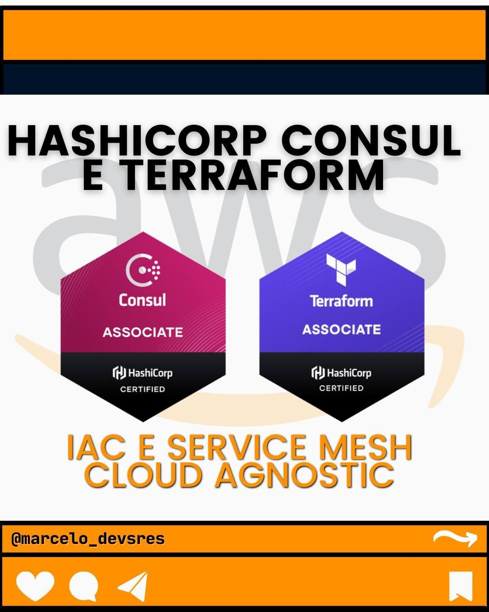

Hashicorp Consul e Terraform: opções "cloud agnostic" de service mesh e Infrastructure as a Code para seu ambiente.

Os provedores de nuvem fazem de tudo para oferecer todo tipo de produto e serviço para enfatizar a conveniência de seu uso. É de se esperar que estas conveniências se apliquem apenas para os ambientes que rodem nas suas próprias infra-estruturas.

Se seu roadmap inclui um cenário multi-cloud ou nuvem híbrida (on prem+public cloud), uma maneira de fugir desse lock-in é a adoção de soluções pensadas para serem cloud-agnostics como os softwares Consul e Terraform, da Hashicorp.

Mas e como fica o lock-in com relação ao uso destes softwares? Bem, eles são software livres, com código aberto disponível no Github; você pode, inclusive, ajudar o desenvolvimento de ambos participando ativamente destas comunidades!

(Esta semana vou ficar devendo conteúdo exclusivo AWS de verdade; o pouco tempo livre que tive dediquei para a preparação para tirar as certificações!)

# Post 
[https://www.instagram.com/p/CNAmmM7HT_s](https://www.instagram.com/p/CNAmmM7HT_s)

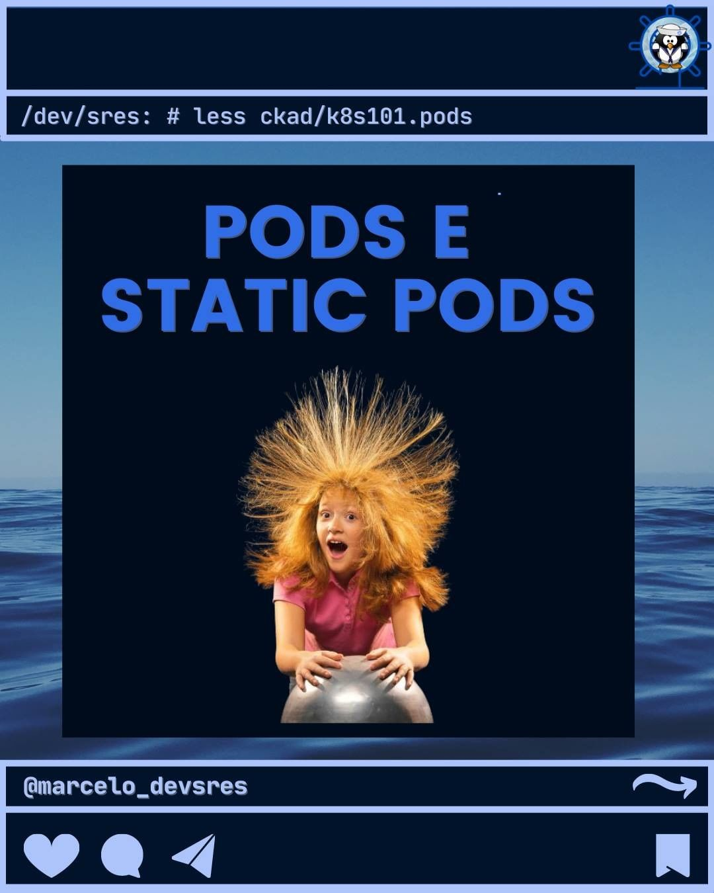

Você já ouviu falar de Static Pods? Não? Se você quer tirar seu CKA, acredito que este post vale a pena.

Quer CKAD ou não liga para certificações? Bem, este post também vale a pena :-P

Aproveito e comento alguns aspectos dos Pods, sejam eles estáticos ou não, como o fato de obrigatoriamente compartilharem a rede, poderem compartilhar volumes (se você quiser) e até mesmo compartilhar a PID namespace!

#kubernetes #cka

# Post 
[https://www.instagram.com/p/CM4tI3hDfCU](https://www.instagram.com/p/CM4tI3hDfCU)

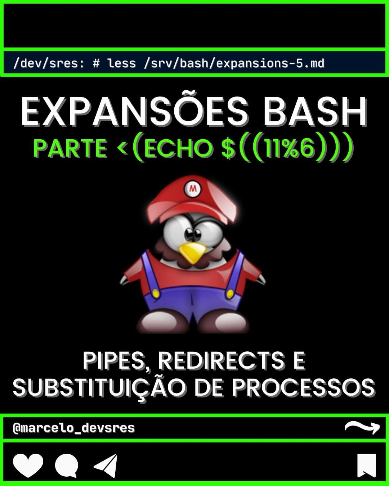

A sexta expansão abordada pelo meu finado curso de Shell Scripting em Bash era a substituição de processos.

Não é um assunto que muita gente conhece - e menos gente ainda domina! Mas, se você pretende trabalhar em um universo colaborativo, usando Dockerfiles com initscripts gerados por grandes gurus da computação moderna, acredito que vale a pena ao menos saber a ideia, o porquê da existência e os casos de uso mais comuns.

Este assunto raramente é abordado em cursos por aí!

#linux #bash

# Post 
[https://www.instagram.com/p/CMzpvXHM9JR](https://www.instagram.com/p/CMzpvXHM9JR)

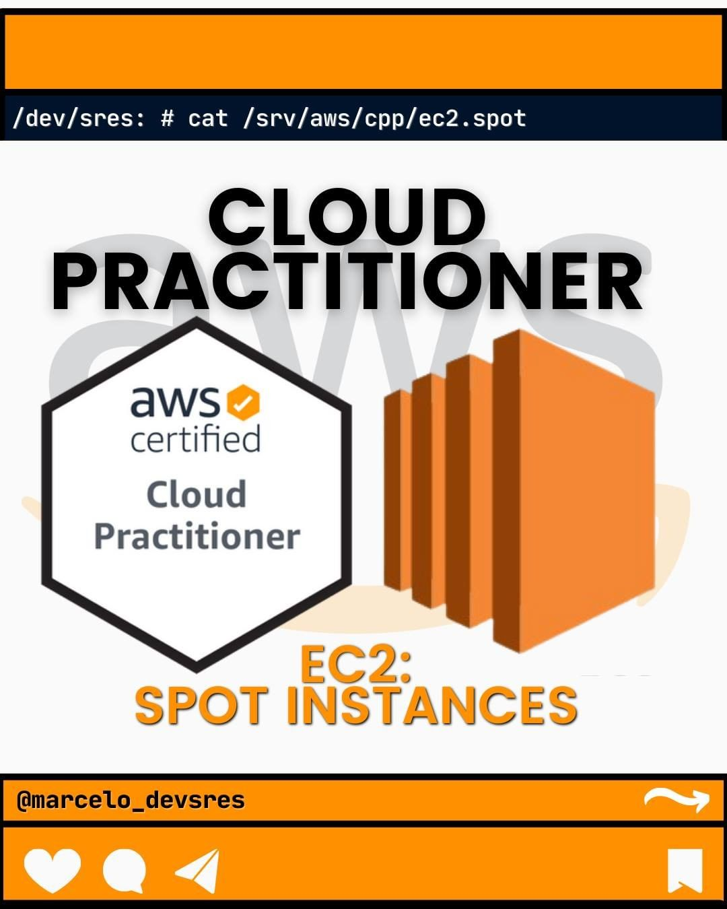

Você gostaria de ganhar um desconto de 70% ou mais em alguns produtos de qualidade excepcional de uma seleção especial? 

Não, não se preocupe, não é um "scam" e eu não quero te vender nada. Quem quer te vender é a AWS.

Semana passada, vimos como economizar em instâncias EC2 assumindo um compromisso de uso constante com a AWS, envolvendo até mesmo pagamento adiantado. 

Mas ninguém gosta disso, né; a gente quer é *promoção*, *desconto* em troca de nada! 

Como boa empresa que trabalhou com vendas a vida inteira, a AWS entende disso, e ela sempre tem uma oferta especial para você.

Spot Instances foi a forma que a AWS encontrou de vender capacidade de processamento ociosa dos seus datacenters. Tá lá, tá sobrando, por que não vender mais barato? E a promessa é de descontos de até 90%.

Qual a pegadinha? Quando a capacidade ociosa não for mais ociosa, ela pode acabar a promoção e desligar sua máquina. Você tem 2 minutos para finalizar o que está fazendo.

No passado, a AWS era bem restritiva ao uso de Spot instances. Com o passar do tempo e a evolução tecnológica (e também da concorrência), ela está flexibilizando cada vez mais o uso deste tipo de recurso.

Mesmo que você não tenha interesse na certificação Cloud Practitioner, vá até o fim; é bem provavel que ao menos o último texto te acrescente alguma coisa e te abra os olhos para uso de Spot!

#aws #cloudpractitioner

# Post 
[https://www.instagram.com/p/CMteoiYslnW](https://www.instagram.com/p/CMteoiYslnW)

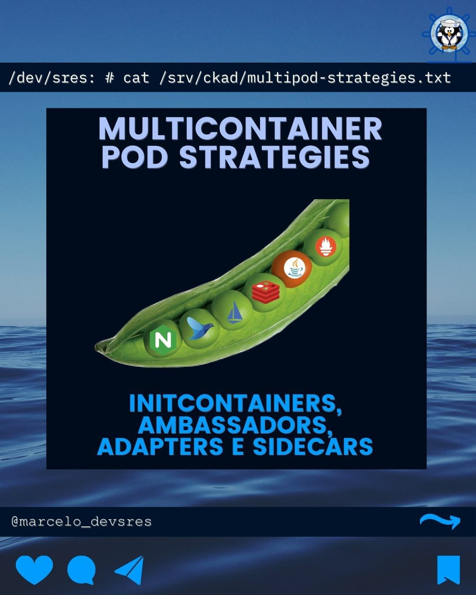

Multicontainer Patterns para Kubernetes: este assunto serve para alguma coisa?
Outra pergunta: pode algo ser listado como tópico de prova de certificação (no caso, CKAD) e ser *completamente irrelevante para ela? Sim, pode, e é exatamente o caso deste assunto.
Excetuando o uso de initContainers, que são especificados de maneira completamente diferentes, Pods Multicontainer são criados exatamente da mesma forma, não importa o "Pattern" escolhido. Logo, do ponto de vista prático para a prova de certificação, conhecer a diferença entre eles é completamente irrelevante.
O assunto, entretanto, não é. Compreender a discussão por trás dos diferentes Design Patterns para uso de containers vai te permitir se aprofundar em ideias para o uso de tecnologia de containers que talvez você não tenha pensado antes, e quem sabe impactar a maneira como você arquiteta seus sistemas.
O domínio da prática é imprescindível; mas, sem a teoria, você é apenas um executor.

#kubernetes #ckad

# Post 
[https://www.instagram.com/p/CMm2smJojjL](https://www.instagram.com/p/CMm2smJojjL)

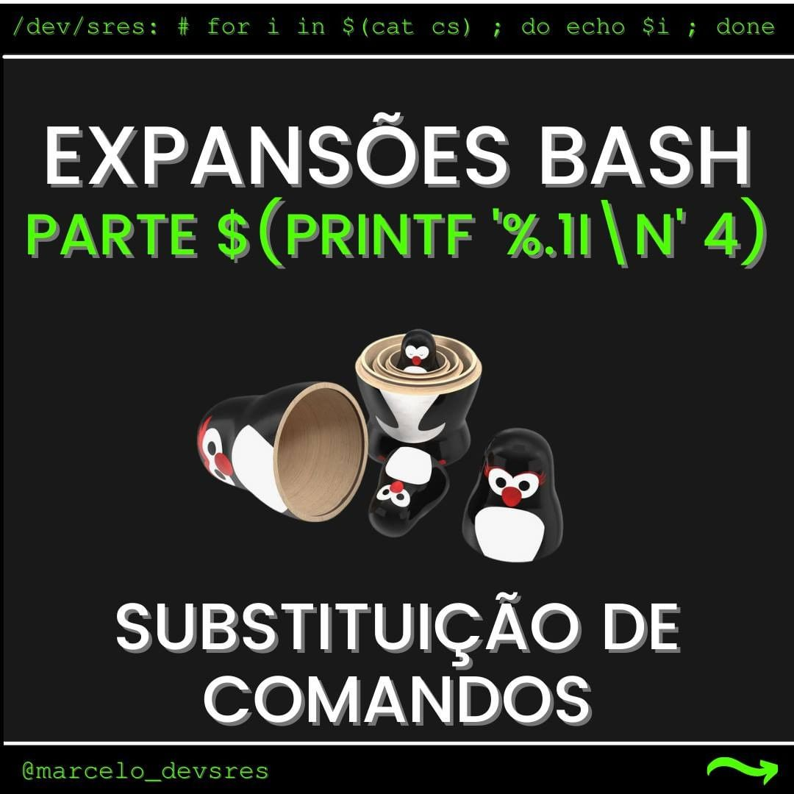

Esta semana, um assunto tranquilo: substituição de comandos, ou as famosas `` espalhadas pelos códigos alheios!

De todas as substituições, provavelmente essa é de longe a mais usada, mesmo por quem conhece muito pouco de shell. 

Embora os 'backticks' (``) possam ser usados sem problemas, pretendo evangelizar os usuários para a adoção do mais legível e estético $(), mostrando sua versatilidade.

O laço abaixo é algo que executo todo dia:
$ for i in $( kubectl get ... | ... ); do : ; done

#linux #bash

# Post 
[https://www.instagram.com/p/CMhtF1voj77](https://www.instagram.com/p/CMhtF1voj77)

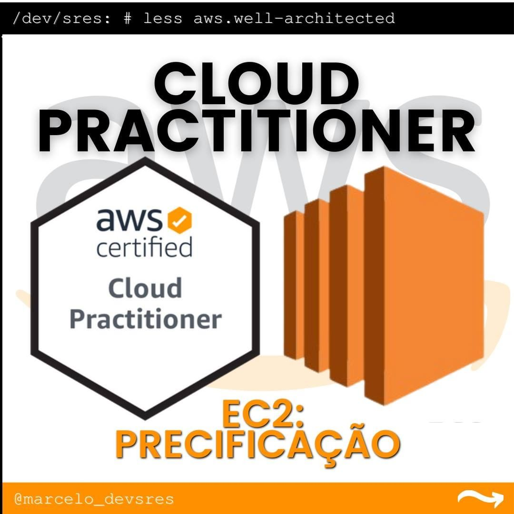

De longe, a pior parte do trabalho de um arquiteto de soluções para a nuvem é lidar com custos. Uma parte dos custos é razoavelmente fácil de computar. Mas outras, como custo de tráfego inbound, tráfego entre zonas, entre regiões, entre serviços da própria AWS... Normalmente é o calcanhar de aquiles de todos os planejamentos.

Para piorar, Até o trabalho "fácil" dá para complicar. Se existe uma maneira mais barata de fazer o que você está fazendo, por que não perseguí-la? Então praticamente *todos* os serviços de nuvem comumente vem com ampla oferta de preços para os mais variados tipos de uso.

Sobre instâncias EC2, são mais de 100 tipos de instâncias diferentes, cada uma delas com 12 possíveis custos mensais diferentes para você tomar uma decisão. 

Descrevo neste post algumas das possibilidades que dizem respeito a Reserved Instances na AWS para instâncias EC2.

# Post 
[https://www.instagram.com/p/CMZrdGkhIG2](https://www.instagram.com/p/CMZrdGkhIG2)

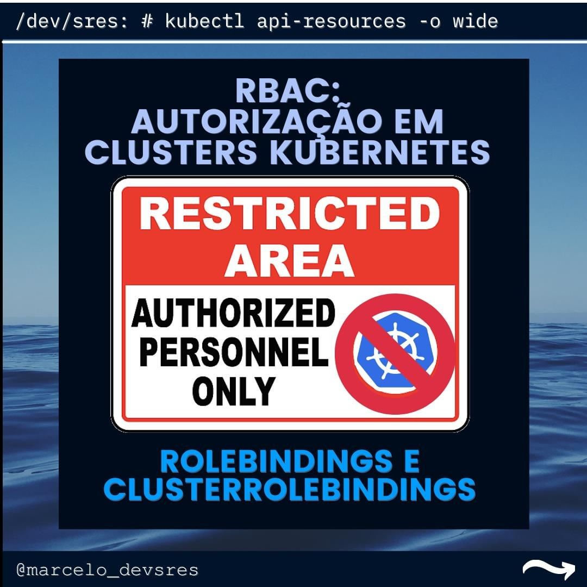

Rolebindings não podem fazer referência a Roles de outras Namespaces, mas podem associar Roles E ClusterRoles a ServiceAccounts de outras Namespaces.

Tranquilo de entender ou Mind melt?

Basicamente este post e os dois últimos foram criados única e exclusivamente para explicar esta frase que escrevi para um material de treinamento.

RBAC, em si, não é difícil de entender - se existe uma crítica váliida, é por ser um mecanismo excessivamente simplório. É "ultraverbose", necessário liberação de cada endpoint e verbo, difícil de mapear para "custom applications" e tem poucas facilidades para apoiar sua elaboração (como por exemplo o RBAC Aggregation).

Obviamente é um avanço com relação ao ABAC no sentido que é dinâmico: as configurações de permissão são feitas diretamente no cluster via kubectl, e o cluster tem inclusive salvaguardas para se recuperar sozinho em caso de EGO (erro grave de operador).

Neste post explico alguns dos aspectos mais sobrenaturais do uso dessa tecnologia.

#kubernetes #ckad

# Post 
[https://www.instagram.com/p/CMXCF1EDBaN](https://www.instagram.com/p/CMXCF1EDBaN)

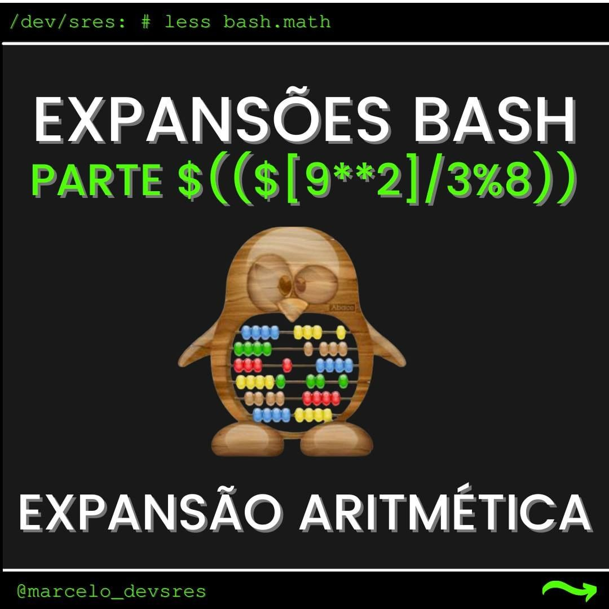

Como fazer contas no shell?

Não, eu não acho que você vai fazer a contabilidade da sua empresa em shell script. Mas uma hora você vai precisar fazer alguma conta, seja ela soma de tamanhos de arquivos, incremento de variável em um laço, implementar um exponencial backoff (!) em algum teste... Alguma coisa vai aparecer.

Eu originalmente iria fazer a expansão aritmética e de comandos em um mesmo post, mas mesmo sendo um assunto "bobo" não consegui, em 8 imagens, falar tudo que eu queria! Faltou, por exemplo, falar do seguinte:

((var+1)) (assim mesmo sem $).

Também faltou espaço para dar exemplos (úteis) de bitwise.

E aí, mais desse assunto semana que vem ou pula que tá chato?

#bash #linux #shell

# Post 
[https://www.instagram.com/p/CMPriAmIfvN](https://www.instagram.com/p/CMPriAmIfvN)

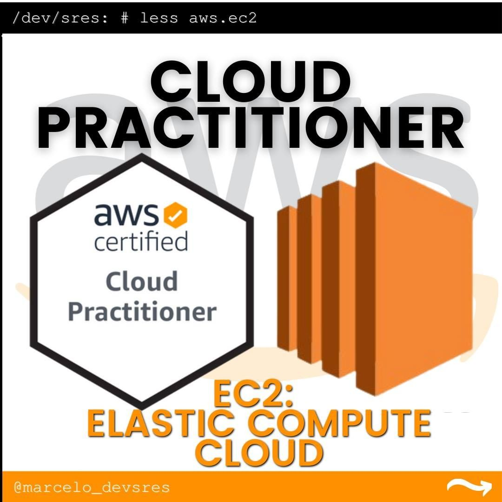

Não existe serviço mais "core" da AWS que o EC2. Mesmo com o "push" dos provedores de cloud para tecnologias "serverless" e melhores alternativas e ofertas em escalabilidade e preço, parece meio que inevitável que você precisará subir uma máquina virtual em algum ponto da sua vida.

Então, não há como correr: o serviço EC2 certamente é o mais cheio de nuances e detalhes necessários para conhecimento para a prova de Cloud Practitioner (e outras!).

Mais que isso: não é suficiente saber apenas dos padrões de máquinas virtuais, tipos de instâncias e modelo de precificação. Também é importante conhecer estratégias de alocação, tipos de volumes disponíveis e particularidades para compliance, como os hosts e instâncias "dedicadas". Além disso, outros serviços associados comumente ao EC2 também são cobrados, como os Autoscaling Groups, as particularidades dos VPCs e dos Elastic IPs.

Com este post começo a descrever algumas das minhas anotações pessoais para esta prova!

#aws #ec2

# Post 
[https://www.instagram.com/p/CMKh6-wouTm](https://www.instagram.com/p/CMKh6-wouTm)

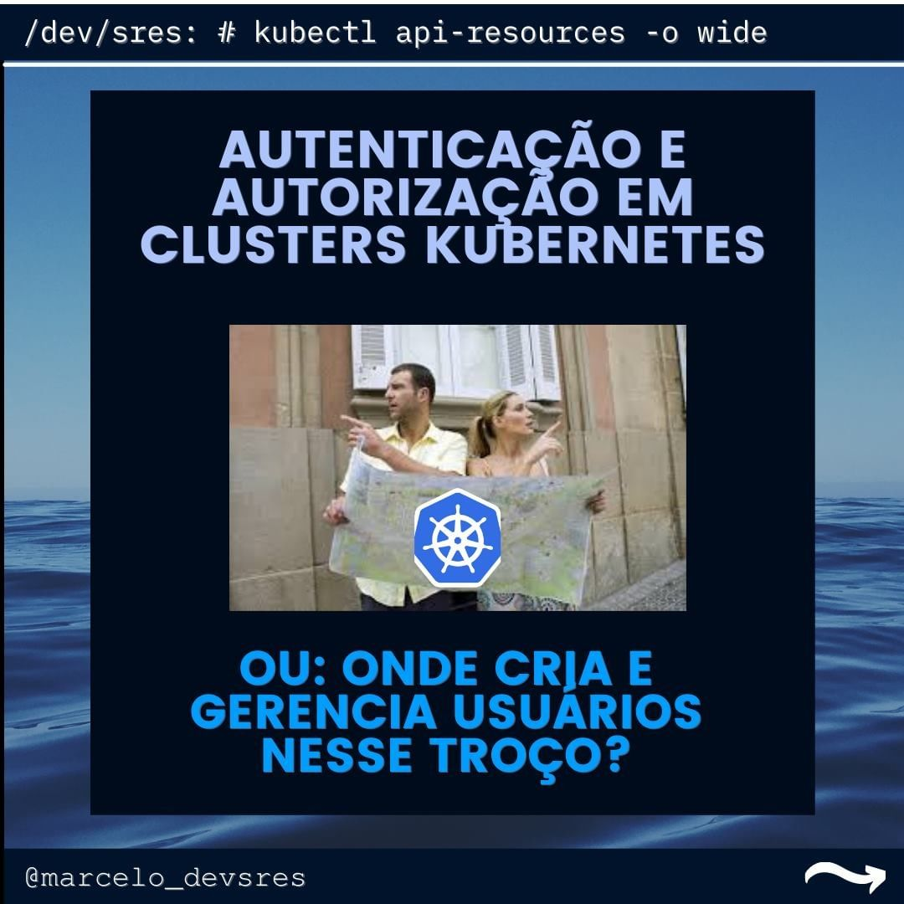

Como cria usuários em um cluster Kubernetes? A resposta é: Kubernetes NÃO LIGA para usuários!

Calma, pera lá. Não é que usuários não "existam" para o cluster. Eles só não existem NO cluster. Você não cria usuários no Kubernetes em lugar algum.

O Kubernetes sempre adotou a estratégia de delegar o "grosso" do trabalho a outra pessoa que tenha sido criada para fazê-lo. Por isso, ele busca abstrair detalhes de implementação de redes (CNI), armazenamento (CSI) ou mesmo de como rodar containers (CRI) para programas dedicados para isso. 

Gestão de usuários não se encaixa na mesma categoria de plugins tipo C*I, mas segue a mesma filosofia. A maioria dos Cloud Providers "terceiriza" o processo de autenticação por meio de Webhooks ou OAuth para seus serviços de identidade e geração de tokens temporários.

Já instalações locais On-Prem mais simples (ou aquela que você faz na sua máquina para testar) normalmente garante autenticação por meio de certificados gerados por uma CA marcada como confiável. Em ambientes On-Prem, espera-se uma PKI sólida (mas nem sempre é assim).

Já a autorização normalmente fica ao encargo do RBAC no cluster. É possível fazer externo, mas é um assunto pouquíssimo discutido (e usado).

Aqui temos um problema de logística: os administradores precisam criar políticas de permissão RBAC levando em consideração sistemas externos. Por exemplo, com certificados, os 'nomes de usuários' - subjects dos certificados gerados - ou 'grupos' - campos 'ogranization' (!) do certificado. Você precisará criar o "integrador" que gerencie essas políticas.

O ideal é que você minimize o acesso ao cluster, tornando-o não apenas mais seguro ("least priviledge") mas também com o mínimo de overhead operacional. Deixe os pipelines fazerem o trabalho de deploy!

# Post 
[https://www.instagram.com/p/CMISW8JpmSH](https://www.instagram.com/p/CMISW8JpmSH)

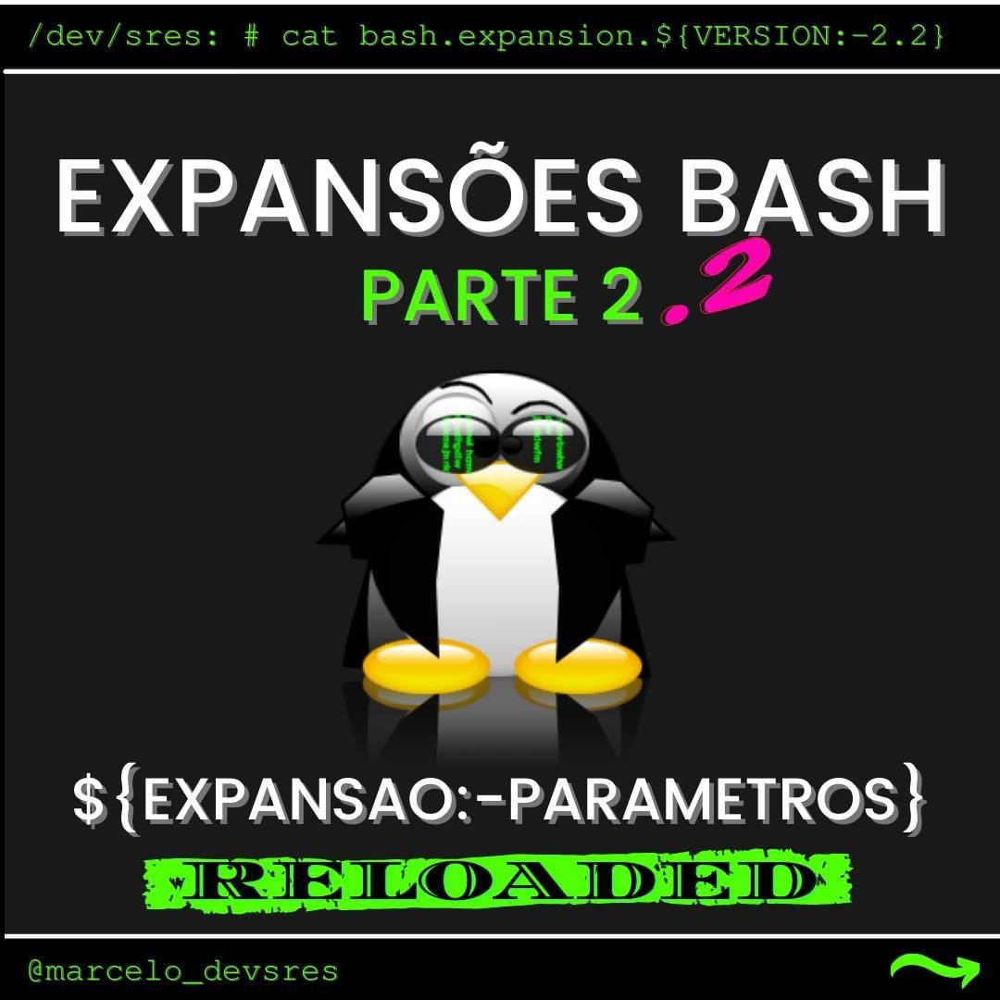

Nesta continuação das expansões de parâmetros do Bash, aprendemos 3 novas maneiras de deixar seu script incompatível com os demais shells sh-compatíveis!

Use estes truques para garantir a ilegibilidade dos scripts para pipelines ou rotinas administrativas e assim continuar sendo indispensável na sua instituição!

Brincadeiras à parte, as expansões listadas aqui estão entre as que eu uso diariamente para extrair informações de comandos e apis a partir do shell. Acredito que quase todo script que eu elabore os ${var#*:} e ${var%:*} dêem as caras em substituição a " cut -f1 -d':' ; cut -f2 -d':'".

E se eu uso, pode acreditar que aquele cara Ops de quem ninguém gosta que sempre olha feio para todo mundo também usa. E, quando ele sair de férias, VOCÊ vai precisar descobrir o que deu errado!

#linux #bash

# Post 
[https://www.instagram.com/p/CL9p4cnMQ91](https://www.instagram.com/p/CL9p4cnMQ91)

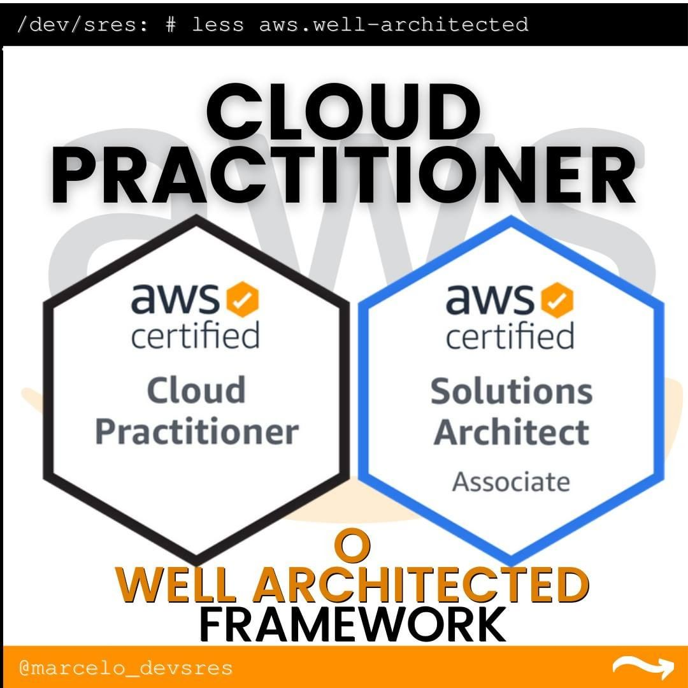

Você sabia que o Well Architected Framework não cai na prova de Architect Associate mas cai na prova de Cloud Practitioner?

Espera! Antes de jogar pedras, deixe-me explicar o que quero dizer.

A prova de Architect Associate é inteiramente dedicada a perguntas voltadas a buscar a melhor alternativa para o cenário apresentado. Então, obviamente, você precisa DOMINAR o Well Architected Framework para entender o melhor caminho, que pode enfatizar o pilar de custos ou o pilar de reliability. Por exemplo, você pode ter alternativas com quatro arquiteturas viáveis, mas apenas uma delas será a melhor opção sob a ótica da necessidade do cliente. Direct Connect ou VPN? Cloudfront com Route53 e arquitetura multi regional ou só um ELB com diversas instâncias EC2? O context da questão que vai indicar o caminho correto.

Na prova de Cloud Practitioner, por outro lado, não é incomum observar questões que perguntem diretamente os princípios e pilares do Well Architected Framework diretamente.

E o mais importante: para evitar confusão, é melhor ler os termos em inglês, já que a prova é integralmente neste idioma. 

Estudar apenas por materiais traduzidos pode te deixar despreparado ao ver na prova um termo como "Game day", que, pela definição do documento, é a simulação de uma falha ou evento para testar sistemas, processos e a resposta dos times responsáveis.

# Post 
[https://www.instagram.com/p/CL4gVb1ItK5](https://www.instagram.com/p/CL4gVb1ItK5)

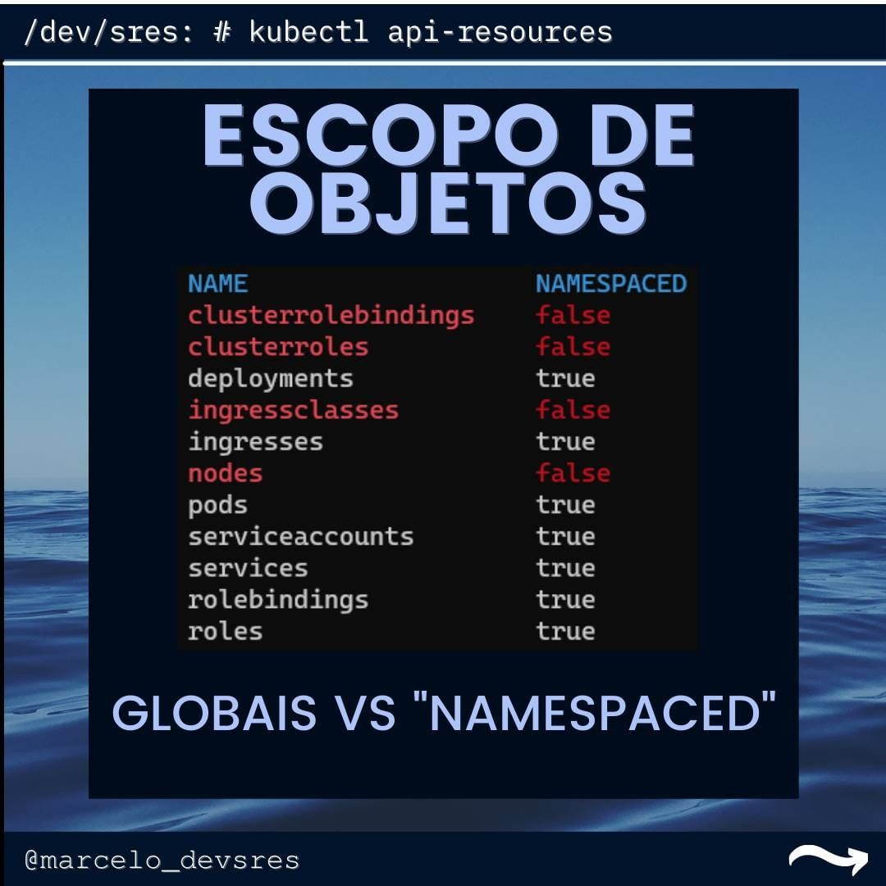

O post de hoje ia ser sobre RBAC, assunto particularmente pavoroso que ninguém gosta.

Mas senti que, para ilustrar a dificuldade de se trabalhar com RBAC, era importante fazer a distinção de escopo de objetos em clusters Kubernetes, uma "bobagem", mas que vale a pena apresentar uma ou outra ideia.

Em particular, e a principal delas: namespaces oferecem escopo isolado para *nomes*, mas basicamente é isso. A namespace, por si só, não é um recurso de segurança que garante isolamento entre usuários ou tenants. É muito importante estar ciente disso ao arquitetar soluções que usem Kubernetes.

Além disso, existem umas "pontas soltas" no Kubernetes que permite que usuários de uma namespace afetem negativamente outros. Um (que não falei) é não obrigar os usuários a obedecerem quotas. Um usuário pode facilmente promover 'starvation' se o cluster não tiver uma estratégia de cluster auto-scaling.

O outro, que acontece por uma característica dos objetos Ingress e pela maneira que seu uso é viabilizado (com programas de terceiros, e não do próprio Kubernetes), é que um usuário pode (mal intencionado ou não) tentar sobrescrever configurações de um mesmo hostname a partir de outra namespace que não a sua. Os resultados são imprevisíveis.

Com este assunto fora do caminho, estou livre para abordar RBAC no próximo post!

#kubernetes #cka #ckad #devsres

# Post 
[https://www.instagram.com/p/CLz3_VEJ4N1](https://www.instagram.com/p/CLz3_VEJ4N1)

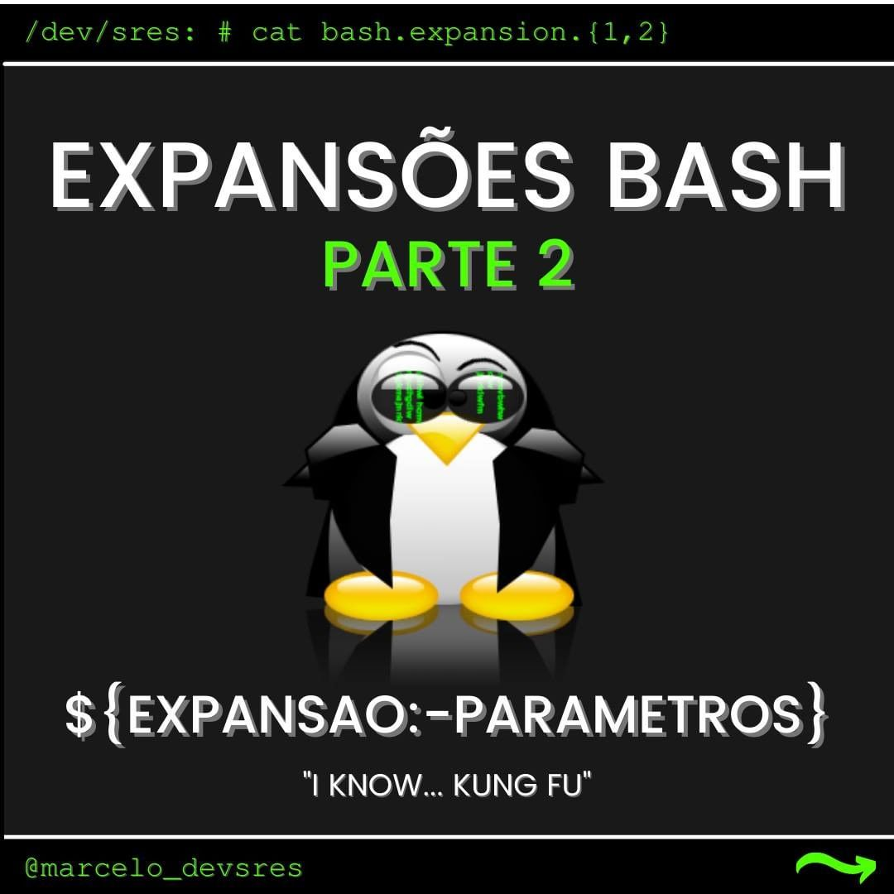

Dando sequência à serie de expansões do Bash, vou mostrar um pouco de expansões de parâmetros e variáveis!

Apenas pouco porque... não cabe em um post só! Semana que vem vem a parte 2 da parte 2!

Espero que curtam os exemplos! 

Ps: já usei todas as listadas aqui em algum ponto da minha vida profissional, inclusive a ${:+}!

#linux #bash #shell

# Post 
[https://www.instagram.com/p/CLuNIw4jWuT](https://www.instagram.com/p/CLuNIw4jWuT)

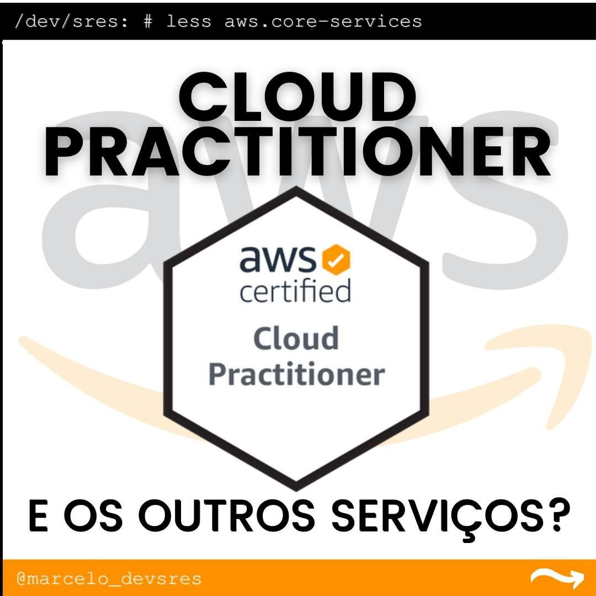

Quantos serviços diferentes a AWS oferece? Acho que se você perguntar a eles mesmos, eles não sabem.

Mas a pergunta relevante é: que serviços podem ser abordados na prova de certificação. E essa resposta, infelizmente, eles NÃO querem que a gente saiba.

Os Core Services são cobrados com mais detalhes a respeito de suas arquiteturas. Esses são bem conhecidos. Os demais tendem a ser cobrados como uma inferência básica de sua finalidade principal.

Qualquer serviço oferecido há mais de 6 meses pode ser cobrado na prova. Obviamente que a complexidade de muitos deles torna inviável uma cobrança em um nível mais alto; ainda assim, é importante dar uma passada de olhos em pelo menos alguns serviços mais "obscuros".

Na lista deste post fiz um compêndio de serviços que já foram reportados como vistos em provas de acordo com usuários de diversos fóruns de discussão e redes sociais.

Eu não posso divulgar os que eu encontrei em minha prova por causa do NDA, desculpem-me!

# Post 
[https://www.instagram.com/p/CLmeyjehIMb](https://www.instagram.com/p/CLmeyjehIMb)

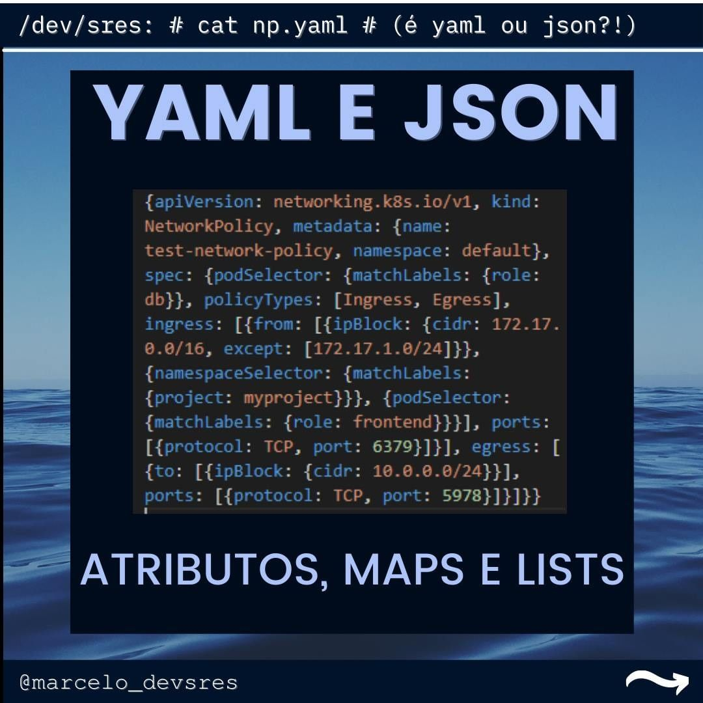

Para usar Kubernetes, você não deve apenas dominar a tecnologia: precisa se tornar fluente na leitura de jsons e yamls!

A maior dificuldade, entretanto, é mapear exatamente quais são os requisitos de cada formato de dados e ainda lidar com as particularidades dos comandos que processam estes arquivos.

Para extrair informações do Kubernetes, o formato JSON oferece melhores possibilidades de filtros usando -o jsonpath, gotemplate ou mesmo o comando jq. É possível usar yq com saída de yaml, mas este comando é bem menos popular e disponível.

Agora, para passar entradas para o kubectl, invariavelmente será usado o formato yaml.

Pretende fazer a certificação CKA/CKAD? Acostume-se com o formato yaml: você precisará editar arquivos nesse formato em praticamente todas as questões!

O comando kubectl explain vai te ajudar a identificar os campos e quais seus tipos.

# Post 
[https://www.instagram.com/p/CLfDrMcpIou](https://www.instagram.com/p/CLfDrMcpIou)

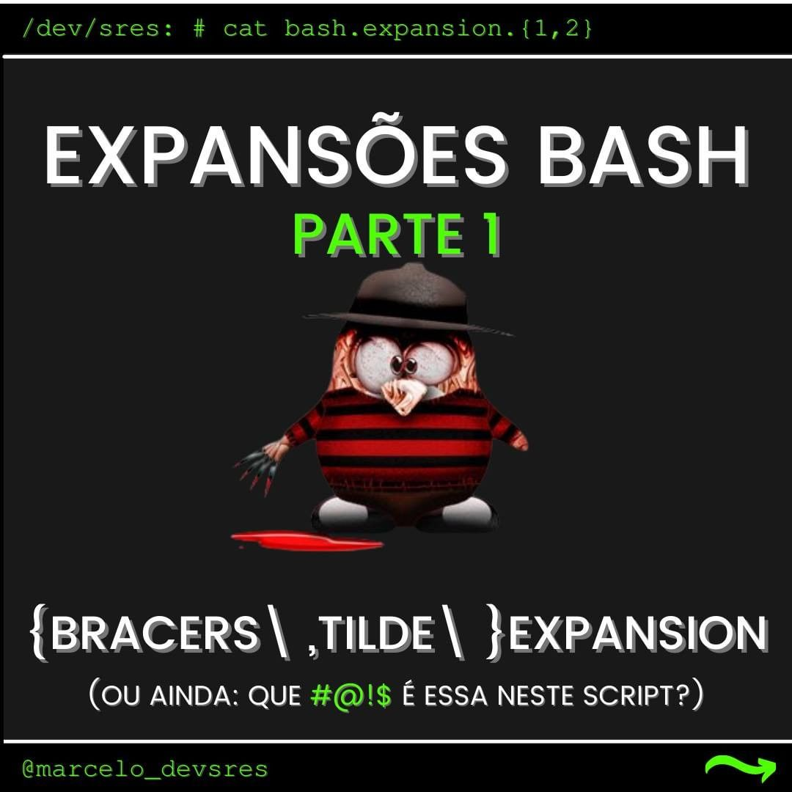

Okay, entendi o recado. Você é um purista da nova geração, acha aprender shell bobagem e perda de tempo dominando as nuances. Muito melhor se dedicar a escrever programas com ampla cobertura de testes e tal para fazer o que os antigos scripts dos admins de outrora fazem.

Te garanto que não quero te provar o contrário.

Mas quando aquele Linux guru que trabalha com você sai de férias e um script quebra, vai sobrar para QUEM resolver o problema?

Ainda que você não queira usar alguns recursos disponíveis, é importante conhecê-lo o suficiente para evitar ter que aprender na hora do desespero.

É muito melhor olhar para "for i in {1..100..3}..." e já saber de cara o que ela faz em vez de ter que perguntar ao Google. Você vai procurar por que termo mesmo? (dica: bracket expansion).

#linux #bash #shell

# Post 
[https://www.instagram.com/p/CLZjWWxI89t](https://www.instagram.com/p/CLZjWWxI89t)

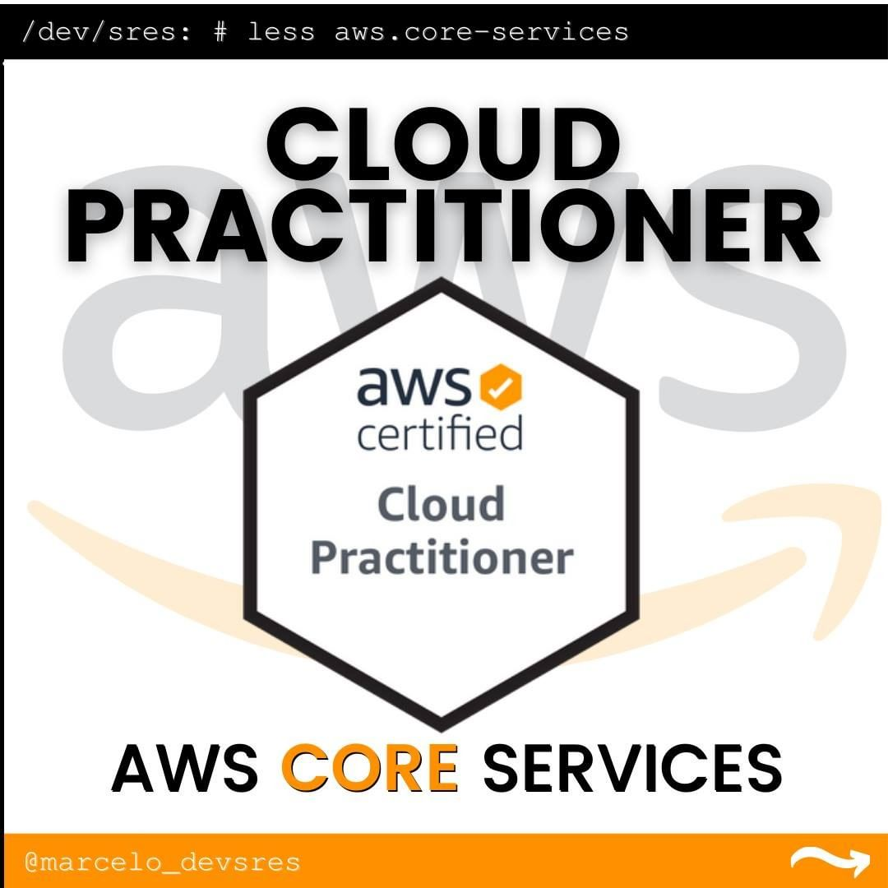

Por onde começar a estudar AWS? 

São tantas ofertas diferentes e serviços (que, algumas vezes, parecem redundantes) que acaba ficando difícil escolher o seu caminho.

A maioria dos cursos (oficiais ou  não, gratuitos ou não) normalmente abordam primeiro os conceitos e princípios de cloud, o "well architected framework" e um monte de outras coisas  importantes - porém bem "aborrecidas".

Já o cara com perfil técnico quer mão na massa, ver resultados e como as coisas funcionam.

Eu acredito em uma abordagem híbrida: buscar exercícios práticos viáveis para domínio da tecnologia conjugando o aprendizado teórico a partir da busca por melhorias para resolver os problemas que vão aparecendo.

Nas provas da AWS para Cloud Practitioner e Architect Associate, qualquer serviço lançado há mais de 6 meses pode cair. Mas o pricnipal foco da prova está em conhecer, de maneira mais aprofundada, alguns serviços principais - os Core Services, listados neste post. Para os demais, normalmente é suficiente saber qual sua finalidade (e talvez, como diferem de outros serviços já existentes).

# Post 
[https://www.instagram.com/p/CLUZxHCMng-](https://www.instagram.com/p/CLUZxHCMng-)

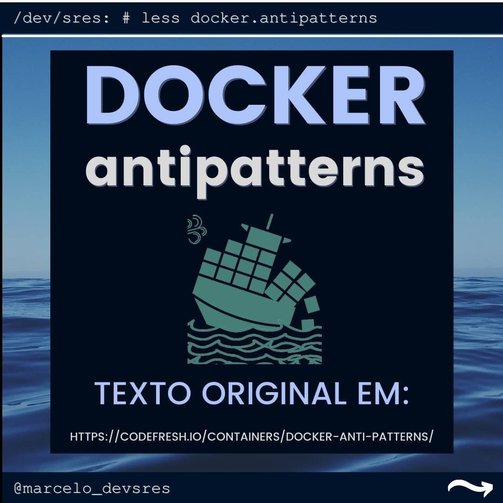

Vou fazer uma pausa para resumir e transcrever, em imagens, um post que li no site https://codefresh.io/containers/docker-anti-patterns/ e que identificou uma série de más práticas no uso de contêineres docker que pude prestigiar nos últimos anos.

Muitas pessoas trabalham com contêineres sem entender direito direito o problema que ele resolve. Além disso, querem estabelecer padrões de trabalho similares aos que já estão acostumados e que não fazem sentido.

Recomendo a leitura do artigo completo em inglês!

# Post 
[https://www.instagram.com/p/CLMrXWSD225](https://www.instagram.com/p/CLMrXWSD225)

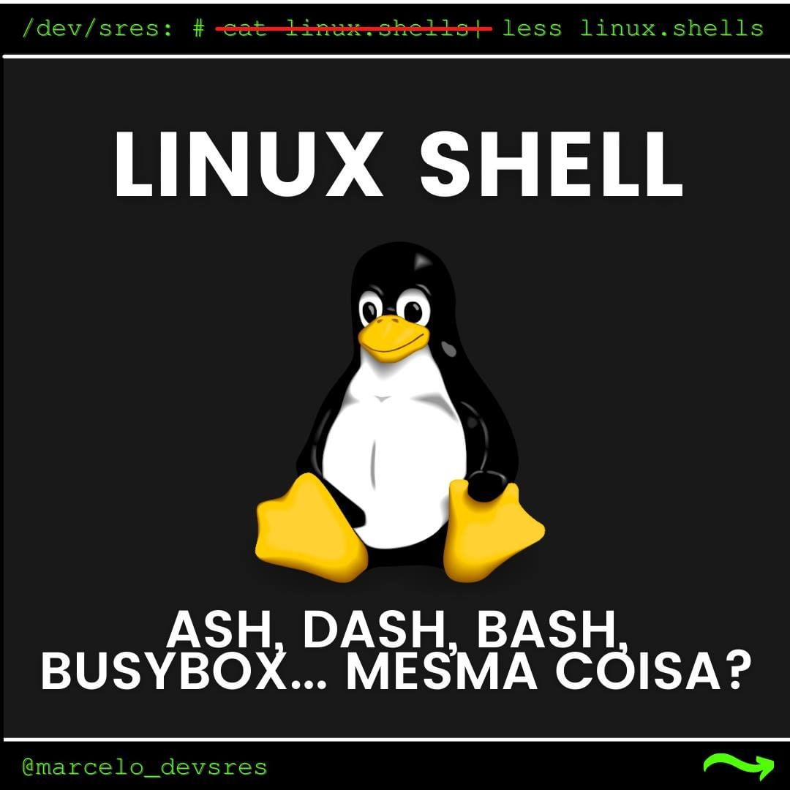

É muito comum ver, por aí, "dicas de shell" para Linux. Mas que shell? Estamos falando da mesma coisa?

Existem diversos programas usados como shell para Linux. 9 em cada 10 vezes, o assunto é Bash, uma variante desenvolvida a partir do 'sh'. 

O Zsh é uma variante do Bash que tem crescido em popularidade nos últimos anos, em especial pelos inúmeros recursos e facilidades no seu modo interativo (ou talvez seja apenas por causa dos temas!).

Debian e Ubuntu, embora disponibilizem por padrão o Bash como shell interativo para os usuários, usam Dash para suas operações não interativas. Aliás, muitas das funções interativas foram descartadas, tornando-o desconfortável para este fim.

O Busybox, popular programa que combina diversos executáveis do Linux dentro de si, implementa um shell Ash, que compartilha muitas das funcionalidades com o Dash, mas não é 100% igual! 

E aí, quando você aprende algo, se preocupa em saber em quais destes shells ele vai funcionar?

# Post 
[https://www.instagram.com/p/CLHhw9LIrVp](https://www.instagram.com/p/CLHhw9LIrVp)

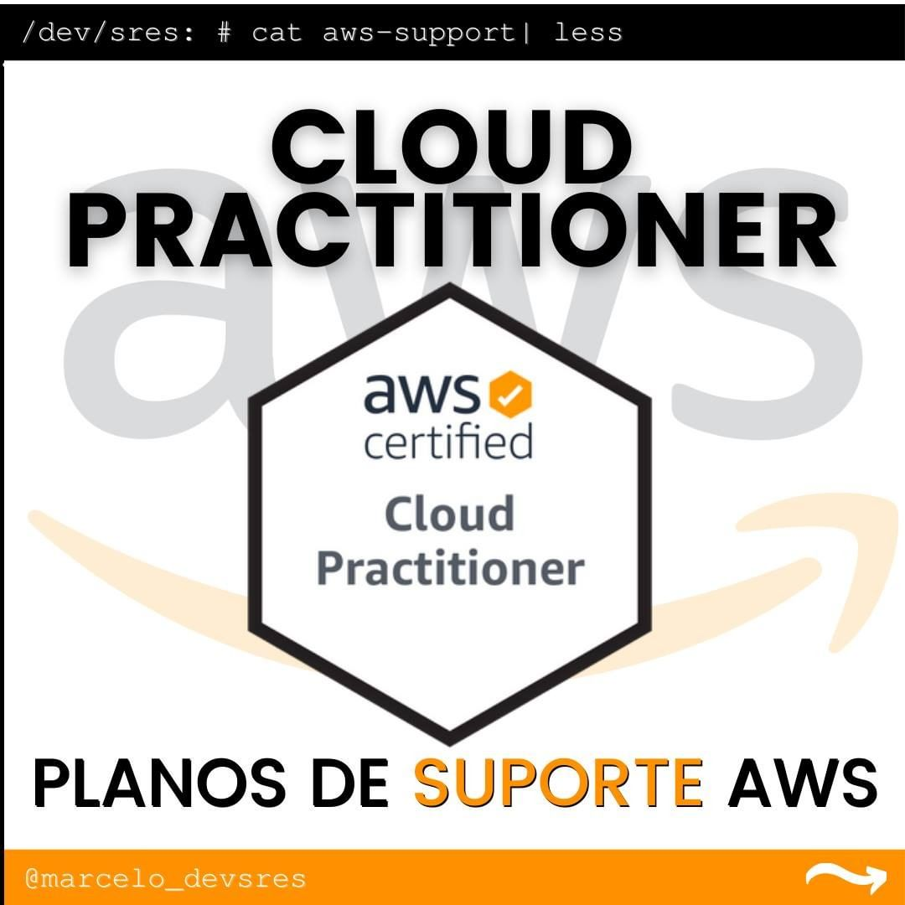

Vou começar a série de assuntos sobre a prova Cloud Practitioner com aquele que possivelmente é o mais impopular deles: os planos de suporte pagos oferecidos pela AWS.

Praticamente nenhum técnico que se dedica a estudar AWS no seu tempo livre resolve ler sobre suporte - você só vai ter contato com isso se estiver empregado  em uma empresa com contrato ou se estiver projetando o lançamento de uma aplicação na sua startup.

Consequentemente, questões sobre suporte tendem a roubar pontos daqueles que não se preparam efetivamente para a prova. Antes de tirar minha certificação, eu *sempre* errava as questões dos simulados que encontrava. 

Então compartilho com vocês as anotações que fiz para não errar no dia!

Se estiver pensando em fazer a prova, salve o post para ler outro dia!

# Post 
[https://www.instagram.com/p/CLC25qLJhWO](https://www.instagram.com/p/CLC25qLJhWO)

Você já fez prova de certificação com consulta? 

As *três provas* de certificação Kubernetes te permitem acessar integralmente a documentação do projeto. 

Com certeza, ter acesso a documentação te poupa de ter que decorar as 10 linhas que formam um bloco de affinity, por exemplo. E ainda te oferece a chance de copiar e colar um esqueleto básico de YAML para NetworkPolicy, objeto que não conta com 'kubectl create'.

Por outro lado, saber que a documentação estará lá pode te acomodar e dar uma falsa sensação de segurança: pode ser tentador acessar a documentação para copiar e colar SPECs de todos os YAMLs possíveis e achar, assim, que conseguirá 100% na prova.

Só que são 15 a 20 questões na prova, e apenas 2 horas para concluí-la! O que é mais rápido, copiar um 'manifest' de um pod e editá-lo com um editor de texto ou executar:

k run nginx --image=nginx --port 8080 -l podname=nginx --env=DOCROOT=/var/www

Confira algumas dicas que eu tenho para fazer a sua possível primeira prova de certificação com consulta da sua vida!

# Post 
[https://www.instagram.com/p/CK6px0Ao0ew](https://www.instagram.com/p/CK6px0Ao0ew)

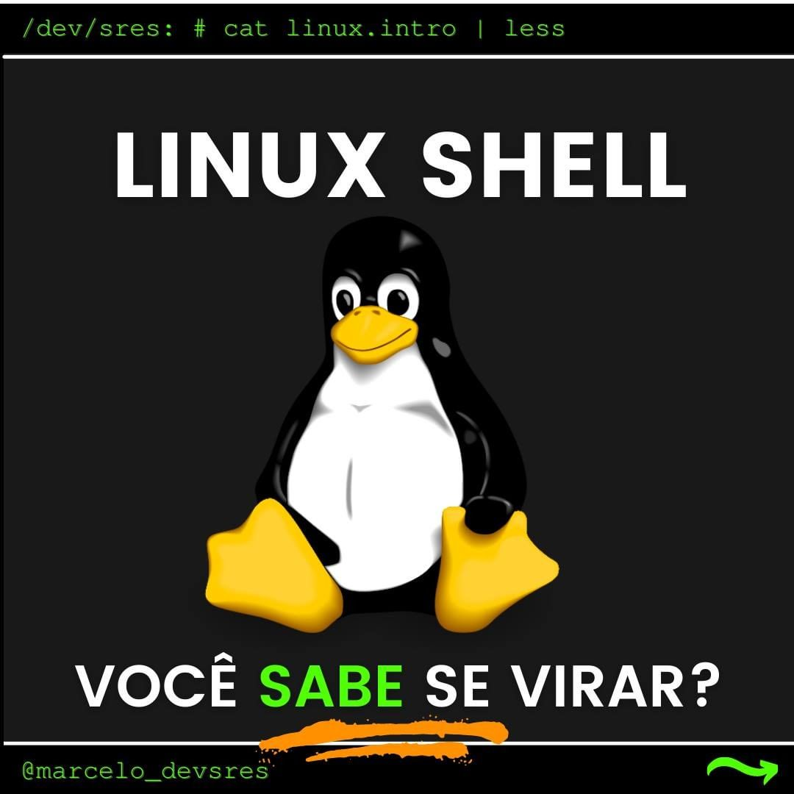

Estamos em 2021; faz sentido "perder" tempo para aprender shell Linux e ser capaz de escrever scripts Bash?

A resposta é: com certeza!

É praticamente impossível um profissional de TI hoje não ter que lidar com Linux de uma forma ou de outra, ainda que não seja o principal foco do seu trabalho. Com a cultura DevOps tentando eliminar o isolacionismo das duas principais categorias de profissionais compartilhando suas responsabilidades, estar confortável em um terminal Linux para construir todas as peças de uma automação consistente e conseguir extrair as informações que você precisa - especialmente em situações de depuração de aplicação.

  Mesmo em um universo "Cloud Native" dominado por APIs REST e microsserviços você deve estar preparado para ter que subir contêineres para diagnóstico e extração de métricas em tempo real; o shell muitas vezes te oferece soluções muito mais rápidas e eficientes para obter as informações. Inclusive 'kubectl  grep' costuma ser executado mais rápido que passar 'kubectl -o go-template', e quantas vezes um 'curl  jq' não me trouxe a resposta que as ferramentas de logs escondiam!

O post de hoje irá iniciar uma sequência em que abordarei diversos comandos relevantes para garantir sua fluência em shell. O principal motivador deste assunto é servir de apoio para a preparação para a CKAD, a Certified Kubernetes Application Developer, prova prática que demanda não apenas fluência em Kubernetes como também em shell Linux!

# Post 
[https://www.instagram.com/p/CK0UahiIYSD](https://www.instagram.com/p/CK0UahiIYSD)

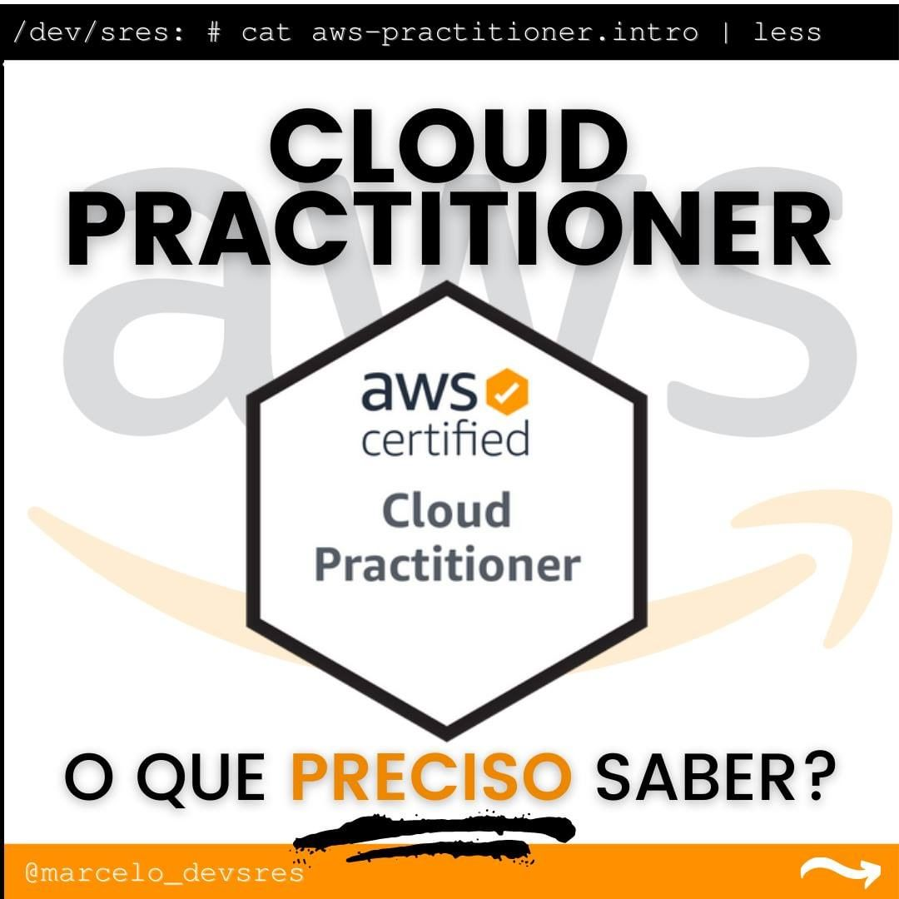

Se você trabalha com TI em um emprego que não faz uso de nuvem pública e não acompanha essa tendência de mercado, cuidado com seu atual status profissional: grandes são as chances que você esteja defasado!

A revolução causada pela computação em nuvem - e, em especial, pelo surgimento das grandes "Clouds Públicas - estão reformatando as exigências de mercado.

Aliás, não duvide que, de repente, em um futuro próximo, "experiência com Cloud" se torne o próximo "noções de Windows e Excel".

AWS é hoje o líder de mercado em Cloud Pública. O número absurdo de serviços e suas correlações torna exepcionalmente difícil para alguém sem qualquer experiência ter um bom primeiro contato eficiente com suas várias tecnologias.

Entendendo o desafio, a AWS passou a oferecer uma certificação profissional de nível "Foundation", com menos conteúdo e mais simples que as suas difíceis certificações de nível Associate para arquitetos, desenvolvedores e pessoas de operações.

Se você sabe pouco ou mesmo nada de AWS, entender o que é abordado na certificação de Cloud Practitioner oferece um excelente guia sobre por onde começar. Siga o post que vou esmiuçar os detalhes nas próximas semanas!

# Post 
[https://www.instagram.com/p/CKwWqEqi8AD](https://www.instagram.com/p/CKwWqEqi8AD)

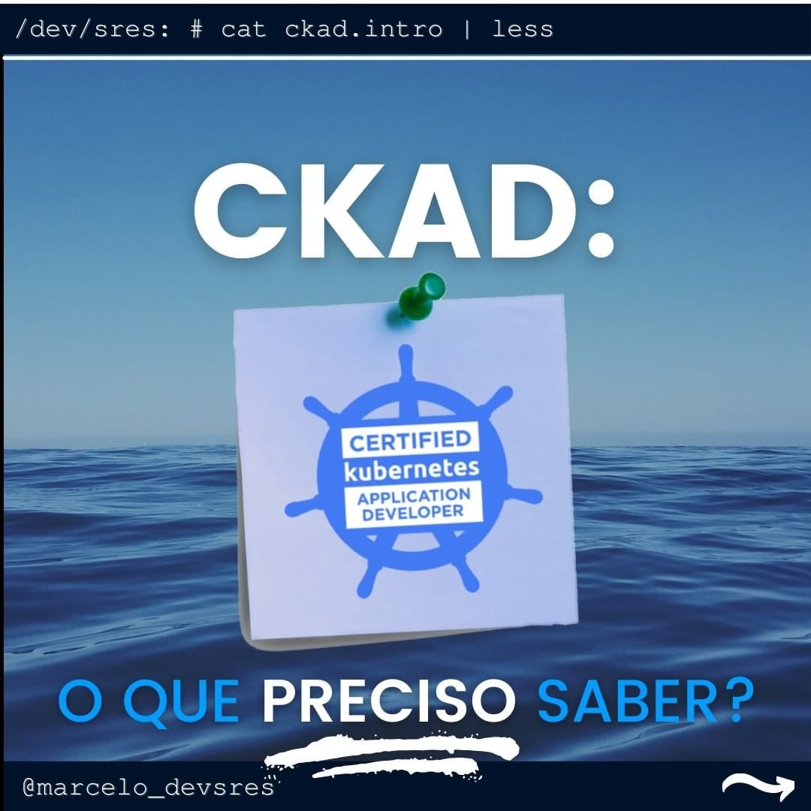

Se você não souber nada de Kubernetes, por incrível que pareça, a melhor maneira de se preparar é estudando para a certificação CKAD - Certified Kubernetes Application Developer.

A certificação te guiará pelos principais tópicos que você precisa dominar para fazer o deploy de aplicações em clusters Kubernetes, tenham sido elas desenvolvidas pensando na orquestração de contêineres ou não.

E não tem coisa melhor que concluir o aprendizado com um certificado para apresentar aos futuros contratantes, não é mesmo?

Inicio, com este post, uma série abordando como se preparar para esta prova, o que estudar e no que focar, seguindo como foi minha própria preparação.

